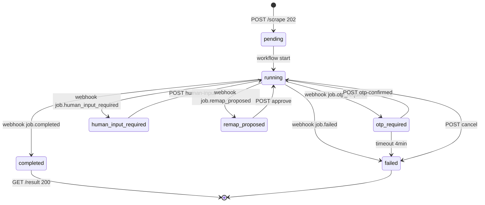

# Flujo de datos de la API — open-banca

Vista **API-first** del sistema: qué entra y sale por HTTP, qué se escribe o lee en storage, cómo Temporal orquesta el trabajo async y cómo los webhooks notifican al cliente integrador.

Complementa (no reemplaza) los sequence diagrams E2E en [`data-flow.md`](./data-flow.md) y el contrato endpoint-por-endpoint en [`../02-components/api.md`](../02-components/api.md).

## Diagrama de flujo de datos

```mermaid
flowchart TB
    subgraph Cliente["Cliente integrador"]
        C1[POST /scrape]
        C2[GET /jobs/id]
        C3[GET /jobs/id/result]
        C4[POST otp-confirmed]
        C5[POST human-input]
        C6[POST cancel]
        C7[POST maps/.../approve|reject]
        C8[GET /banks /accounts]
        WH_RECV[Recibe webhooks POST]
    end

    subgraph API["FastAPI — adapters/api"]
        Auth[Bearer + Idempotency-Key]
        Val[Validación Pydantic]
        Sig[Temporal Client signals]
        WH_Emit[Webhook Emitter]
    end

    subgraph Storage["SQLite + sqlcipher"]
        Jobs[(jobs)]
        Creds[(credentials cifrados)]
        Accts[(accounts)]
        Txns[(transactions)]
        Dedup[(dedup_index)]
        Outbox[(webhook_outbox)]
        Audit[(audit_log)]
        CB[(circuit_breakers)]
        OTP[(otp_sessions)]
    end

    subgraph Temporal["Temporal"]
        WF[ScrapeJobWorkflow]
        Act[Activities: sandbox, runner, parse, validate, persist]
    end

    subgraph FS["Filesystem maps"]
        Map[map.json + parser.json]
    end

    C1 --> Auth
    Auth --> Val
    Val --> CB
    CB -->|423 circuit open| C1
    Val --> Creds
    Val --> Jobs
    Jobs -->|status=pending| WF
    Val -->|202 job_id| C1
    Jobs --> Outbox
    Outbox --> WH_Emit
    WH_Emit -->|job.created HMAC| WH_RECV

    WF --> Act
    Act --> Map
    Act -->|xlsx efímero sandbox| Act
    Act --> ValAgent[Validator LLM]
    ValAgent --> Txns
    Act --> Dedup
    Act --> Accts
    Act --> Jobs
    Act --> Outbox
    Outbox -->|otp_required progress completed failed remap_proposed human_*| WH_RECV

    C4 --> Sig
    C5 --> Sig
    C6 --> Sig
    C7 --> Sig
    Sig -->|otp_confirmed human_input_provided cancel_job remap_approved| WF
    Sig --> OTP
    Sig --> Audit

    C2 --> Jobs
    Jobs --> C2
    C3 -->|409 si no completed| Jobs
    C3 --> Accts
    C3 --> Txns
    Accts --> C3
    Txns --> C3

    C8 --> Jobs
    C8 --> Accts
    C8 --> Map

    C6 --> Jobs
    WF -->|job.failed cancelled| Outbox
```

### Leyenda de datos por arista

| Flujo | Datos | Destino at-rest |
|-------|--------|-----------------|
| `POST /scrape` | `bank_id`, `credentials`, `accounts[]`, `full`, `since`, `webhook_url`, `metadata` | `credentials` (AES-GCM), `jobs` (pending), idempotency 24 h |
| Webhooks salientes | JSON firmado (`job_id`, counts, `result_url`, sin secretos) | `webhook_outbox` → HTTP cliente |
| `POST .../otp-confirmed` | vacío o `confirmation_id` | signal Temporal; `otp_sessions.confirmed_at` |
| `POST .../human-input` | `{field_key, answer, persist}` | signal Temporal; audit `sha256(answer)[0:8]` |
| `POST .../approve` | `reviewer_id`, `note` | signal → `map.json` nueva versión en FS |
| `GET .../result` | schema canónico ADR-0012 | lectura `accounts` + `transactions` post-dedup |

## Ciclo de vida del job (vista API)



Estados espejados en tabla `jobs`; la fuente de verdad operativa es Temporal; la API expone el espejo para polling (`GET /jobs/{id}`).

## Cuándo usar qué diagrama

| Documento | Enfoque | Cuándo usarlo |
|-----------|---------|---------------|
| [`api.md`](../02-components/api.md) (sequence) | Solo arranque `POST /scrape` | Contrato HTTP mínimo |
| [`data-flow.md`](./data-flow.md) | Happy path + ruptura con banco, sandbox, LLM | Debugging scrape completo |
| **Este documento** | Puertos HTTP ↔ storage ↔ Temporal ↔ webhooks | Integración cliente, onboarding API |

## Referencias cruzadas

- Contrato REST: [`../02-components/api.md`](../02-components/api.md)
- Tablas SQLite y ER: [`../02-components/storage.md`](../02-components/storage.md)
- Eventos webhook: [`../02-components/webhooks.md`](../02-components/webhooks.md)
- Workflows y signals: [`../02-components/orchestrator.md`](../02-components/orchestrator.md)
- Flujo E2E con banco: [`./data-flow.md`](./data-flow.md)
- OTP pause/resume: [`../03-flows/otp-pause-resume.md`](../03-flows/otp-pause-resume.md)
- Human input: [`../03-flows/human-input-pause-resume.md`](../03-flows/human-input-pause-resume.md)
- Remap HITL: [`../03-flows/remap-approval.md`](../03-flows/remap-approval.md)
