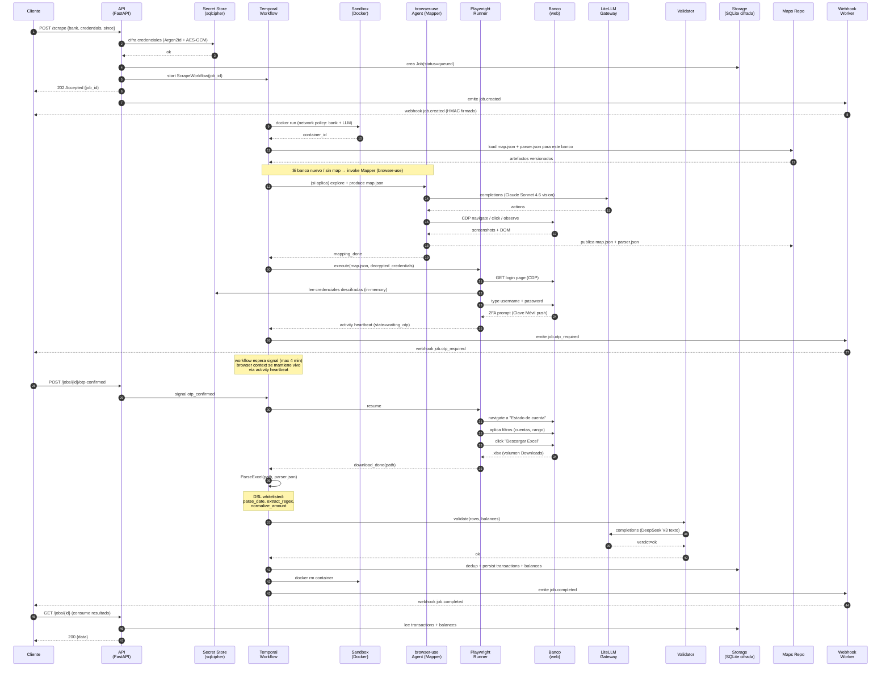
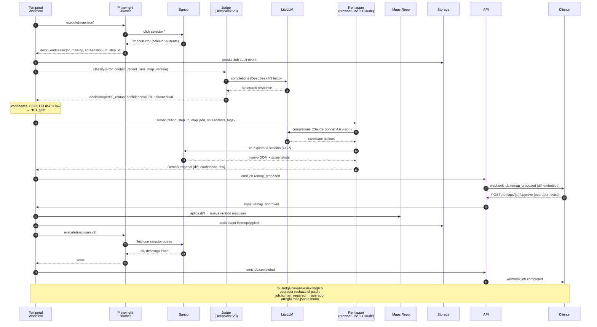

# Flujo de datos end-to-end — open-banca

Dos diagramas. El primero es el **happy path** completo de un scrape (con OTP pause/resume). El segundo es el **flujo de ruptura** cuando el Scraper detecta que el banco cambió, escala a Judge y al Remapper.

## Happy path — scrape exitoso con OTP

### Notas sobre el happy path

- **OTP pause**: el browser context **NO se cierra** durante la espera. La activity hace heartbeat para indicar a Temporal que sigue viva; Temporal mantiene el activity slot reservado. Si excede 4 minutos, abort + retry desde login (ver [ADR-0015](../adr/0015-no-session-persistence-v1.md)).
- **Credenciales en memoria**: viajan descifradas sólo dentro del sandbox del job, nunca a logs ni a archivos. El sandbox cae al final → memoria liberada.
- **Excel oficial**: el dato canónico es el `.xlsx`, no el DOM. Si la página de transacciones rinde otra cosa (ej. JS lazy load), no nos importa: descargamos el reporte que el banco mismo genera ([ADR-0002](../adr/0002-excel-download-strategy.md)).
- **Webhooks firmados**: cada webhook lleva header `X-OpenBanca-Signature: t=<ts>,v1=<hmac>` ([ADR-0011](../adr/0011-webhook-events-hmac.md)).

## Flujo de ruptura — Scraper detecta cambio → Judge → Remapper

Cuando el banco cambia HTML/flow (selector roto, schema mismatch, redirect inesperado), el Runner produce un error estructurado. El Workflow lo recibe y dispara la cadena de reparación.

### Notas sobre el flujo de ruptura

- **El Runner no intenta "auto-corregir"**: produce un error estructurado y termina. La inteligencia vive en Judge + Remapper, jamás en el path determinístico.
- **Auto-apply vs HITL**: la regla la evalúa el Workflow (use case `ApproveRemap` cuando es manual, lógica directa del workflow cuando es auto). El umbral está en [ADR-0013](../adr/0013-confidence-threshold-remap.md).
- **Re-ejecución**: una vez aplicado el patch, el Workflow re-corre el step desde el principio, no desde el punto de fallo. Más simple, más seguro, idempotencia más fácil.
- **Cap de remap attempts**: 3 por banco por 24h. Si los 3 fallan, circuit breaker `bank_in_repair`; nuevos jobs fallan rápido con error claro.
- **Versionado de maps**: cada apply genera commit en el git del Maps Repo. Rollback = checkout de la versión anterior. Diff humanamente legible.

## Datos en tránsito y at-rest

| Dato | En tránsito | At-rest |
|------|-------------|---------|
| Credenciales bancarias | TLS cliente↔API; descifradas sólo dentro del sandbox | sqlcipher + Argon2id + AES-GCM |
| `.xlsx` descargado | volumen Docker del job (efímero) | retenido configurable, en disco del operador |
| Transacciones canónicas | TLS API↔cliente | SQLite cifrada |
| `map.json` / `parser.json` | filesystem del operador | git versioned, opcional firmado sigstore |
| Eventos webhook | TLS firmado HMAC-SHA256 | log de entregas en SQLite cifrada |
| Prompts/completions LLM | TLS al provider | Langfuse self-hosted (opcional) |

## Referencias cruzadas

- Vista física: [`macro.md`](./macro.md)
- Capas e ports: [`hexagonal.md`](./hexagonal.md)
- Roles de los agentes: [`multi-agent.md`](./multi-agent.md)
- Decisiones: [ADR-0001](../adr/0001-opcion-a-mapper-runner-split.md), [ADR-0002](../adr/0002-excel-download-strategy.md), [ADR-0003](../adr/0003-temporal-orchestration.md), [ADR-0009](../adr/0009-docker-sandbox-per-job.md), [ADR-0011](../adr/0011-webhook-events-hmac.md), [ADR-0013](../adr/0013-confidence-threshold-remap.md), [ADR-0015](../adr/0015-no-session-persistence-v1.md)
