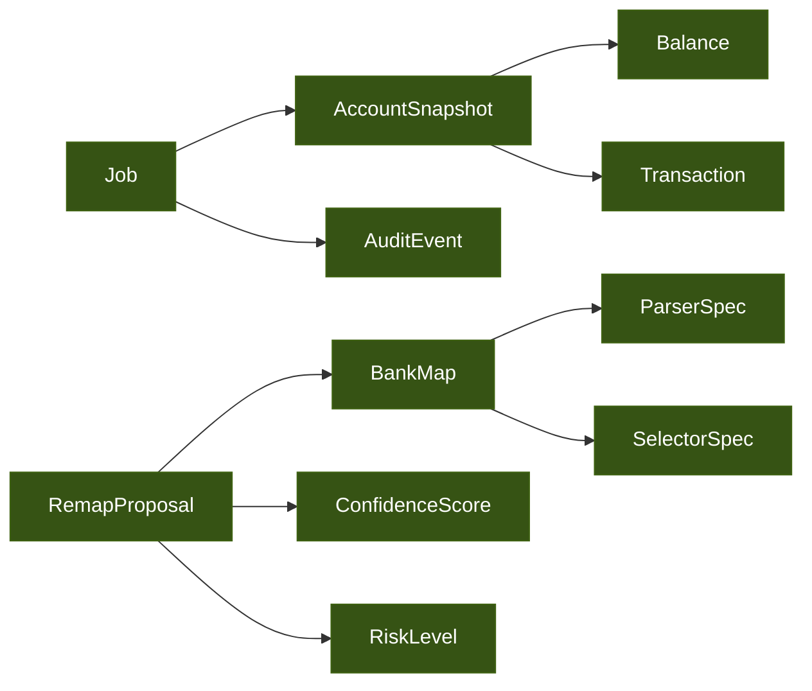

# Layout hexagonal — open-banca

Aplicamos arquitectura hexagonal (ports & adapters) sobre la base del monorepo Nx descrito en [`DECISIONS.md`](../DECISIONS.md). El **dominio** y los **casos de uso** no conocen FastAPI, Temporal, Playwright ni LiteLLM. Todo lo externo entra por **puertos** que los adaptadores implementan.

## Capas y dependencias

```mermaid
flowchart TB
    subgraph Driving["Adaptadores entrantes (driving)"]
        APIAdapter["adapters/api<br/>(FastAPI router)"]:::adapter
        OrchAdapter["adapters/orchestrator<br/>(Temporal workflows + activities)"]:::adapter
        WebhookAdapter["adapters/api/webhooks<br/>(HMAC signer + delivery worker)"]:::adapter
    end

    subgraph Application["application — use cases (orquestación pura)"]
        UC1["ExecuteScrape"]:::uc
        UC2["RemapBank"]:::uc
        UC3["ResolveOTP"]:::uc
        UC4["ApproveRemap"]:::uc
        UC5["ParseExcel"]:::uc
        UC6["DeduplicateTransactions"]:::uc
    end

    subgraph Domain["domain — entities, value objects, ports"]
        Entities["Entities<br/>(Job, BankMap, Account,<br/>Transaction, Balance,<br/>RemapProposal, AuditEvent)"]:::dom
        Ports["Ports (interfaces puras)<br/>BankMapPort, BrowserDriverPort,<br/>LLMPort, JobStorePort,<br/>EventBusPort, SecretStorePort,<br/>ExcelParserPort, SandboxPort,<br/>ObservabilityPort, ClockPort"]:::dom
    end

    subgraph Driven["Adaptadores salientes (driven)"]
        BrowserAdapter["adapters/browser<br/>(browser-use Mapper +<br/>Playwright Runner)"]:::adapter
        LLMAdapter["adapters/llm<br/>(LiteLLM + PydanticAI)"]:::adapter
        StorageAdapter["adapters/storage<br/>(SQLite + sqlcipher)"]:::adapter
        ParsingAdapter["adapters/parsing<br/>(Excel DSL engine)"]:::adapter
        SandboxAdapter["adapters/sandbox<br/>(Docker exec wrapper)"]:::adapter
        MapsAdapter["adapters/storage/maps<br/>(filesystem + git)"]:::adapter
        ObsAdapter["adapters/observability<br/>(OTel + Langfuse)"]:::adapter
    end

    %% Direcciones de dependencia (siempre hacia el centro)
    APIAdapter --> UC1
    APIAdapter --> UC3
    APIAdapter --> UC4
    OrchAdapter --> UC1
    OrchAdapter --> UC2
    OrchAdapter --> UC5
    OrchAdapter --> UC6
    WebhookAdapter --> UC1

    UC1 --> Entities
    UC2 --> Entities
    UC3 --> Entities
    UC4 --> Entities
    UC5 --> Entities
    UC6 --> Entities

    UC1 -.usa.-> Ports
    UC2 -.usa.-> Ports
    UC3 -.usa.-> Ports
    UC4 -.usa.-> Ports
    UC5 -.usa.-> Ports
    UC6 -.usa.-> Ports

    %% Adaptadores implementan ports
    BrowserAdapter -.implementa.-> Ports
    LLMAdapter -.implementa.-> Ports
    StorageAdapter -.implementa.-> Ports
    ParsingAdapter -.implementa.-> Ports
    SandboxAdapter -.implementa.-> Ports
    MapsAdapter -.implementa.-> Ports
    ObsAdapter -.implementa.-> Ports

    classDef dom fill:#365314,stroke:#3f6212,color:#fff
    classDef uc fill:#1e3a8a,stroke:#1e40af,color:#fff
    classDef adapter fill:#7c2d12,stroke:#9a3412,color:#fff
```

Regla de dependencia: **las flechas siempre apuntan hacia el dominio**. El dominio no importa nada; los use cases sólo importan dominio; los adaptadores importan dominio y use cases. Nunca al revés.

## Catálogo de ports

| Port | Propósito | Adaptador(es) |
|------|-----------|---------------|
| **BankMapPort** | Cargar / guardar / versionar `map.json` y `parser.json` por banco | `adapters/storage/maps` (filesystem + git) |
| **BrowserDriverPort** | Lanzar browser, navegar, click, type, descargar archivo, capturar screenshot | `adapters/browser/runner` (Playwright puro) y `adapters/browser/agent` (browser-use) |
| **LLMPort** | Completions con structured output, vision opcional, conteo de tokens y costos | `adapters/llm/litellm` (Mapper, Remapper) y `adapters/llm/pydanticai` (Validator, Judge) |
| **JobStorePort** | CRUD jobs, transacciones canónicas, balances, audit log | `adapters/storage/sqlite` |
| **SecretStorePort** | Guardar / leer credenciales bancarias cifradas | `adapters/storage/secrets` (sqlcipher + Argon2id + AES-GCM) |
| **EventBusPort** | Emitir eventos de dominio (`JobCreated`, `OTPRequired`, `RemapProposed`...) que el delivery worker traduce a webhooks | `adapters/api/webhooks` |
| **ExcelParserPort** | Ejecutar `parser.json` sobre un `.xlsx` y devolver rows normalizadas | `adapters/parsing/excel` |
| **SandboxPort** | Crear / destruir container Docker, montar volumen de downloads, aplicar network policy | `adapters/sandbox/docker` |
| **ObservabilityPort** | Trazas, métricas, logs estructurados; abstrae OTel y Langfuse | `adapters/observability` |
| **ClockPort** | Tiempo determinístico para testing y replay | `adapters/clock/system` (prod) y `adapters/clock/fake` (tests) |
| **WorkflowEnginePort** | Iniciar workflows, enviar signals, query state | `adapters/orchestrator/temporal` |

## Use cases — responsabilidades

| Use case | Trigger | Ports usados (lectura) | Ports usados (escritura) |
|----------|---------|------------------------|--------------------------|
| **ExecuteScrape** | API o schedule | BankMapPort, SecretStorePort | JobStorePort, EventBusPort, BrowserDriverPort, ExcelParserPort, SandboxPort |
| **RemapBank** | Judge decide remap | BankMapPort, BrowserDriverPort (agent), LLMPort | BankMapPort, EventBusPort |
| **ResolveOTP** | API recibe `otp-confirmed` | JobStorePort | WorkflowEnginePort (signal) |
| **ApproveRemap** | API recibe approval HITL | JobStorePort, BankMapPort | BankMapPort (apply), EventBusPort |
| **ParseExcel** | Después de descarga | BankMapPort, ExcelParserPort | JobStorePort |
| **DeduplicateTransactions** | Después de parse | JobStorePort | JobStorePort |

Los use cases son funciones de aplicación; **no contienen reglas de dominio** (esas viven en entities) ni infraestructura (esa vive en adapters).

## Entities y value objects

Reglas que viven en entities (no en use cases):

- `Transaction` define cómo se calcula su fingerprint para dedup.
- `Balance` valida coherencia (available ≤ ledger en checking, etc.).
- `BankMap` valida que su grafo de pasos no tenga ciclos no-permitidos.
- `RemapProposal` decide auto-apply vs HITL en función de `ConfidenceScore` y `RiskLevel` (regla de [ADR-0013](../adr/0013-confidence-threshold-remap.md)).

## Mapeo a paquetes Nx

| Paquete | Capa | Contenido |
|---------|------|-----------|
| `domain/` | Domain | Entities, value objects, ports (interfaces puras). Cero deps externas. |
| `application/` | Application | Use cases. Depende sólo de `domain/`. |
| `adapters/api/` | Driving adapter | FastAPI, request/response models, HMAC signer. |
| `adapters/orchestrator/` | Driving + driven adapter | Temporal workflows (driving para use cases) y `WorkflowEnginePort` (driven para API). |
| `adapters/browser/` | Driven adapter | `runner/` (Playwright puro) + `agent/` (browser-use wrapper). |
| `adapters/llm/` | Driven adapter | LiteLLM client + PydanticAI integration. |
| `adapters/storage/` | Driven adapter | SQLite repos, sqlcipher secrets, maps filesystem+git. |
| `adapters/parsing/` | Driven adapter | Excel DSL engine. |
| `adapters/sandbox/` | Driven adapter | Docker exec wrapper. |
| `adapters/observability/` | Driven adapter | OTel + Langfuse providers. |
| `banks/<bank>/` | Data + tests | `map.json`, `parser.json`, fixtures, tests por banco. |
| `shared/schemas/` | Cross-cut | Pydantic models comunes (request/response, eventos). |

## Por qué hexagonal (en este proyecto)

1. **Swap de ejecutor** — si Playwright no rinde, podemos cambiar a otro driver implementando `BrowserDriverPort` sin tocar use cases.
2. **Swap de LLM provider** — el split LLMPort + LiteLLM hace que cambiar Anthropic ↔ otro proveedor con vision sea config.
3. **Testing real** — los use cases se testean contra fakes de los ports sin levantar Docker, Temporal ni Chromium.
4. **Separación banco-específica** — los `banks/<bank>/` son sólo data; ningún adapter depende de un banco concreto.
5. **Auditoría** — la lista de ports = la lista de cosas que tocan el mundo exterior. Útil para security review y para diseñar el sandbox.

## Referencias cruzadas

- Containers físicos: [`macro.md`](./macro.md)
- Quién invoca qué use case: [`multi-agent.md`](./multi-agent.md), [`data-flow.md`](./data-flow.md)
- Decisiones que justifican el split: [ADR-0001](../adr/0001-opcion-a-mapper-runner-split.md), [ADR-0004](../adr/0004-multi-agent-architecture.md), [ADR-0005](../adr/0005-pydanticai-litellm.md)
