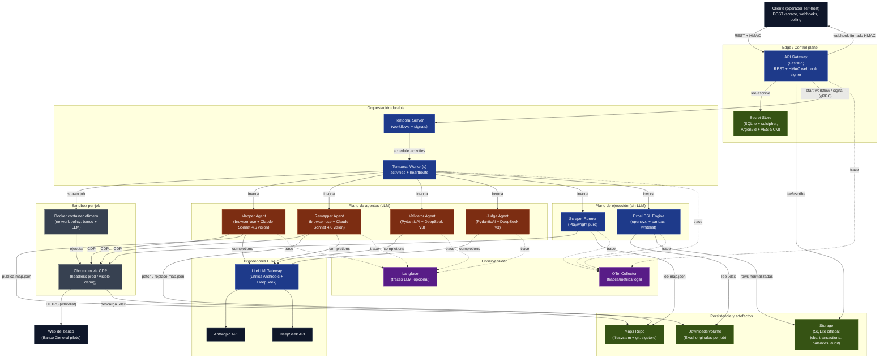

# Arquitectura macro — open-banca

Vista C4 nivel 2 (containers + responsabilidades). Este documento es la entrada principal a la arquitectura. Las vistas finas (hexagonal, multi-agent, data-flow) se derivan de acá.

## Contexto

`open-banca` es una API REST self-hostable que expone, detrás de un contrato simple (`POST /scrape`, webhooks), la captura de información financiera desde bancos panameños que no ofrecen Open Banking. Internamente combina **agentes LLM** (mapping y supervisión), un **runner determinístico** (ejecución repetible) y **Temporal** (durable execution con OTP pause/resume).

Principios macro:

1. **Separación LLM / determinismo** — los LLMs producen artefactos (`map.json`); la ejecución de cada scrape es Playwright puro sin LLM.
2. **Excel-first** — el dato fuente es el reporte oficial del banco; nunca DOM scrape de transacciones.
3. **Sandbox por job** — cada scrape corre en un container Docker efímero con network whitelist al dominio del banco + APIs LLM.
4. **Self-host completo** — sin dependencia obligatoria de servicios cloud propietarios. Langfuse y Temporal opcionales pero auto-hospedables.
5. **AGPL-3.0** — presión institucional intencional.

## Diagrama de containers

## Containers — responsabilidades

### Edge / control plane

- **API Gateway (FastAPI)** — único surface público. Endpoints: `POST /scrape`, `GET /jobs/{id}`, `POST /jobs/{id}/otp-confirmed`, `POST /remaps/{id}/approve`. Firma webhooks con HMAC-SHA256.
- **Secret Store** — credenciales bancarias del cliente cifradas at-rest. KDF Argon2id sobre passphrase maestra del operador, AES-GCM por registro, persistido en SQLite con sqlcipher.

### Orquestación durable

- **Temporal Server** — coordina workflows. Crítico para OTP pause/resume vía `signal` y para retries declarativos.
- **Temporal Worker** — proceso(s) que materializan activities. Una activity = un paso bounded (login, descarga, parse, validate). Heartbeat conserva contexto de browser durante OTP.

### Plano de agentes (LLM)

- **Mapper / Remapper** — agentes que conducen el browser para producir o reparar `map.json`. Construidos sobre la librería `browser-use` (CDP, event bus, tools, sensitive_data injection ya resueltos). Modelo: Claude Sonnet 4.6 con vision.
- **Validator** — inspecciona el resultado parseado del Excel y emite verdicts de sanidad (totales coherentes, fechas dentro de rango, sin nulls inesperados). Modelo: DeepSeek V3 texto.
- **Judge** — invocado cuando Runner o Validator detectan ruptura. Decide entre `retry`, `partial_remap`, `full_remap`, `abort`, `escalate_human`. Modelo: DeepSeek V3 texto.

### Plano de ejecución (sin LLM)

- **Scraper Runner** — interpreta `map.json` con Playwright puro. Determinístico, replay-able, cero llamadas LLM.
- **Excel DSL Engine** — interpreta `parser.json` (DSL whitelisted: `parse_date`, `extract_regex`, `normalize_amount`). Sin Python arbitrario. Encaja con sandbox.

### Sandbox

- **Docker container efímero** — uno por scrape job. Network policy: HTTPS al dominio del banco + endpoints LLM whitelisted (api.anthropic.com, api.deepseek.com); drop everything else. Sin filesystem persistente cross-job; volumen montado para Excel originales.
- **Chromium via CDP** — single-tab browser controlado tanto por `browser-use` (en mapping) como por el Runner (en scrape).

### Persistencia y artefactos

- **Maps Repo** — filesystem + git. Cada `map.json` versionado, diffable, firmado con sigstore/cosign en releases oficiales. `community/` carpeta separada con warning.
- **Storage (SQLite cifrada)** — jobs, transacciones canónicas, balances, audit log, eventos webhook entregados.
- **Downloads volume** — Excel originales del banco por job. TTL configurable.

### Observabilidad

- **Langfuse** (opcional, self-hosted) — traces LLM cross-agent: prompts, completions, costos, latencia.
- **OTel Collector** — traces/metrics/logs del resto del stack (API, Worker, Runner, Parser).

### Plano LLM

- **LiteLLM Gateway** — unifica el cliente. Cambiar de Anthropic a otro proveedor con vision = un cambio de config. Aísla los agentes del SDK del proveedor.

## Protocolos entre containers

| Origen | Destino | Protocolo |
|--------|---------|-----------|
| Cliente | API | REST/HTTPS, JSON |
| API | Cliente | Webhook HTTPS firmado HMAC-SHA256 |
| API | Temporal Server | gRPC (SDK Temporal) |
| Temporal Server | Worker | gRPC (long-poll task queue) |
| Worker | Docker | Docker socket / engine API |
| Mapper / Remapper / Runner | Browser | Chrome DevTools Protocol (CDP) sobre WebSocket local |
| Browser | Banco | HTTPS |
| Agentes | LiteLLM | HTTPS REST |
| LiteLLM | Anthropic / DeepSeek | HTTPS REST |
| Agentes | Langfuse | HTTPS REST async |
| Todo el stack | OTel Collector | OTLP gRPC |
| Worker → API resume | Temporal signal (gRPC) |

## Concurrencia y aislamiento

- Un scrape job = un Temporal workflow = un Docker container = una sesión de browser. No multiplexamos cuentas dentro del mismo container.
- Múltiples jobs simultáneos = múltiples containers paralelos, limitados por recursos del host. El Worker enqueue lo regula.
- El sandbox no comparte cookies, localStorage ni filesystem entre jobs ([ADR-0015](../adr/0015-no-session-persistence-v1.md)).

## Failure domains

- **API caído** → no se aceptan nuevos scrapes; jobs en vuelo siguen porque viven en Temporal.
- **Temporal caído** → workflows pausados, recuperan estado al volver (durable execution).
- **LLM provider down** → Mapper/Remapper fallan con error claro; Scraper Runner sigue corriendo (no depende de LLM); Validator/Judge degradan a reglas básicas (cuando el ADR de fallback se materialice).
- **Banco down / cambia el flujo** → Runner detecta selector roto → Judge → Remapper. Si Remapper falla → escalate human (webhook `job.human_required`).

## Referencias cruzadas

- Layout interno por capas: [`hexagonal.md`](./hexagonal.md)
- Detalle de los 5 agentes: [`multi-agent.md`](./multi-agent.md)
- Flujo end-to-end de un scrape: [`data-flow.md`](./data-flow.md)
- Decisiones que sostienen este diseño: [`../adr/`](../adr/)
- Overview del producto: [`../00-overview.md`](../00-overview.md)
