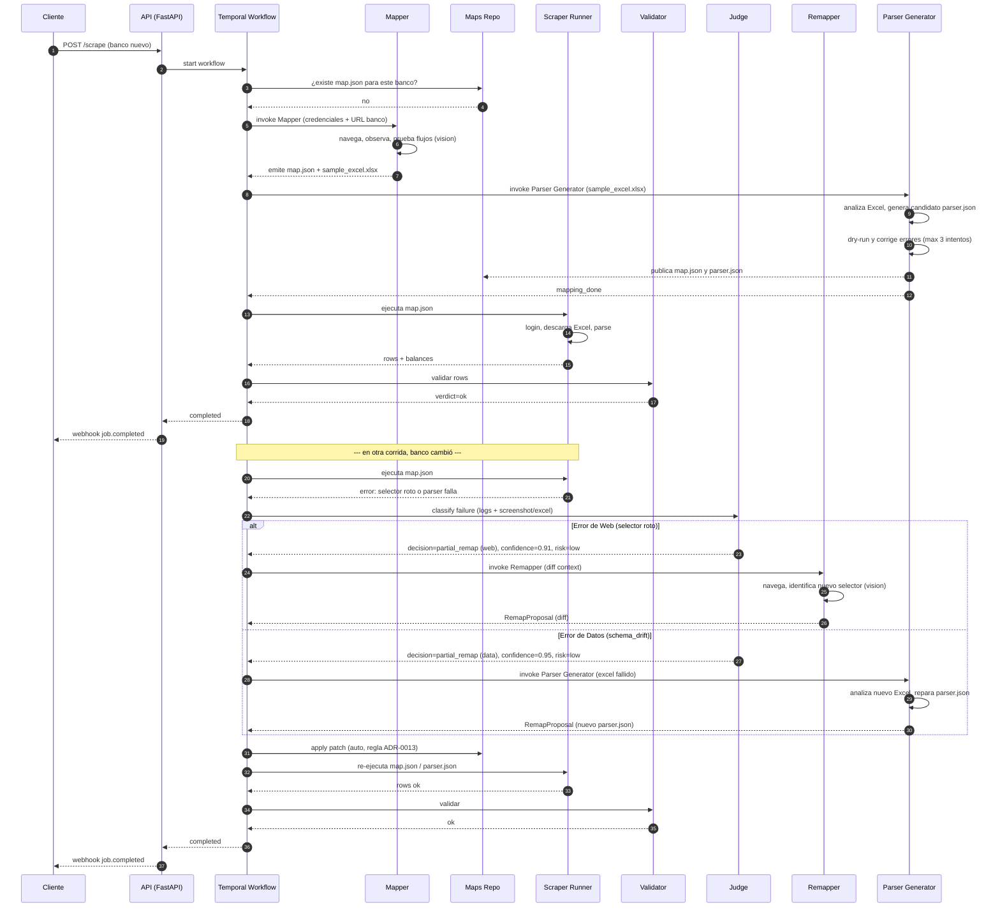
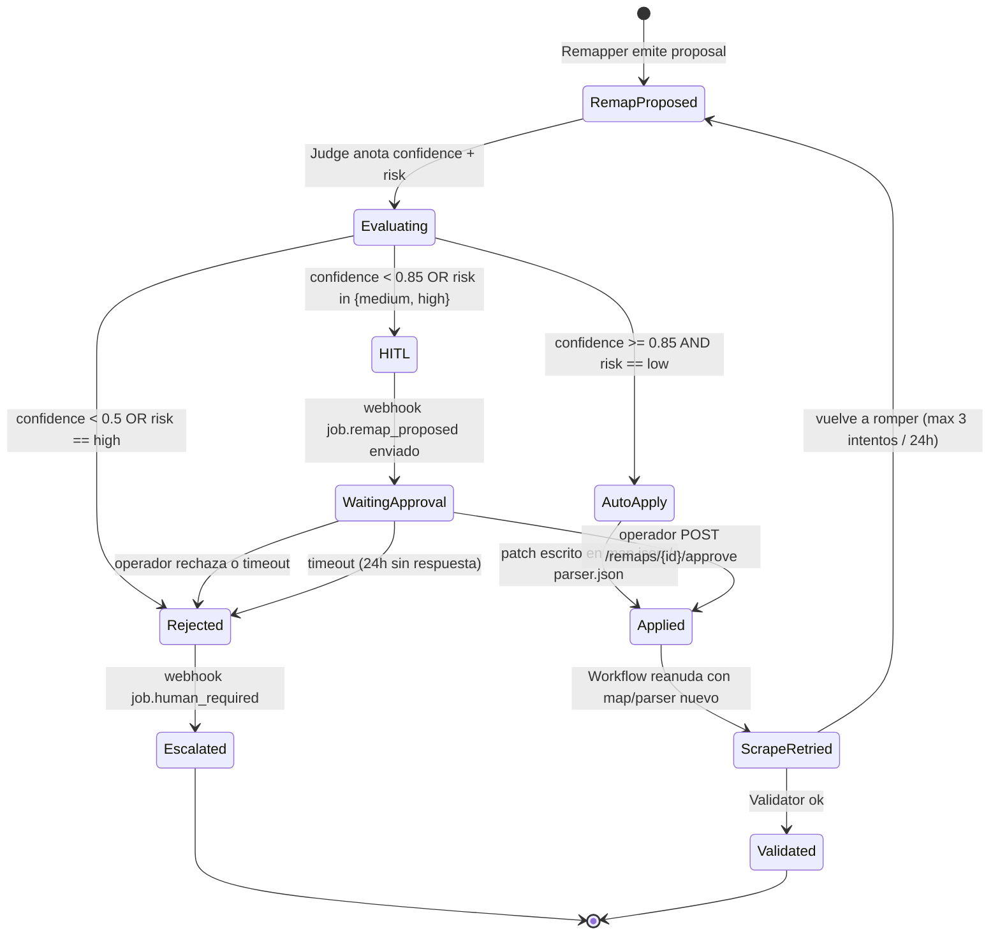

# Orquestación multi-agente — open-banca

Seis roles, dos modelos LLM distintos, un runner sin LLM. La separación es intencional: control de costo, determinismo del scrape, responsabilidad clara cuando algo rompe.

## Tabla de agentes

| Agente | Rol | Modelo | Trigger | Output | Cost guardrail |
|--------|-----|--------|---------|--------|----------------|
| **Mapper** | Explora la web del banco y produce `map.json` declarativo de navegación. Descarga el primer Excel. One-time por banco. | Claude Sonnet 4.6 (vision) vía LiteLLM | Banco nuevo o `RemapBank` con `full_remap` | `map.json` candidato, sample Excel | Token budget alto (one-time); cap LLM/job; max 3 remaps/banco/24h |
| **Parser Generator** | Genera `parser.json` (DSL determinista) analizando el sample Excel extraído por el Mapper, o repara un `parser.json` roto ante un `schema_drift`. | Claude Sonnet 4.6 o DeepSeek V3 (texto) | Éxito del Mapper (sample Excel disponible) o decisión `partial_remap (data)` del Judge | `parser.json` validado | Max 3 iteraciones de corrección en loop de dry-run |
| **Scraper Runner** | Ejecuta `map.json` (para navegar) y `parser.json` (para datos) cada corrida. Determinístico, replay-able. | **Sin LLM** (Playwright + Parser Engine) | Cada `POST /scrape` o schedule | Excel descargado + rows parseadas | $0 LLM cost |
| **Validator** | Inspecciona el resultado parseado: totales, fechas, nulls, schema. Emite verdict + razones. | DeepSeek V3 (texto) | Después del parse en cada job | `ValidationVerdict` (ok / suspicious / broken) | DeepSeek ~10× más barato que Claude texto |
| **Judge** | Cuando Runner o Validator detectan ruptura, decide acción. | DeepSeek V3 (texto) | `JobBroken` event, `ValidationFailed` event | Decision: `retry` / `partial_remap` (web/data) / `full_remap` / `abort` / `escalate_human` + `confidence` + `risk` | Texto-only, costo bajo |
| **Remapper** | Reabre el browser, identifica el cambio, propone parche al `map.json`. | Claude Sonnet 4.6 (vision) vía LiteLLM | Judge emite `partial_remap` o `full_remap` | `RemapProposal` (diff + confidence + risk) | Token budget per attempt; cap LLM/job |

## Secuencia high-level — happy path + remap

## Diagrama de estados — confidence/risk → auto-apply vs HITL

Regla operativa de [ADR-0013](../adr/0013-confidence-threshold-remap.md): el Remapper produce un parche; el sistema decide si aplicarlo automáticamente o pedir aprobación humana.

## Por qué cada agente

### Mapper — separado del Scraper

Si dejáramos al LLM "scrapear cada corrida", pagaríamos: latencia (segundos por step), costo (~$0.10–$1 por job según volumen) y no-determinismo (mismo banco, mismo flujo, dos resultados distintos). Separar Mapper del Runner permite que el Runner sea Playwright puro: rápido, repetible, debuggable con HAR + video. ([ADR-0001](../adr/0001-opcion-a-mapper-runner-split.md))

### Parser Generator — especializado en datos

Extrae la responsabilidad de comprender formatos de Excel fuera del Mapper. El Mapper lidia con el browser (DOM, vision, login, clicks) mientras que el Parser Generator opera puramente sobre datos tabulares (CSV/Markdown) para emitir el `parser.json`. Esto permite aislar errores, usar modelos de texto más baratos para la etapa de datos, y re-generar parsers si un formato cambia sin tener que correr todo el Mapper visual.

### Validator — pre-filtro barato

DeepSeek V3 texto le pega a "¿estos 142 rows tienen sentido?" mucho más barato que Claude. Filtra el 95% de los casos donde todo está ok antes de involucrar al Judge.

### Judge — decisión pequeña, alto impacto

El Judge no produce contenido ni ejecuta acción; sólo elige una de 5 opciones. Es un classifier con razonamiento. DeepSeek encaja perfecto porque la tarea es texto-puro y el output es enum + score.

### Remapper — separado del Mapper

Mismo modelo (Claude vision), pero distinto **prompt** y distinto **contexto** (recibe el `map.json` viejo, los logs del fallo y screenshots). Operacionalmente es otro agente: presupuesto separado, métricas separadas, política de retry separada. Esa separación importa para observabilidad y cost guardrails.

### Scraper — sin LLM, religiosamente

El runner consume `map.json` y `parser.json`. Cualquier ambigüedad en runtime es un bug del map, no algo que el runner deba resolver "creativamente". Esto hace que: (a) el runner sea testeable con replay HAR sin pegarle al banco; (b) un job en producción tenga costo LLM cero salvo que algo se rompa.

## Cost & risk guardrails

- **Per-job LLM budget**: cap `$0.50` total. Validator+Judge típicamente bajo $0.01; Mapper/Remapper consumen el grueso.
- **Per-bank remap limit**: max 3 intentos por banco por 24h. Excedido → circuit breaker, jobs fallan rápido con `bank_in_repair`.
- **Per-agent token budget**: cada agente recibe un cap de tokens; si lo excede, abort con `budget_exceeded`.
- **Auto-apply gate**: sólo `confidence >= 0.85 AND risk == low`. Cualquier remap dudoso pasa por humano.
- **Login guardrail**: 2 logins fallidos consecutivos → circuit breaker 1h por cuenta.

## Observabilidad por agente

Cada agente reporta a Langfuse con `trace_id = job_id` y `span = agent_name`, permitiendo armar el árbol completo: Mapper → (n × Runner) → Validator → Judge → Remapper. Métricas exportadas por OTel: `agent_invocations_total`, `agent_token_cost_usd`, `agent_latency_seconds`, `agent_failures_total`.

## Referencias cruzadas

- Vista física: [`macro.md`](./macro.md)
- Capas e ports: [`hexagonal.md`](./hexagonal.md)
- Flujo paso a paso: [`data-flow.md`](./data-flow.md)
- Decisiones: [ADR-0001](../adr/0001-opcion-a-mapper-runner-split.md), [ADR-0004](../adr/0004-multi-agent-architecture.md), [ADR-0006](../adr/0006-vision-split-claude-deepseek.md), [ADR-0013](../adr/0013-confidence-threshold-remap.md), [ADR-0014](../adr/0014-browser-use-as-mapper-foundation.md)
