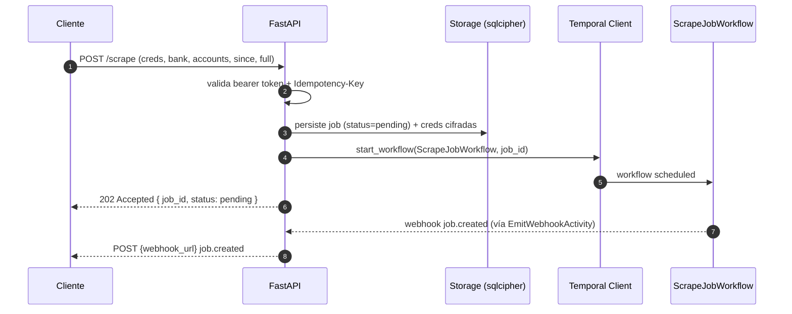

# API REST (FastAPI)

Contrato HTTP único entre operador / cliente integrador y open-banca. Expone el ciclo de vida de un `scrape job`, gestiona la confirmación manual de OTP y arbitra la aprobación de remaps.

Para una vista consolidada de cómo los endpoints leen/escriben storage, disparan Temporal y entregan webhooks al cliente, ver [`../01-architecture/api-data-flow.md`](../01-architecture/api-data-flow.md).

## Sequence diagram: arranque de un job

## Flujo de datos (vista API)

El sequence diagram anterior cubre solo el arranque de `POST /scrape`. Para el mapa completo de entradas HTTP, tablas at-rest (`jobs`, `credentials`, `webhook_outbox`, etc.), señales a Temporal, webhooks salientes y lectura de resultados, ver [`../01-architecture/api-data-flow.md`](../01-architecture/api-data-flow.md) (flowchart + state machine del job). No duplica los sequence diagrams de [`../01-architecture/data-flow.md`](../01-architecture/data-flow.md).

## Endpoints

| Method | Path | Propósito |
|--------|------|-----------|
| POST | `/scrape` | Crea un nuevo scrape job |
| GET | `/jobs/{id}` | Estado actual y metadata del job |
| GET | `/jobs/{id}/result` | Datos normalizados (cuentas + transacciones) |
| POST | `/jobs/{id}/otp-confirmed` | Confirma que el cliente aceptó el push de Clave Móvil |
| POST | `/jobs/{id}/human-input` | Entrega respuesta del operador a un step `prompt_user` (pregunta de seguridad, captcha texto) — ADR-0021 |
| POST | `/jobs/{id}/cancel` | Cancela job en cualquier fase |
| POST | `/maps/{bank}/proposals/{id}/approve` | Aprueba patch de map propuesto |
| POST | `/maps/{bank}/proposals/{id}/reject` | Rechaza patch de map propuesto |
| GET | `/banks` | Lista bancos soportados + estado de su `map.json` |
| GET | `/accounts` | Lista cuentas conocidas (cacheadas tras primer scrape) |
| POST | `/webhooks/test` | Dispara un webhook sintético contra el endpoint configurado |

### POST `/scrape`

- **Request (alto nivel)**: `bank_id`, `credentials` (passthrough cifrado), `accounts` (lista vacía = todas), `full` (bool), `since` (timestamp opcional), `webhook_url`, `metadata` (libre).
- **Response 202**: `job_id`, `status: pending`, `created_at`.
- **Webhooks disparados**: `job.created` inmediato; luego `job.otp_required`, `job.progress`, `job.completed | failed | remap_proposed | human_required` según el ciclo.
- **Errores**: `400` payload inválido, `401` token, `409` `Idempotency-Key` ya consumida con payload distinto, `423` circuit breaker abierto para esa combinación banco/cuenta, `429` rate limit.

### GET `/jobs/{id}`

- **Response 200**: `job_id`, `status`, `current_step`, `progress` (0..1), `attempts`, `cost_llm_usd`, `created_at`, `updated_at`, `error` (si aplica).
- **Errores**: `404` job inexistente.

### GET `/jobs/{id}/result`

- **Response 200**: payload normalizado bajo schema canónico (cuentas + transacciones) con discriminator `account_type`. Vacío hasta que job termine en `completed`.
- **Errores**: `404`, `409` job no completado.

### POST `/jobs/{id}/otp-confirmed`

- **Request**: vacío o con `confirmation_id` opcional para auditoría.
- **Response 204**: signal entregado a workflow.
- **Webhooks**: ninguno propio; el job continúa y dispara `job.progress` siguientes.
- **Errores**: `404` job, `409` job no está en `otp_required`, `410` ya expiró el hard cap de 4 min.

### POST `/jobs/{id}/human-input`

Resuelve un step `prompt_user` pendiente (ADR-0021). Análogo a `/otp-confirmed` pero carga **valor textual de retorno**.

- **Request**: `{ field_key: str (required), answer: str (required), persist: bool = true }`.
- **Validación**:
  - `field_key` matchea regex `^[a-z][a-z0-9_]{2,32}$`. Mismatch → `400 validation_error`.
  - `answer` length ≤ **256 bytes UTF-8**. Mismatch → `400 validation_error`.
  - `answer` whitelist: Unicode categories L (letras), N (números), P (puntuación), Z (separators básicos), Sm/Sc/So (símbolos comunes). Rechaza categoría Cc (control) y format chars (Cf), incl. embed direction marks. Mismatch → `400 validation_error`.
  - Rate limit: max 3 intentos por `(job_id, field_key)` durante una ventana de wait. Cuarto intento → `429 too_many_attempts`.
- **Response 204**: signal entregado a workflow.
- **Webhooks**: ninguno propio; el job continúa y dispara `job.progress` / `job.completed` / `job.failed` según outcome del step posterior.
- **Errores**:
  - `400 validation_error` — `field_key`, length, o charset inválidos.
  - `404 not_found` — job no existe.
  - `409 conflict` — job no está en `human_input_required`, **o** `field_key` no matchea el prompt actual (el body de error incluye `expected_field_key`).
  - `410 gone` — wait expiró (`human_input_expired`).
  - `429 too_many_attempts` — más de 3 intentos en la misma ventana.

**Audit log**: la operación registra `(job_id, field_key, attempt_n, sha256(answer)[0:8], persist)`. La respuesta plaintext **nunca** se loguea.

### POST `/jobs/{id}/cancel`

- **Request**: `reason` opcional.
- **Response 202**: cancelación aceptada (workflow ejecuta cleanup async).
- **Webhooks**: `job.failed` con `reason: cancelled_by_user`.

### POST `/maps/{bank}/proposals/{id}/approve` y `.../reject`

- **Request**: `reviewer_id` opcional, `note` libre.
- **Response 204**: signal entregado a `RemapBankWorkflow`.
- **Webhooks**: en `approve` el job original sigue y emite `job.progress`; en `reject` emite `job.failed` con `reason: remap_rejected`.
- **Errores**: `404` proposal, `410` proposal expiró (TTL 24 h), `409` ya resuelto.

### GET `/banks`

- **Response 200**: lista con `bank_id`, `display_name`, `country`, `map_version`, `last_successful_scrape`, `circuit_status` (`ok | open_until`).

### GET `/accounts`

- **Response 200**: lista cacheada de cuentas detectadas en runs previos. Útil para que el cliente sepa qué `account_id`s pasar en `/scrape`.

### POST `/webhooks/test`

- **Request**: `event_type`.
- **Response 204**: dispara webhook sintético firmado contra el endpoint configurado para verificar conectividad y firma.

## Idempotency

- Header obligatorio en `POST /scrape`: `Idempotency-Key` (UUID v7 recomendado).
- Storage retiene `(idempotency_key, request_hash, job_id)` por 24 h.
- Mismo key + mismo payload → devuelve job existente (200 con body original).
- Mismo key + payload distinto → `409 Conflict`.
- Endpoints `approve`/`reject`/`otp-confirmed` son idempotentes por estado del recurso (no necesitan header).

## Rate limiting

- Token bucket por bearer token. Default sugerido: 60 req/min, burst 10.
- `POST /scrape` adicional: máximo 1 job concurrente por `(bank_id, account_set_hash)`. Segundo intento devuelve `409` con referencia al job en curso.
- Cost guardrail: si la suma de `cost_llm_usd` del último 24 h excede el budget configurado por banco, `POST /scrape` devuelve `429` con `Retry-After`.

## Auth

- Bearer token estático configurado en `.env` por el operador (`OPEN_BANCA_API_TOKEN`). Sin OAuth en v1: el contrato es self-host single-org.
- Webhooks salientes firmados HMAC-SHA256 con `OPEN_BANCA_WEBHOOK_SECRET`. El cliente valida el header `X-OpenBanca-Signature` antes de procesar.
- TLS termination delegada al reverse proxy del operador (Caddy/Traefik). La API solo escucha HTTP intra-network.

## Errores: shape uniforme

`{"error": {"code": "string", "message": "string", "details": {...}}}`. Códigos relevantes: `validation_error`, `not_found`, `conflict`, `circuit_open`, `otp_expired`, `proposal_expired`, `budget_exceeded`, `rate_limited`.

## Referencias

- Webhooks payload + firma: [`adr/0011-webhook-events-hmac.md`](../adr/0011-webhook-events-hmac.md) (existente).
- Schema canónico: [`adr/0012-unified-account-schema.md`](../adr/0012-unified-account-schema.md) (existente).
- Flujos: [`03-flows/full-historical-scrape.md`](../03-flows/full-historical-scrape.md), [`03-flows/otp-pause-resume.md`](../03-flows/otp-pause-resume.md), [`03-flows/remap-approval.md`](../03-flows/remap-approval.md).
