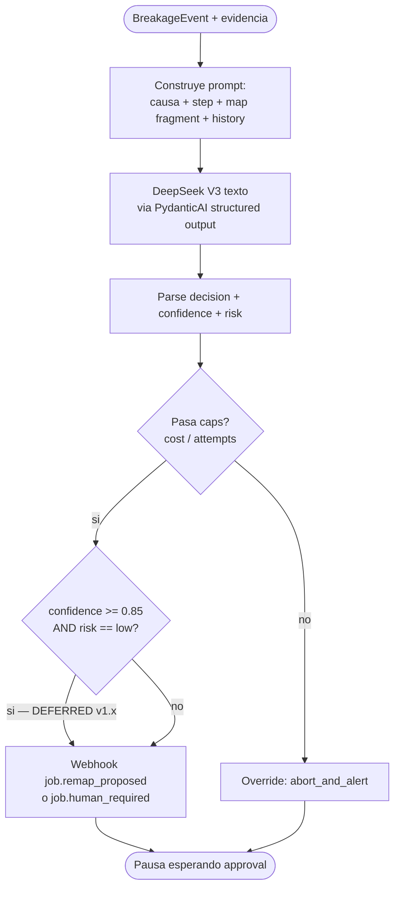
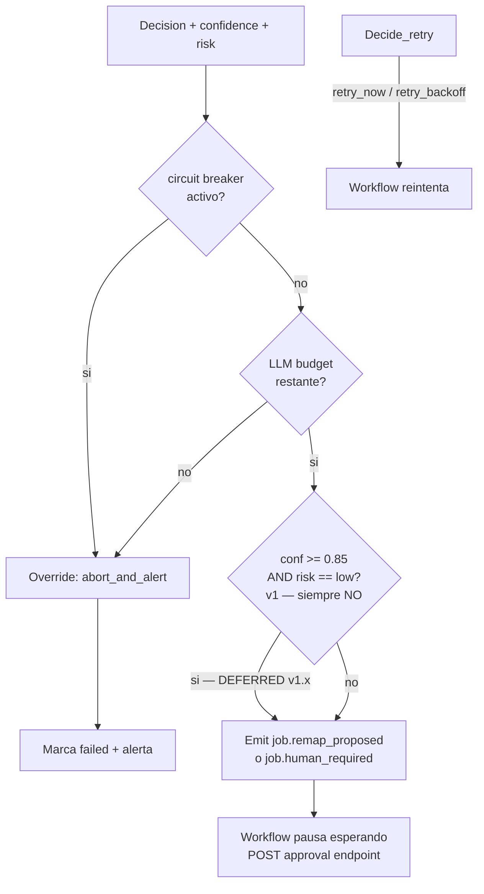

# Judge Agent

Componente de **decisión** ante ruptura del scrape. Construido con **PydanticAI + DeepSeek V3 (texto)** vía LiteLLM. Recibe evidencia (BreakageEvent + ValidationReport + screenshot + último step + map.json relevante) y decide qué hacer: reintentar, re-mapear parcial, re-mapear total, abortar, o escalar a humano.

El Judge **nunca toca el browser** ni ejecuta código. Sólo razona sobre evidencia y emite una decisión estructurada con `confidence` y `risk`.

## Contrato

| Entrada | Detalle |
|---------|---------|
| `breakage` | `BreakageEvent` del Scraper Runner (cause, step_id, evidence). |
| `validation_report` (opcional) | Si la ruptura ocurrió post-extracción. |
| `screenshot_at_break` | Imagen del momento de la ruptura — pasada como descripción textual generada por OCR/heurístico, ya que DeepSeek es texto. |
| `last_step_executed` | Snapshot del step y sus parámetros. |
| `map_excerpt` | Fragmento relevante del `map.json` (no el archivo entero). |
| `recent_history` | Últimos N intentos del mismo banco/cuenta (tasa de fallo, decisiones previas). |

| Salida | Detalle |
|--------|---------|
| `decision` | Enum (ver tabla abajo). |
| `confidence` | 0..1. |
| `risk` | `low | medium | high`. |
| `rationale` | Texto breve con razonamiento. |
| `suggested_remap_scope` (si aplica) | `step_id` o `flow` a re-mapear. |

## Flujo de decisión

> **v1 — Auto-apply path DEFERRED.** La rama `confidence >= 0.85 AND risk == low → Auto-execute` está desactivada en v1. Todos los remaps van por HITL. Ver [ADR-0013 Amendment](../adr/0013-amendment-hitl-only-v1.md).

## Decisiones posibles

| Decisión | Cuándo | Acción del workflow |
|----------|--------|---------------------|
| `retry_now` | Causa transient (network blip, render lento). | Reintenta la activity inmediatamente. Max 3. |
| `retry_with_backoff` | Rate limit detectado, banco lento, picos de carga. | Reintenta con backoff exponencial + jitter. |
| `partial_remap` | Un step específico roto (selector cambió), resto del flow OK. | Invoca Remapper con `scope=step_id`. Si auto-apply pasa thresholds, parchea map y reintenta. |
| `full_remap` | Estructura del banco cambió (rediseño), múltiples steps fallan. | Invoca Remapper con `scope=full`. Bloquea scrapes nuevos del banco hasta validación. |
| `abort_and_alert` | Banco bloqueó IP, lockout, anti-bot agresivo. | Marca job `failed`, abre circuit breaker 1h, emite alerta. |
| `human_required` | Ambigüedad alta, confidence baja o risk alto. | Emite webhook `job.human_required` con bundle de evidencia, pausa workflow. |

## Combinaciones causa → decisión sugerida

Heurísticas que el prompt enfatiza al LLM (no son reglas hard-coded; el LLM puede desviarse con justificación):

| Cause del BreakageEvent | Contexto | Decisión sugerida |
|--------------------------|----------|-------------------|
| `selector_missing` | Sólo 1 step afectado, otros pasaron | `partial_remap` |
| `selector_missing` | >2 steps en mismo flow fallaron en últimos 24h | `full_remap` |
| `step_timeout` | Sin patrón histórico | `retry_with_backoff` |
| `step_timeout` | 3+ veces consecutivas en 1h | `partial_remap` o `abort_and_alert` |
| `http_error` 5xx | Banco caído (síntoma sistémico) | `retry_with_backoff` |
| `http_error` 4xx | Lockout / sesión inválida / 403 | `abort_and_alert` |
| `schema_drift` | Excel tiene columna nueva | `partial_remap` (parser, no map) |
| `assertion_failed` | Texto cambió ("Bienvenido" → "Hola") | `partial_remap` con bajo risk |
| `mime_mismatch` | Banco devolvió HTML en vez de XLSX | `retry_now` (puede ser sesión expirada) |
| `download_aborted` | Conexión cortada | `retry_with_backoff` |
| `widget_unsupported` | Datepicker nuevo | `human_required` (DSL probablemente necesita extensión) |
| `balance_mismatch` (de Validator) | Gap >5% | `human_required` |
| `balance_mismatch` (de Validator) | Gap <1% | `retry_now` (puede ser commission no listada) |

## Calibración de confidence y risk

El prompt instruye al modelo a calibrar así (estrategia, no reglas mecánicas):

- **Confidence alto (>=0.85)** sólo si:
  - La causa observada matchea un patrón conocido en `recent_history`.
  - La decisión propuesta tiene precedente exitoso para este banco.
  - El `map_excerpt` muestra un fragmento aislado y bien delimitado.
- **Risk low** sólo si:
  - La acción no consume credenciales adicionales (ej. `retry_now` no relogea).
  - La acción no requiere OTP del usuario.
  - No estamos cerca del cap de remaps por banco/24h.
- **Risk high** automático si:
  - Es full_remap.
  - Quedan ≤1 intentos antes del circuit breaker.
  - El usuario recibió OTP en los últimos 5 min (no quemar OTP de más).

PydanticAI fuerza structured output con validators que rechazan combinaciones inválidas (ej. `decision=full_remap` con `risk=low` se rechaza y se re-prompts).

## Decision routing

> **v1 — Auto-apply path deferred to v1.x.** El nodo `Th → si → Decide` está desactivado. En v1, `partial_remap` y `full_remap` siempre emiten webhook y esperan HITL, independientemente de `confidence` y `risk`. Los valores de `confidence` y `risk` se persisten para instrumentación (baseline de calibración, 90 días). Ver [ADR-0013 Amendment](../adr/0013-amendment-hitl-only-v1.md).

## Lo que el Judge **no** hace

- No ejecuta el remap — eso lo hace Remapper (otro agente, mismo motor que Mapper).
- No habla con el browser ni con el banco.
- No persiste decisiones — el workflow lo hace en su event ledger.
- No mira data financiera real, sólo metadata y estructura — minimiza superficie de leak vía LLM logs.

## Referencias

- ADR-0013 confidence threshold: [`../adr/0013-confidence-threshold-remap.md`](../adr/0013-confidence-threshold-remap.md).
- ADR-0013 Amendment — v1 HITL-only: [`../adr/0013-amendment-hitl-only-v1.md`](../adr/0013-amendment-hitl-only-v1.md).
- Validator que alimenta evidencia: [`validator-agent.md`](./validator-agent.md).
- Mapper / Remapper que ejecutan acción: [`mapper-agent.md`](./mapper-agent.md).
- Cost guardrails: [`../05-operations/cost-guardrails.md`](../05-operations/cost-guardrails.md).
- Detección de ruptura (BreakageEvent): [`scraper-runner.md`](./scraper-runner.md).
