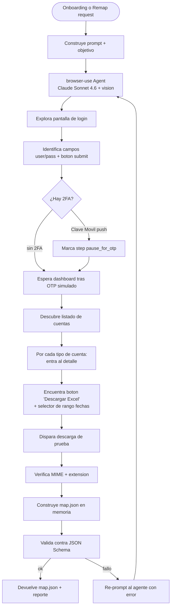
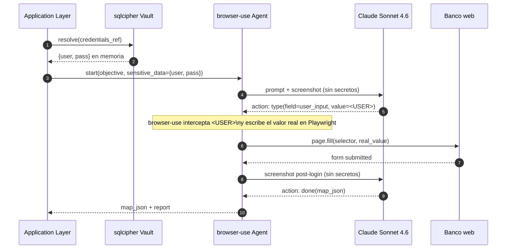

# Mapper Agent

Componente responsable del **first-time mapping** de un banco. Construido sobre la librería `browser-use` con Claude Sonnet 4.6 + vision como motor de razonamiento. Su única salida útil es un `map.json` declarativo y validado, consumido luego por el Scraper Runner sin LLM (ver [`scraper-runner.md`](./scraper-runner.md)).

El Mapper sólo corre en dos momentos: (a) onboarding de un banco nuevo, (b) full-remap disparado por Judge. En operación estable **no se invoca nunca**.

## Contrato de entrada/salida

| Entrada | Detalle |
|---------|---------|
| `bank_id` | Identificador canónico (ej. `banco_general`). |
| `entry_url` | URL de banca en línea pública. |
| `objective` | Texto en español: "loguear, descargar Excel de movimientos para todas las cuentas en rango D1..D2". |
| `credentials_ref` | Handle al vault sqlcipher; el agente jamás ve los valores reales (ver `sensitive_data` abajo). |
| `account_types_target` | Set: `savings`, `checking`, `credit_card`. |
| `viewport`, `locale`, `timezone` | Configuración del browser context. |

| Salida | Detalle |
|--------|---------|
| `map.json` | Documento declarativo (estructura abajo). |
| `mapping_report` | Resumen: pasos explorados, screenshots clave, hallazgos, riesgos. |
| `confidence` | 0..1 self-reported (input para Judge si es remap). |

## Estructura conceptual de `map.json`

| Campo | Propósito |
|-------|-----------|
| `bank` | Identificador del banco. |
| `version` | Semver del map; bump manual o por Remapper. |
| `auth_flow[]` | Steps ordenados para login (incluye fase OTP marcada con `pause_for_otp: true`). |
| `download_flow[]` | Steps por tipo de cuenta para llegar al export Excel. Usa `for_each_account`. |
| `parser_ref` | Nombre del `parser.json` asociado (ver [`parser.md`](./parser.md)). |
| `quirks` | Notas de comportamiento del banco (timeouts inusuales, banners modales, etc.). |
| `success_criteria` | Asserts post-flow (texto en navbar, presencia de tabla de cuentas, etc.). |

Validado contra JSON Schema antes de aceptar; se rechaza si referencia step types fuera de la whitelist del Scraper Runner.

## Flujo del agente

## Tools disponibles para el agente

`browser-use` expone un set acotado. El Mapper no recibe nada fuera de esta lista:

| Tool | Propósito | Nota |
|------|-----------|------|
| `navigate(url)` | Carga URL en el contexto. | Sólo dominio del banco + recursos del banco. |
| `click(selector_hint)` | Click por descripción/coords. | Agente decide selector estable a posteriori. |
| `type(field_hint, value_ref)` | Escribe valor. **No expone el valor al modelo.** | Mecanismo `sensitive_data` de browser-use. |
| `screenshot()` | Captura visual para vision. | Auto-emitido por turn. |
| `extract_dom(scope)` | Devuelve DOM resumido del frame. | Sirve para inferir selectores estables. |
| `wait(condition, timeout)` | Espera por selector/network idle. | |
| `read_url()` | Devuelve URL actual. | Detecta redirects post-login. |
| `download_intent(selector_hint)` | Marca el clic que dispara el Excel. | Consume el download event. |
| `done(map_json)` | Termina con artifact. | Único exit válido. |

Tools fuera del set (ejecutar JS arbitrario, leer cookies, etc.) están **explícitamente prohibidas**.

## Inyección de credenciales — `sensitive_data`

Las credenciales del operador **nunca** entran al prompt del LLM. Se inyectan así:

El LLM ve placeholders (`<USER>`, `<PASS>`); browser-use sustituye en el momento de ejecución dentro del browser. Si el agente intenta leer el valor (ej. tool `extract_dom` sobre un input de password) se devuelve mascarado.

### Pre-LLM PII redact filter

Una vez que el agente completa el login, el banco renderiza en el DOM y en los screenshots datos personales del titular (nombre, número de cuenta, saldos). Estos datos se redactan **antes** de enviar el payload a LiteLLM / Claude Sonnet 4.6:

- **Capa 1 (texto/DOM)**: regex sobre el texto de los mensajes redacta números de cuenta, nombres en selectores marcados como `"pii": true` en `map.json`, y saldos numéricos (reemplazados por orden de magnitud `[BAL~10K]`).
- **Capa 2 (imagen/screenshot)**: bloque sólido sobre regiones definidas en `pii_regions[]` del `map.json`. No opera en el primer run de onboarding (el map no existe aún — gap documentado en threat T18).

Ver [ADR-0020 — PII redact at LLM boundary](../adr/0020-pii-redact-llm-boundary.md) y amenaza **T18** en el threat model.

## Límites operativos

| Cap | Valor por defecto | Razón |
|-----|-------------------|-------|
| `max_steps` | 60 | Mapping de Banco General toma ~25-35 steps; margen para exploración. |
| `max_tokens_input` | 1.5M acumulado | Vision pesa; Sonnet 4.6 con prompt caching mitiga costo. |
| `max_tokens_output` | 64k acumulado | El JSON final es chico; budget para razonamiento. |
| `wallclock_timeout` | 8 min | Si excede, abort y emit `mapping.failed`. |
| `screenshot_budget` | 80 imágenes | Limita explosión de tokens vision. |
| `cost_cap_usd` | $0.40 | Subset del cap global $0.50/job. |

Excedido cualquier cap → `mapping.aborted` con razón. No hay fallback automático: requiere intervención del maintainer.

## Validación post-mapping

Antes de aceptar el `map.json`:

1. **Schema validation** — JSON Schema strict; rechaza step types fuera de whitelist.
2. **Dry-run sin creds** — Scraper Runner ejecuta hasta el primer `pause_for_otp` con creds dummy; verifica que selectores resuelvan.
3. **Diff vs map anterior** (si es remap) — alimenta input de Judge para confidence scoring.
4. **Lint** — selectores demasiado frágiles (`nth-child`, índices absolutos, clases generadas) marcan warning.

## Lo que el Mapper **no** hace

- No escribe el `parser.json` del Excel — eso es responsabilidad de un parser-author flow separado (manual hoy, agentic v2).
- No decide si auto-aplicar un remap — eso lo decide Judge (ver [`judge-agent.md`](./judge-agent.md)).
- No persiste estado entre runs — cada invocación es stateless.
- No habla con el banco fuera del browser context sandbox.

## Referencias

- Scraper Runner que consume el output: [`scraper-runner.md`](./scraper-runner.md).
- Judge que valida remaps: [`judge-agent.md`](./judge-agent.md).
- Parser asociado: [`parser.md`](./parser.md).
- ADR-0014 browser-use como base: [`../adr/0014-browser-use-as-mapper-foundation.md`](../adr/0014-browser-use-as-mapper-foundation.md).
- ADR-0013 confidence threshold: [`../adr/0013-confidence-threshold-remap.md`](../adr/0013-confidence-threshold-remap.md).
