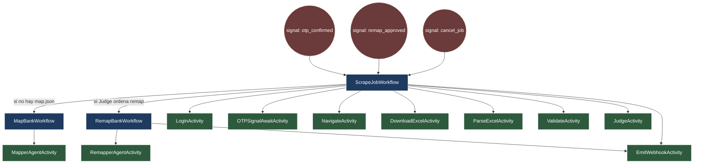
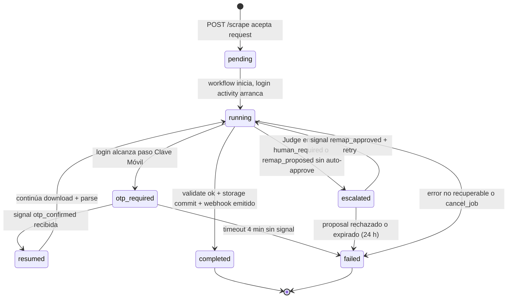
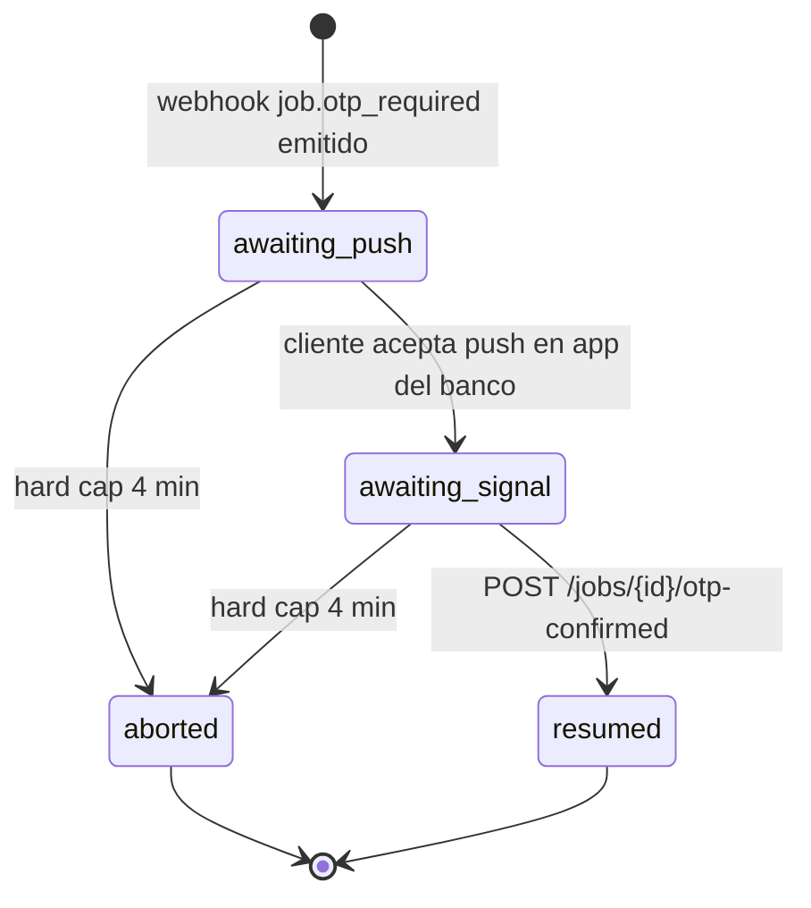

# Orchestrator (Temporal)

Capa de durable execution que coordina cada `scrape job`. Resuelve OTP pause/resume, retries, recovery post-crash y handoff con agentes LLM sin perder determinismo.

## Topología de workflows y activities

## Inventario

| Nombre | Tipo | Idempotency | Retry policy | Timeout | Heartbeat |
|--------|------|-------------|--------------|---------|-----------|
| `ScrapeJobWorkflow` | workflow | `idempotency_key` del request | N/A (orquesta) | sin cap (vive lo que dure) | N/A |
| `MapBankWorkflow` | child workflow | `bank_id + map_version_target` | manual via Judge | 30 min | N/A |
| `RemapBankWorkflow` | child workflow | `bank_id + breakage_hash` | 1 intento (los siguientes pasan por Judge) | 20 min | N/A |
| `LoginActivity` | activity | hash de creds + nonce | exp backoff, 2 intentos máx | start-to-close 90 s | cada 10 s mientras espera login |
| `OTPSignalAwaitActivity` | activity (long-running) | `job_id` | sin retry | start-to-close 4 min (hard cap) | cada 15 s manteniendo browser context |
| `NavigateActivity` | activity | `job_id + step_id` | exp backoff, 3 intentos | 30 s por step | cada 5 s en steps largos |
| `DownloadExcelActivity` | activity | `job_id + account_id + period` | exp backoff, 3 intentos | 2 min | cada 10 s durante descarga |
| `ParseExcelActivity` | activity (sync, threadpool) | hash del archivo | 1 intento (parser determinístico) | 60 s | N/A |
| `ValidateActivity` | activity | hash del payload normalizado | 2 intentos | 60 s | N/A |
| `JudgeActivity` | activity | hash del `BreakageEvent` | 1 intento | 30 s | N/A |
| `MapperAgentActivity` | activity (long-running) | `bank_id + run_id` | sin retry (caro) | 20 min | cada 30 s, reporta paso explorado |
| `RemapperAgentActivity` | activity (long-running) | `bank_id + breakage_hash + run_id` | sin retry | 15 min | cada 30 s |
| `EmitWebhookActivity` | activity | `event_id` (UUID v7) | exp backoff, 5 intentos, max 1 h | 10 s por intento | N/A |

Idempotency notes: cada activity recibe el `job_id` y un `step_id` lógico; el ledger persiste resultado para que un replay no re-ejecute side-effects (descarga, webhook, escritura de `map.json`).

## Signals: input asincrónico sin romper determinismo

`ScrapeJobWorkflow` declara handlers para tres signals externos. Llegan vía `Temporal Client` desde la API y el workflow los espera con primitivas determinísticas (no `time.sleep`, no I/O directo):

- `otp_confirmed` — disparado por `POST /jobs/{id}/otp-confirmed`. Desbloquea `OTPSignalAwaitActivity`.
- `remap_approved` — disparado por `POST /maps/{bank}/proposals/{id}/approve`. Reanuda el job pausado tras `job.remap_proposed`.
- `cancel_job` — disparado por `POST /jobs/{id}/cancel`. Workflow ejecuta cleanup (cerrar browser, marcar job como `cancelled`).

El workflow nunca llama APIs externas directamente: toda interacción con red, disco o LLM ocurre dentro de activities. El estado del workflow vive en variables locales que Temporal serializa en el event history; un crash del worker reanuda exactamente desde el último evento.

## Estados del job

## Sub-estados de `otp_required`

Mientras el job vive en `otp_required`, `OTPSignalAwaitActivity` envía heartbeats cada 15 s para mantener vivo el browser context (la sesión bancaria expira a ~5 min). El context se re-asocia tras crash del worker porque el heartbeat carga el `browser_session_token` referencia al sandbox container.

## Garantías

- **Determinismo**: workflows usan `workflow.now()`, `workflow.uuid4()`, `workflow.sleep()`. Toda lógica no determinística (random, llamadas externas) vive en activities.
- **Recovery**: crash del worker durante OTP pause no pierde el job; el siguiente worker reanuda en el mismo punto del event history.
- **Cost control**: `MapperAgentActivity` y `RemapperAgentActivity` chequean budget LLM (`$0.50/job`) antes de invocar; si lo exceden, abortan con `ApplicationError(non_retryable=True)`.
- **Circuit breaker**: dos fallos consecutivos de `LoginActivity` por banco/cuenta marcan circuit abierto en storage; nuevos `ScrapeJobWorkflow` para esa combinación abortan en preflight por 1 h.

## Referencias

- Flujos end-to-end: [`03-flows/full-historical-scrape.md`](../03-flows/full-historical-scrape.md), [`03-flows/incremental-scrape.md`](../03-flows/incremental-scrape.md)
- OTP detalle: [`03-flows/otp-pause-resume.md`](../03-flows/otp-pause-resume.md)
- Decisión arquitectural: [`adr/0003-temporal-orchestration.md`](../adr/0003-temporal-orchestration.md)
