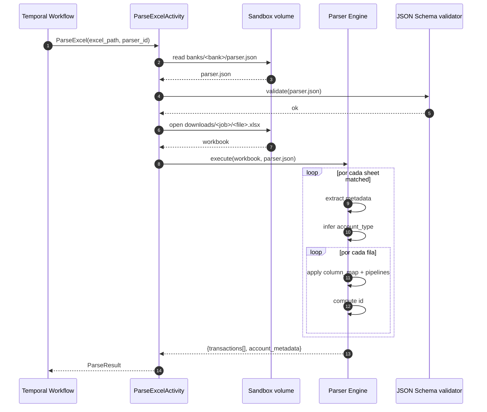

# Excel Parser (DSL declarativo)

Componente que transforma un archivo Excel descargado del banco en records normalizados al schema canónico. **No ejecuta Python arbitrario**: lee un `parser.json` declarativo que describe sheets, columnas y transformaciones usando un set finito de helpers whitelisted.

## Por qué declarativo

| Razón | Detalle |
|-------|---------|
| **Sandbox-friendly** | El sandbox por job (Docker + network policy) no puede correr `eval()` ni cargar módulos arbitrarios sin debilitar su modelo de amenaza. Un DSL JSON es data, no código. |
| **Community-safe** | Maps oficiales firmados con sigstore + `community/` folder con warning. Si los maps fueran Python, un fork malicioso podría hacer RCE en cualquier deploy. DSL elimina la superficie. |
| **Diffeable / reviewable** | PRs con cambios al parser son JSON: cualquier engineer (no sólo Python devs) puede revisar un cambio de columna. |
| **Validable estáticamente** | JSON Schema + linter que comprueba que cada `transformation` referencia helpers existentes y tipos compatibles. |
| **Versionable** | Vive en filesystem + git, signable, replicable, sin dependencias runtime extra. |
| **Trade-off explícito** | Pierde expresividad para casos extremos. Bancos con lógica muy peculiar requieren extensión del set de helpers (PR al core), no parche local. Aceptado en [ADR-0007](../adr/0007-declarative-excel-dsl.md). |

## Helpers whitelisted

Set cerrado v1. Cualquier nuevo helper requiere PR al core con tests + doc.

| Helper | Argumentos | Uso |
|--------|------------|-----|
| `parse_date(format)` | `format` (strptime-like, ej. `%d/%m/%Y`) | Parsea celda string a ISO-8601. |
| `extract_regex(pattern, group)` | `pattern`, `group` (int) | Extrae substring de la celda. Backend **re2** (google/re2 Python binding) — complejidad O(n) garantizada, inmune a ReDoS (CWE-1333). Pattern validado re2-compat en linter (regla L13) antes de deployment. |
| `normalize_amount(locale)` | `locale` (`pa_PA`, `en_US`, etc.) | Convierte string monetario a decimal (`-1,234.56` → `-1234.56`). |
| `lookup_table(map)` | `map` (dict literal en JSON) | Reemplaza valores conocidos (ej. `"DEB"` → `"debit"`). |
| `coalesce(...refs)` | Lista de col refs | Devuelve primera no-vacía. Útil cuando débito y crédito están en columnas separadas. |
| `trim` | — | Strip whitespace. |
| `to_upper` | — | Uppercase. |
| `to_lower` | — | Lowercase. |
| `concat(sep)` | `sep` | Une refs con separador. Sirve para componer `description` de varias columnas. |
| `negate_if(condition)` | `condition` literal | Niega el monto si la celda referenciada cumple condición (ej. tipo == "DEB"). |
| `fixed(value)` | `value` | Setea constante (útil para `currency: "PAB"`). |
| `compute_hash(fields)` | `fields[]` | Para id_strategy=fingerprint cuando el banco no emite ID estable. |

Sin loops, sin condicionales arbitrarios, sin acceso a filesystem, sin red. Pipeline de transformaciones es **lineal** por celda.

## Estructura del `parser.json`

| Campo top-level | Propósito |
|-----------------|-----------|
| `version` | Semver del parser. |
| `bank` | Identificador. |
| `sheets[]` | Una entrada por sheet esperado (Banco General típicamente 1 por descarga). |
| `defaults` | `date_format`, `decimal_separator`, `currency`, `locale`. |

Por sheet:

| Campo | Propósito |
|-------|-----------|
| `name_pattern` | Regex que matchea el nombre del sheet (ej. `^Movimientos.*$`). |
| `header_row` | Índice (1-based) donde están los nombres de columna. |
| `data_start_row` | Primera fila con datos (post-header, post-metadata). |
| `data_end_marker` | Heurístico para frenar (`empty_row`, `regex`, `last_row`). |
| `account_metadata_extraction` | Mapping de celdas absolutas (ej. `B3` → `account_number`) cuando el header trae info de cuenta. |
| `column_map[]` | Por cada campo del schema canónico, source col + transformations. |
| `account_type_inference` | Heurísticos para detectar `savings | checking | credit_card` por columnas presentes. |
| `id_strategy` | Cómo derivar `transaction_id`. |

### `column_map[]` entry conceptual

Cada entry mapea un campo target del schema canónico a una source col (por nombre o letra), opcionalmente con un pipeline de transformations aplicadas en orden.

Campos: `target_field` (`date | description | amount | reference | category_hint | ...`), `source` (col name regex o letra), `transformations[]` (lista de helper invocations), `required` (bool), `on_missing` (`fail | null | default`).

### `account_type_inference`

Reglas declarativas:

- **Si** sheet trae columnas `Pago Mínimo` o `Saldo a la Fecha de Corte` **entonces** `credit_card`.
- **Si** sheet trae sólo `Débito`, `Crédito`, `Saldo` **y** la cuenta empieza con prefijo `04-` **entonces** `savings`.
- **Default** si no matchea: `checking` (con warning en el report).

Las reglas son una lista evaluada en orden; primera que matchea gana.

### `id_strategy`

| Estrategia | Descripción | Cuándo aplica |
|------------|-------------|----------------|
| `embedded` | El banco emite ID estable en una col. | Banco General: por validar (probablemente no). |
| `fingerprint` | `compute_hash(date, amount, description, account_id, sequence_in_day)` | Default para v1. Estable si descripción no cambia. |
| `composite` | Combina múltiples cols + reference number. | Tarjetas de crédito que sí emiten reference. |

La dedup en API usa el id resultante como nivel 1 (ver [`storage.md`](./storage.md)).

## Engine

```mermaid
flowchart TD
    Start([Excel + parser.json]) --> Validate[Valida parser.json\ncontra JSON Schema]
    Validate -->|fail| Err1[error: invalid_parser]
    Validate -->|ok| Open[Abre Excel con openpyxl + defusedxml\nVerifica tamaño andlt;=50 MB + zip ratio andlt;=100x]
    Open --> Iter[Por cada sheet en parser.sheets]
    Iter --> Match{name_pattern\nmatchea?}
    Match -->|no| Skip[Skip sheet]
    Match -->|si| Meta[Extrae account_metadata]
    Meta --> Headers[Lee header_row -> map col_name -> col_index]
    Headers --> Type[Aplica account_type_inference]
    Type --> Rows[Itera data_start_row hasta end_marker]
    Rows --> Cell[Por cada celda en column_map]
    Cell --> Pipe[Aplica pipeline transformations]
    Pipe --> Build[Construye record normalizado]
    Build --> Id[Aplica id_strategy]
    Id --> Push[Append a output buffer]
    Push --> More{Mas filas?}
    More -->|si| Rows
    More -->|no| Sheets{Mas sheets?}
    Sheets -->|si| Iter
    Sheets -->|no| Emit([Devuelve transactions[] + account_metadata])
```

## Sequence diagram de execution



## Validación post-parse

Antes de devolver:

- Cada record se valida contra el schema Pydantic discriminado por `account_type` (ver [ADR-0012](../adr/0012-unified-account-schema.md)).
- Records inválidos se descartan y se loggea por separado; si `dropped > 5%` del total, el activity emite warning para el Validator.

## Lo que el parser **no** hace

- No abre red ni filesystem fuera del sandbox volume.
- No ejecuta código Python user-supplied.
- No interpreta semántica financiera (eso lo hace Validator).
- No deduplica (eso pasa en API, ver [`storage.md`](./storage.md)).
- No infiere parsers — eso es flujo separado (manual hoy, agentic v2).

## Hardening / DSL Safety

Definido formalmente en [ADR-0007 Amendment](../adr/0007-amendment-dsl-hardening.md). Esta sección documenta los controles activos en el engine.

### extract_regex — backend re2

`extract_regex` utiliza el binding Python de **google/re2** (`re2` / `pyre2`), no la stdlib `re`. re2 implementa autómatas finitos sin backtracking, garantizando complejidad **O(n)** en el largo del input para cualquier pattern. Esto elimina ReDoS (CWE-1333) por construcción.

El linter de CI valida cada pattern con **regla L13**: el pattern debe compilar en re2 sin error antes de que el map sea aceptado. Features no soportadas por re2 (lookahead sin límite, backreferences) son rechazadas en linter — no llegan al engine. Ver REQ-017.

### Presupuestos de recursos por helper

Cada helper tiene caps irrechazables aplicados en runtime. Si alguno se excede, el activity aborta con `resource_budget_exceeded`.

| Helper | Cap de CPU por celda | Cap de memoria / tamaño | Cap de iteraciones |
|--------|---------------------|------------------------|--------------------|
| `extract_regex` | 100 ms | — | — |
| `parse_date` | 100 ms | — | — |
| `lookup_table` | — | Máx. 100 000 filas; lookup hash O(1) | — |
| `concat` | — | Output máx. 64 KB por celda | Máx. 50 refs por invocación |
| Sheet completo | — | Máx. 10 MB datos descomprimidos por sheet | Máx. 10 000 filas por sheet |

### Ingesta Excel — defusedxml + validaciones de tamaño

Antes de abrir cualquier `.xlsx` el engine realiza tres checks obligatorios:

1. **Tamaño en disco**: rechaza archivos > **50 MB** (error `excel_too_large`). Evita zip bombs y archivos malformados.
2. **Ratio de compresión ZIP**: rechaza si `tamaño_descomprimido / tamaño_comprimido > 100x` medido via streaming del header ZIP sin descomprimir completamente (error `excel_zip_bomb_heuristic`). Heurístico para CVE-2017-5992 / defusedxml advisories.
3. **Entidades XML externas**: openpyxl se configura con **defusedxml** activo, que deshabilita la resolución de entidades externas y previene billion-laughs / SSRF por XML unsafe loading.

Estas validaciones se ejecutan antes de que openpyxl lea cualquier celda. No son configurables por el map ni por el operador (sin override).

### Reglas del linter (REQ-017) — 14 reglas totales

El linter de community maps (L01–L14) incluye dos reglas de hardening DSL:

| ID | Regla |
|----|-------|
| L13 | Cada `extract_regex` pattern debe ser compilable por re2. Patterns con lookahead/lookbehind sin límite de longitud son rechazados. |
| L14 | Tamaño total de todos los `lookup_table` maps en un `parser.json` ≤ 1 MB serializado. |

Ver tabla completa en [`../04-security/community-maps.md`](../04-security/community-maps.md).

### CVEs y CWEs de referencia

| Referencia | Descripción | Control aplicado |
|------------|-------------|-----------------|
| CWE-1333 | Inefficient Regular Expression Complexity (ReDoS) | Backend re2 + linter L13 |
| CVE-2017-5992 / defusedxml advisories | XML unsafe loading en parsers basados en openpyxl/lxml | defusedxml + zip ratio cap |
| CWE-400 | Uncontrolled Resource Consumption | Hard caps por helper + Excel size limits |

## Referencias

- ADR-0007 DSL declarativo: [`../adr/0007-declarative-excel-dsl.md`](../adr/0007-declarative-excel-dsl.md).
- ADR-0007 Amendment (hardening): [`../adr/0007-amendment-dsl-hardening.md`](../adr/0007-amendment-dsl-hardening.md).
- Schema canónico: [`../adr/0012-unified-account-schema.md`](../adr/0012-unified-account-schema.md).
- Storage y dedup: [`storage.md`](./storage.md).
- Banco General specs: [`../06-banks/banco-general.md`](../06-banks/banco-general.md).
