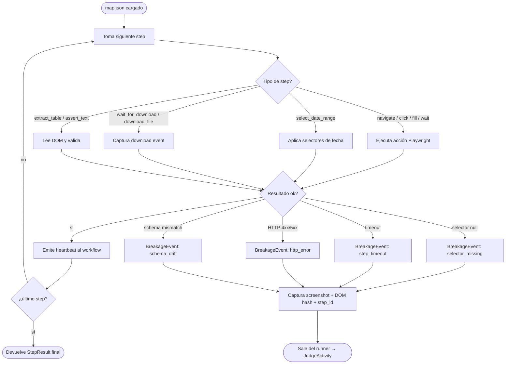

# Scraper Runner (Playwright puro)

Componente determinístico, **0 LLM en el hot path**. Lee `map.json`, ejecuta cada `step` con Playwright y emite `BreakageEvent` cuando algo no cierra. Vive dentro de un sandbox Docker efímero por job.

## Modelo de ejecución

`map.json` es una lista ordenada de `steps` con tipo y parámetros. El runner mantiene un `step_pointer` y avanza secuencialmente. Cada step produce un `StepResult` que entra al ledger del workflow para idempotency. El runner nunca toma decisiones inteligentes: si un step falla, levanta `BreakageEvent` y devuelve control al workflow, que invoca `JudgeActivity`.

## Loop de ejecución

## Tipos de step soportados (v1)

| Tipo | Parámetros | Success criteria | Failure mode |
|------|-----------|------------------|--------------|
| `navigate` | `url`, `wait_until` (`load`/`networkidle`) | navegación completa sin error de red | `http_error` si 4xx/5xx, `step_timeout` si excede 30 s |
| `click` | `selector`, `nth` opcional | elemento existe + es clickable + click resuelve | `selector_missing` si null, `step_timeout` si no es clickable |
| `fill` | `selector`, `value_ref` (referencia a vault de creds) | input existe + valor escrito + evento `input` emitido | `selector_missing`, `value_not_resolved` |
| `wait_for_selector` | `selector`, `state` (`visible`/`attached`/`hidden`), `timeout_ms` | selector alcanza el state pedido | `step_timeout` |
| `wait_for_download` | `trigger_selector`, `timeout_ms` | evento `download` capturado en el contexto | `step_timeout`, `download_aborted` |
| `select_date_range` | `from_selector`, `to_selector`, `from_date`, `to_date`, `widget` (`ngb-datepicker` u otro) | ambos inputs reflejan las fechas y el form valida | `selector_missing`, `widget_unsupported` |
| `assert_text` | `selector`, `expected` (literal o regex), `mode` (`exact`/`contains`/`regex`) | texto del nodo cumple `mode` | `assertion_failed` (drift de copy) |
| `extract_table` | `table_selector`, `column_map`, `row_filter` opcional | tabla parsea a lista de records con todas las columnas mapeadas | `schema_drift` si columna faltante o tipo inesperado |
| `download_file` | `trigger_selector`, `expected_mime`, `expected_extension` | archivo descargado + mime/extensión correctos | `mime_mismatch`, `download_aborted` |
| `prompt_user` | `selector` (input), `question_selector`, `field_key` (regex `^[a-z][a-z0-9_]{2,32}$`), `timeout_s` (default 240), `cache_answers` (default true), `submit_selector` opcional | runner extrae `question_text` vía `question_selector`, compone `cache_key = sha256(bank_id:credential_ref:field_key:normalize(question_text))`, busca en vault namespace `security_q`. Hit → fill auto + (submit). Miss → emite webhook `job.human_input_required` y delega a `HumanInputAwaitActivity` (pausa el runner). Tras signal `human_input_provided` → fill + persist opcional. | `selector_missing`, `question_extract_failed`, `human_input_timeout`, `human_input_rejected`, `browser_lost` |

`value_ref` evita que el `map.json` cargue secretos: el runner los resuelve desde el vault sqlcipher en runtime.

## Detalle del step `prompt_user`

El step type `prompt_user` cubre el caso "el banco pide input textual del usuario mid-scrape" (preguntas de seguridad, captcha texto, re-auth pasiva). Definido por **ADR-0021**.

A diferencia del flag `pause_for_otp: true` (que es out-of-band, sin valor de retorno), `prompt_user` recibe un `answer: str` desde un endpoint dedicado y lo inyecta en `selector`. Reutiliza el `BrowserSidecar` (ADR-0019) para mantener el browser context vivo durante el wait.

**Reglas operativas:**

- El runner **nunca** loguea `answer` en claro; solo `cache_key[:8]` y `field_key`.
- Si el step posterior a un `prompt_user` con cache hit dispara `BreakageEvent{cause: assertion_failed | http_error}`, el workflow invalida `cache_key` antes de propagar el fallo (defense contra account lockout por cache stale).
- `question_text` extraído por `question_selector` puede contener PII colateral del titular; pasa por la Capa 1 del PII filter (ADR-0020) antes de adjuntarse al webhook.
- `field_key` lo declara el autor del map; sirve como identificador estable de qué pregunta (no qué respuesta).
- Múltiples `prompt_user` en un mismo flow son válidos. El signal `human_input_provided` carga `field_key` para correlación.

Ver flow completo: [`../03-flows/human-input-pause-resume.md`](../03-flows/human-input-pause-resume.md).

## `BreakageEvent`: contrato hacia Judge

Estructura conceptual emitida cuando el loop sale por la rama de error:

- `job_id`, `bank_id`, `map_version`
- `step_id`, `step_type`, `step_index`
- `cause`: `selector_missing | step_timeout | http_error | schema_drift | assertion_failed | mime_mismatch | download_aborted | widget_unsupported`
- `evidence`:
  - `screenshot_path` (artefacto en sandbox volume)
  - `dom_snapshot_hash` (sha256 del HTML del frame relevante)
  - `selector_attempted`
  - `expected` vs `observed` (cuando aplica)
- `context_window`: últimos 3 steps con sus `StepResult`s
- `network_trace_ref`: HAR del job para debug profundo

El workflow recibe el evento, lo persiste en el ledger e invoca `JudgeActivity`. Reglas de escalación están en [`03-flows/remap-detection.md`](../03-flows/remap-detection.md).

## Heartbeats e interacción con Temporal

- Cada step exitoso emite heartbeat (`step_index`, `progress`).
- Steps largos (`wait_for_download`, `select_date_range` con calendarios pesados) emiten heartbeats parciales cada 5 s.
- Sin heartbeat por `heartbeat_timeout` (10 s configurable) → Temporal asume worker muerto y reintenta la activity en otro worker. El runner es **stateless entre activities**: el browser context vive en el sandbox container y se re-asocia por `browser_session_token`.

## Trazas y artefactos

Cada job produce, en el volumen montado del sandbox:

- `trace.zip` — Playwright trace (snapshots, network, console).
- `video.webm` — opcional, sólo en debug mode.
- `har.json` — network trace completa.
- `screenshots/step-{n}.png` — al inicio y al fallo de cada step crítico.
- `downloads/` — Excel originales recibidos del banco (insumo del parser).

Estos artefactos se referencian desde `BreakageEvent.evidence` y quedan retenidos según política de `05-operations` (no documentado aquí).

## Lo que el runner **no** hace

- No interpreta el contenido del Excel — eso lo hace `ParseExcelActivity` con el parser DSL.
- No decide retry — el workflow lo hace tras consultar a Judge.
- No habla con LLMs.
- No persiste estado cross-job — el container es efímero.

## Referencias

- Estructura de `map.json`: `06-banks/banco_general/` (a redactar).
- DSL del parser: [`adr/0007-declarative-excel-dsl.md`](../adr/0007-declarative-excel-dsl.md).
- Detección de ruptura: [`03-flows/remap-detection.md`](../03-flows/remap-detection.md).
- Recovery patterns: [`03-flows/error-recovery.md`](../03-flows/error-recovery.md).
