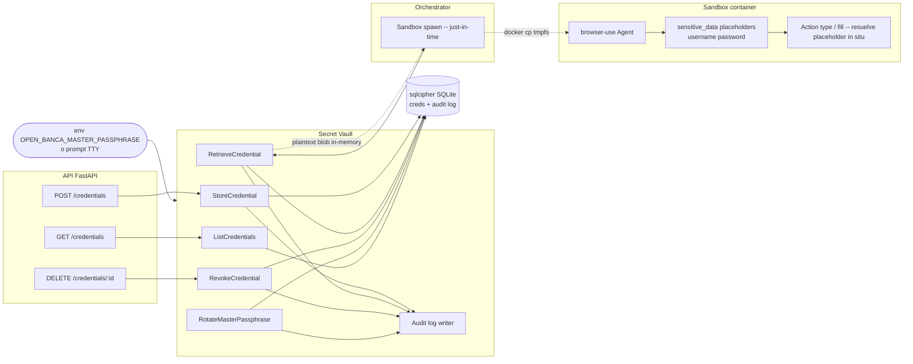

# Componente — Secret Vault

## Contexto

El Secret Vault es el componente que custodia las credenciales bancarias del usuario y expone operaciones explícitas. Es el único lugar del sistema con permiso de derivar la master key y descifrar plaintext. Detalle criptográfico: [`04-security/secrets-at-rest.md`](../04-security/secrets-at-rest.md). Modelo de amenaza: [`04-security/threat-model.md`](../04-security/threat-model.md).

Cross-refs: [`orchestrator.md`](./orchestrator.md) · [`04-security/sandbox.md`](../04-security/sandbox.md).

## Diagrama del componente

## Operaciones expuestas

| Operación | Input | Output | Side effects | Audit log entry |
|-----------|-------|--------|--------------|-----------------|
| StoreCredential | `bank_id`, `username`, `password`, opcional `label` | `cred_id` | INSERT row cifrada (salt+nonce+ct+tag); plaintext wiped post-encrypt | `cred_stored {cred_id, bank_id, label, ts}` (sin valores) |
| RetrieveCredential | `cred_id` | Plaintext blob in-memory; el caller debe `wipe` post-uso | SELECT row; deriva row_key Argon2id; AES-GCM decrypt | `cred_retrieved {cred_id, job_id, ts}` |
| RotateMasterPassphrase | `master_old`, `master_new` (env vars) | OK / fail | Re-encrypt batch de todas las rows; `PRAGMA rekey` del sqlcipher | `master_rotated {operator_id, ts, rows_count}` |
| RevokeCredential | `cred_id` | OK | DELETE row + tombstone; abort jobs activos que la usen | `cred_revoked {cred_id, reason, ts}` |
| ListCredentials | filtro opcional por `bank_id` | Lista de `{cred_id, bank_id, label, created_at, last_used_at}` — **sin valores** | SELECT proyectada sin ct/salt/nonce | `cred_listed {operator_id, count, ts}` (sólo si flag verbose) |

Reglas transversales:

- Toda operación requiere que el Vault esté `init`-ed con la master passphrase. Sin master, todas las ops fallan con error explícito.
- Plaintext nunca se loguea, ni en stdout ni en OTel ni en Langfuse. El logger del Vault tiene un filter dedicado.
- Audit log es append-only y vive dentro del mismo sqlcipher DB.
- Errores no incluyen plaintext en el mensaje (e.g. "decrypt failed" en lugar de "expected X got Y").

## Integración con el resto del sistema

| Cliente | Cuándo invoca | Operaciones |
|---------|---------------|-------------|
| API FastAPI | Onboarding del usuario; gestión via panel admin | StoreCredential, RevokeCredential, ListCredentials |
| Orchestrator (Temporal activity) | Justo antes de spawn de sandbox | RetrieveCredential |
| CLI admin | Operación explícita del operador | RotateMasterPassphrase, ListCredentials |

Nunca el sandbox accede al Vault directamente. El orchestrator hace la mediación: descifra → escribe en tmpfs del container → spawn → wipe del blob en su memoria.

## Mecanismo `sensitive_data` de browser-use

Dentro del sandbox, browser-use lee `/secrets/cred.json` y registra placeholders:

- El Agent recibe el prompt con `<<username>>` y `<<password>>` como tokens textuales.
- El LLM nunca ve el plaintext.
- Cuando el LLM emite una tool call tipo `type(<<password>>, selector="#pwd")`, el wrapper de la tool resuelve el placeholder localmente (sin re-prompt) y dispara el evento CDP con el valor real.
- El log de la tool call se redacta antes de exportar a Langfuse: el atributo `args` se reemplaza por `{password: "<<redacted>>"}`.

Esto convierte la fuga al LLM en un imposible de diseño, no en un best-effort.

## Riesgos y trade-offs

- **Operación cara**: Argon2id 256 MiB / 3 iter ~ 300-500 ms por Retrieve. Aceptable porque ocurre una vez por job (no por request).
- **Vault es SPOF para todo scrape**: si el DB cifrado se corrompe, no hay recuperación sin backup. Documentado en runbook.
- **Master passphrase en env**: visible a procesos del mismo UID. Mitigación: process isolation del API (systemd `PrivateTmp`, `ProtectSystem=strict`); usuario dedicado.
