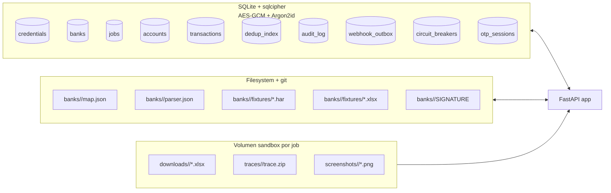
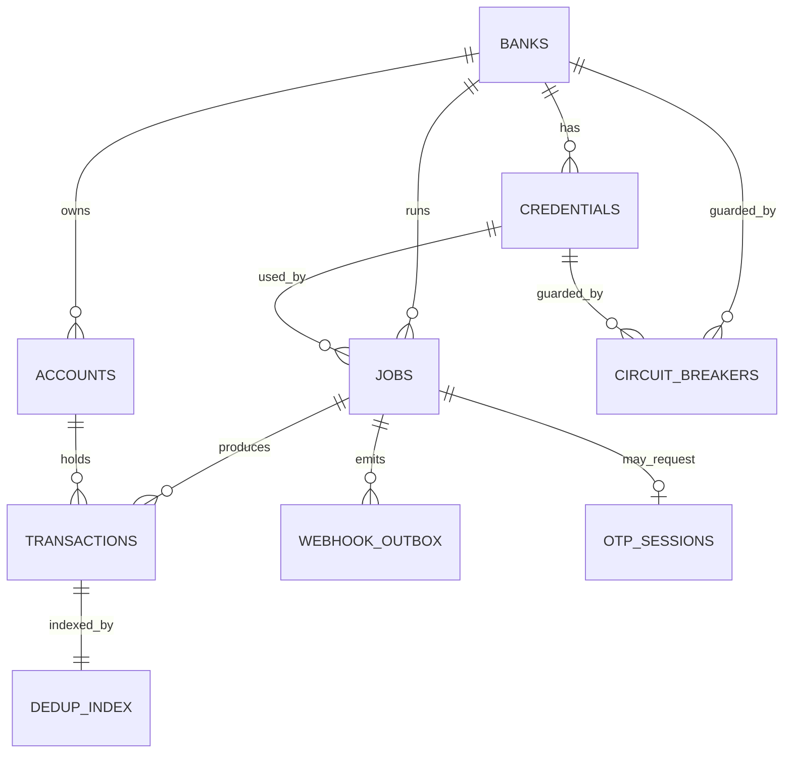
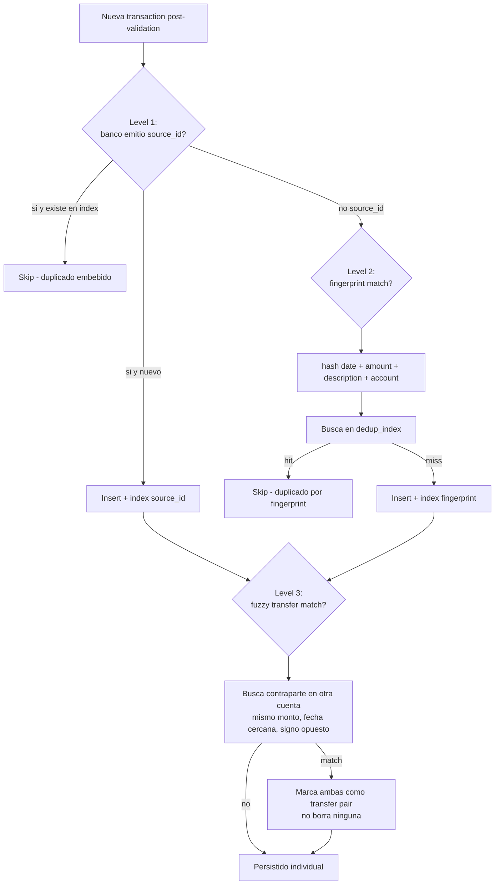

# Storage

Capa de persistencia. Dos sustratos:

1. **SQLite + sqlcipher** para datos operativos y sensibles (credentials, jobs, accounts, transactions, dedup index, audit, webhook outbox).
2. **Filesystem + git** para artefactos versionables (`map.json`, `parser.json`, fixtures HAR/Excel anonimizados).

## Layout general



Master passphrase abre la SQLite cifrada al boot (env var o prompt). Sin ella, la app no levanta.

## Tablas SQLite

| Tabla | Propósito | Key fields conceptuales | Relaciones |
|-------|-----------|--------------------------|------------|
| `credentials` | Vault de creds bancarias del operador. AES-GCM por fila además del cifrado de DB. | `id`, `bank_id`, `label`, `ciphertext`, `nonce`, `kdf_meta` | → `banks` |
| `banks` | Catálogo de bancos soportados localmente. | `id`, `name`, `country`, `map_version`, `parser_version`, `enabled` | — |
| `jobs` | Cada `POST /scrape` crea un job. Estado de workflow Temporal espejado. | `id` (UUID), `bank_id`, `credential_id`, `status`, `range_from`, `range_to`, `created_at`, `started_at`, `finished_at`, `temporal_workflow_id`, `cost_usd`, `failure_reason` | → `banks`, `credentials` |
| `accounts` | Cuentas descubiertas por el scraper. Materialización de la última vista conocida. | `id`, `bank_id`, `account_number_hash`, `account_type`, `currency`, `balance`, `last_synced_at`, `metadata_json` | → `banks` |
| `transactions` | Movimientos persistidos post-validation. | `id`, `account_id`, `job_id`, `date`, `amount`, `description`, `reference`, `source_id`, `fingerprint`, `created_at` | → `accounts`, `jobs` |
| `dedup_index` | Indice de fingerprints + IDs embebidos para lookup O(1). | `fingerprint`, `account_id`, `transaction_id`, `level` (`embedded\|fingerprint\|fuzzy`) | → `transactions` |
| `audit_log` | Append-only event log. Cada acción crítica (job created, OTP confirmed, remap approved, cred read). | `id`, `actor`, `action`, `entity_type`, `entity_id`, `at`, `metadata_json` | — |
| `webhook_outbox` | Outbox pattern: webhooks pendientes de entregar con HMAC. | `id`, `job_id`, `event_type`, `payload_json`, `signature`, `attempts`, `next_retry_at`, `delivered_at` | → `jobs` |
| `circuit_breakers` | Estado de circuit breakers por banco/cred. | `bank_id`, `credential_id`, `state` (`closed\|open\|half_open`), `opened_at`, `failure_count` | → `banks`, `credentials` |
| `otp_sessions` | Estado de OTPs en curso para correlacionar `POST /jobs/{id}/otp-confirmed`. | `job_id`, `requested_at`, `expires_at` (4 min), `confirmed_at` | → `jobs` |

Sin tabla de `users`/`roles`: el contrato es **single-org self-hosted**, autenticación al API por API key del operador.

## ER conceptual



## Estrategia de dedup (3 niveles, orden estricto)



Notas:

- **Level 1** (embedded ID): el banco emite identificador estable. Banco General probablemente no — ver [`../06-banks/banco-general.md`](../06-banks/banco-general.md).
- **Level 2** (fingerprint): hash determinístico. Único por cuenta. Robusto si descripción no cambia run-a-run.
- **Level 3** (fuzzy transfer): no deduplica, **vincula**. Una transferencia entre dos cuentas del mismo operador aparece dos veces (débito + crédito); marcamos el par para que el cliente sepa que son la misma operación lógica. Heurístico: mismo monto, fecha ±1 día, signo opuesto, descripciones con prefijo de transferencia.

Heredado del análisis de Banistmo (ver memoria del proyecto).

## Maps storage en filesystem

```
banks/
  banco_general/
    map.json
    parser.json
    SIGNATURE                      # cosign signature del map oficial
    fixtures/
      login_happy.har
      download_savings_2026.xlsx   # anonimizado
      download_credit_card_2026.xlsx
      schema_drift_case.har        # casos para regression tests
    CHANGELOG.md                   # historia de cambios al map/parser
community/
  banco_xyz/
    map.json                       # warning: unsigned, comunidad
    ...
```

Conventions:

- **Versioning vía git tags**: `bank/banco_general/v1.3.0` apunta al commit donde el `map.json` y `parser.json` fueron sellados.
- **Naming**: `<bank_id>` snake_case, igual al `id` en tabla `banks`.
- **Signing**: maps en `banks/` firmados con sigstore/cosign por maintainer; deploys con `STRICT_MAP_SIGNATURES=true` rechazan no firmados. `community/` siempre unsigned con warning explícito.
- **Read-only en runtime**: la app no escribe estos archivos. Los actualiza el maintainer vía PR + CI build que regenera firmas.

## Lo que storage **no** hace

- No corre lógica de negocio — sólo CRUD + transacciones.
- No transforma data — eso es del parser/validator.
- No hace dedup en el lado del cliente.
- No persiste browser context cross-job (ver [ADR-0015](../adr/0015-no-session-persistence-v1.md)).
- No hace backup automático del DB — responsabilidad del operador (volumen Docker).

## Referencias

- ADR-0008 sqlcipher + Argon2id: [`../adr/0008-sqlcipher-secrets.md`](../adr/0008-sqlcipher-secrets.md).
- ADR-0007 DSL parser: [`../adr/0007-declarative-excel-dsl.md`](../adr/0007-declarative-excel-dsl.md).
- ADR-0012 schema unificado: [`../adr/0012-unified-account-schema.md`](../adr/0012-unified-account-schema.md).
- Threat model: [`../04-security/threat-model.md`](../04-security/threat-model.md).
