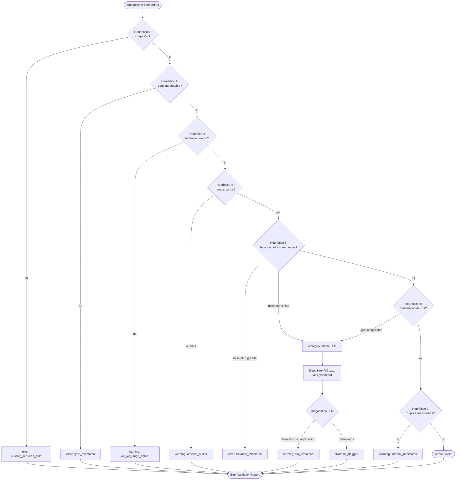
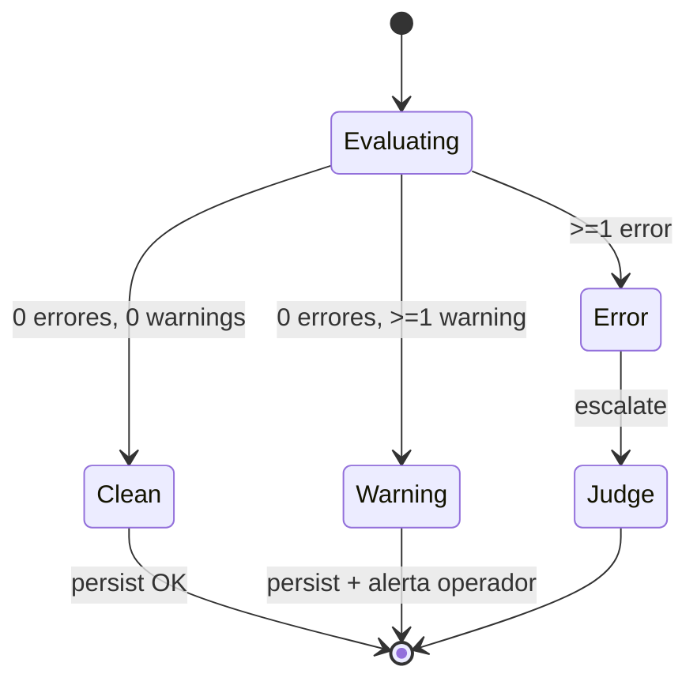

# Validator Agent

Componente post-scrape que verifica **sanity** de los datos extraídos antes de persistirlos al schema canónico. Construido con **PydanticAI + DeepSeek V3 (texto)** vía LiteLLM. El LLM **sólo se usa cuando los heurísticos no alcanzan**: el camino feliz es 100% determinístico y barato.

El Validator no decide retry/remap (eso lo hace Judge). Sólo emite un `ValidationReport` con verdict y anomalías. El workflow Temporal interpreta el report y, si hay errores severos, escala a Judge.

## Contrato

| Entrada | Detalle |
|---------|---------|
| `account_metadata` | `account_type`, `currency`, `account_id`, `balance_reported`. |
| `transactions[]` | Records normalizados por el parser DSL. |
| `range` | Rango de fechas pedido (`from`, `to`). |
| `prior_snapshot` (opcional) | Último snapshot conocido para detectar regresiones. |

| Salida | Detalle |
|--------|---------|
| `verdict` | `clean | warning | error`. |
| `anomalies[]` | Lista de hallazgos con severity, category, evidencia. |
| `confidence` | 0..1 — qué tan seguro está del verdict. |
| `notes` | Texto libre para debug. |

## Flujo del validator

## Tabla de checks heurísticos

| # | Check | Severity por defecto | Lógica conceptual |
|---|-------|----------------------|-------------------|
| 1 | **Shape** | error | Cada record tiene los campos requeridos del schema (date, amount, description, account_id). |
| 2 | **Tipos** | error | `date` parseable a ISO-8601; `amount` numérico finito; `currency` ISO-4217. |
| 3 | **Rangos de fecha** | warning | Todas las fechas dentro del rango pedido ± 1 día (tolerancia tz). |
| 4 | **Rangos de monto** | warning | `abs(amount) < umbral_banco` (ej. 1M USD por mov en cuenta retail). Outliers se marcan. |
| 5 | **Totales** | error si gap grande, ambig si chico | `balance_inicial + sum(movs) ≈ balance_final`. Tolerancia configurable por moneda. |
| 6 | **Continuidad** | warning o ambig | Si el banco emite IDs secuenciales, gap inexplicable abre LLM. Banco General **no** emite secuencia, así que este check es soft. |
| 7 | **Duplicados internos** | warning | Mismo (date, amount, description) repetido en el mismo Excel — síntoma de re-ingest del banco. |
| 8 | **Account_type coherence** | error | Si `account_type=credit_card`, debe haber `credit_limit` y `min_payment`; sino, error. |
| 9 | **Currency consistency** | error | Todos los movs misma `currency` que la cuenta. |

Los checks 1, 2, 8, 9 son **bloqueantes** (no se llama LLM, se emite error directo). El resto puede activar el LLM en caso ambiguo.

## Cuándo llama al LLM

El LLM **no** se llama para validar campo a campo. Sólo cuando:

- **Balance gap pequeño** (<1% del balance final): puede ser comisión no listada, fee oculto, intereses devengados — DeepSeek lee descripciones y propone explicación.
- **Patrones sospechosos** detectados por heurístico de fraude (varios montos idénticos consecutivos, descripciones genéricas tipo "AJUSTE", etc.).
- **Continuidad rota** sin causa obvia.

PydanticAI fuerza structured output: el LLM devuelve un objeto con `is_data_valid: bool`, `explanation: str`, `suspected_cause: enum`, `recommended_action: enum`. Sin texto libre fuera de `explanation`.

Token budget LLM por validación: **<2k tokens** input + 500 output. DeepSeek a precio actual = costo despreciable.

## Output: `ValidationReport`

Campos del report (conceptual):

- `verdict`: enum
- `anomalies[]`: cada uno con `severity`, `category` (`shape | type | range | total | continuity | duplicate | coherence`), `description`, `evidence_refs[]` (índices de filas, hashes, etc.).
- `metrics`: contadores agregados (n_records, n_warnings, n_errors, balance_delta_pct).
- `llm_used`: bool — telemetría para Langfuse.
- `confidence`: 0..1 — el Validator se expresa con humildad cuando confió en el LLM.

## Determinismo y testing

- **Heurísticos son puros**: testeables con fixtures sin red ni LLM.
- **LLM mock vía PydanticAI test models**: respuestas predefinidas por escenario (`balance_gap_explained`, `balance_gap_unexplained`, etc.).
- **Snapshot tests**: dado un Excel fixture, el report debe ser idéntico run-to-run cuando el LLM está mockeado.

## Lo que el Validator **no** hace

- No corrige datos — sólo reporta. Corrección es responsabilidad del parser o del Remapper.
- No decide retry — Judge lo hace.
- No persiste — la persistencia ocurre downstream sólo si verdict ∈ {clean, warning}.
- No accede al browser — sólo recibe data ya extraída.

## Referencias

- Judge consume `ValidationReport`: [`judge-agent.md`](./judge-agent.md).
- Schema canónico: [`../adr/0012-unified-account-schema.md`](../adr/0012-unified-account-schema.md).
- Vision split rationale: [`../adr/0006-vision-split-claude-deepseek.md`](../adr/0006-vision-split-claude-deepseek.md).
- Cost guardrails: [`../05-operations/cost-guardrails.md`](../05-operations/cost-guardrails.md).
