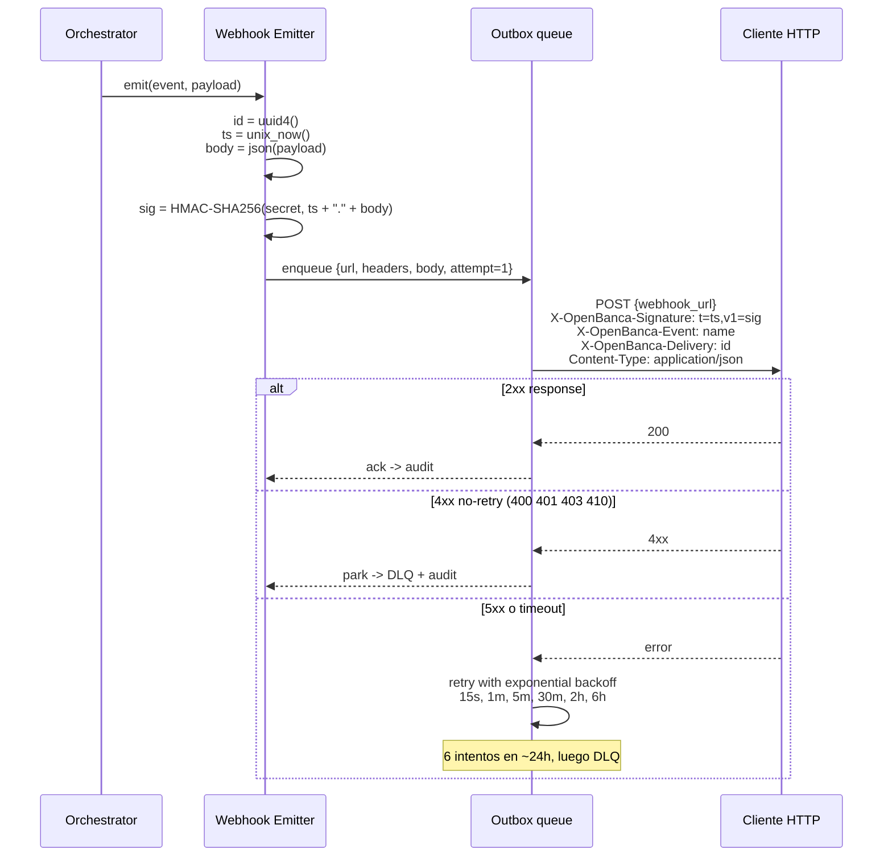

# Componente — Webhook Emitter

## Contexto

El Webhook Emitter notifica al cliente sobre el ciclo de vida de cada job. Eventos firmados con HMAC-SHA256 + timestamp anti-replay. Decisión: [ADR-0011](../adr/0011-webhook-events-hmac.md). Cross-refs: [`orchestrator.md`](./orchestrator.md) · [`04-security/threat-model.md`](../04-security/threat-model.md) (T09, T16).

## Eventos

| Evento | Cuándo dispara | Payload alto-nivel | Retriable |
|--------|----------------|--------------------|-----------|
| `job.created` | API acepta `POST /scrape` y enqueue en Temporal | `job_id`, `bank_id`, `created_at`, `request_id` | sí |
| `job.otp_required` | Workflow llega a la fase de 2FA y entra en pause con signal | `job_id`, `bank_id`, `otp_method` (`clave_movil`), `expires_at` (4 min) | sí |
| `job.progress` (opcional) | Hitos intermedios: login ok, account discovered, excel downloaded | `job_id`, `stage`, `pct` (best effort) | sí, idempotente |
| `job.completed` | Workflow termina con éxito y resultado normalizado disponible | `job_id`, `bank_id`, `accounts_count`, `transactions_count`, `result_url` | sí |
| `job.failed` | Workflow aborta sin recuperación | `job_id`, `bank_id`, `error_code`, `error_message` (sin secretos), `phase` | sí |
| `job.remap_proposed` | Judge propone remap pero `confidence < 0.85` o `risk != low` (HITL) | `job_id`, `bank_id`, `proposal_id`, `confidence`, `risk`, `diff_summary` | sí |
| `job.human_required` | Judge escaló (selector roto crítico, schema cambió, etc.) | `job_id`, `bank_id`, `reason`, `last_screenshot_url` | sí |

Reglas:

- Todos los payloads incluyen un `event` con el nombre y un `id` UUID por entrega (no por job) para idempotencia client-side.
- `result_url` y `last_screenshot_url` apuntan al mismo host del API, requieren el token del operador para descargar.
- Ningún payload incluye plaintext de credenciales, OTP, ni cookies de sesión.

## Envío con firma HMAC

Headers de la request:

- `X-OpenBanca-Signature: t=<unix_ts>,v1=<hex_hmac>`
- `X-OpenBanca-Event: <event_name>`
- `X-OpenBanca-Delivery: <uuid>`
- `Content-Type: application/json; charset=utf-8`
- `User-Agent: open-banca-webhook/<version>`

Política de reintentos:

- Backoff exponencial con jitter: 15s, 1m, 5m, 30m, 2h, 6h. Total ~24h, 6 attempts.
- Sólo retry en 5xx, 408, 429 (respetando `Retry-After`) y errores de red. 4xx (excepto 408/429) parkean directo a DLQ.
- DLQ persiste 7 días; expone `GET /webhooks/dlq` y `POST /webhooks/dlq/:id/replay` para el operador.

## Verificación client-side

El cliente verifica:

1. Parsear header `X-OpenBanca-Signature` y extraer `t` y `v1`.
2. Validar timestamp: `abs(now - t) <= 5 min`. Sino → reject como replay.
3. Computar `expected = HMAC-SHA256(secret, ts + "." + raw_body)` usando el body **byte-exact** recibido (no re-serializar).
4. `compare_digest(expected, v1)` (constant-time). Sino → reject.
5. Idempotencia: persistir `X-OpenBanca-Delivery` y deduplicar entregas.

Defensa contra replay: la ventana ±5 min combinada con dedup de `Delivery` cierra la mayoría de los reuse attempts. Para clientes sin almacenamiento de IDs entregados, la ventana sola limita el daño a 5 minutos.

## Rotación del webhook secret

- Soporta dos secretos vivos simultáneamente: `current` y `previous` durante una ventana de gracia.
- El emitter siempre firma con `current`. El cliente acepta firmas válidas con cualquiera de los dos durante la transición.
- Operación admin via CLI: `open-banca rotate-webhook-secret <client_id>`. Audit log entry generado.
- Período de gracia recomendado: 24-72h.
- Endpoint admin para forzar revocación del `previous` antes del fin de la ventana.

## Riesgos residuales

- **Cliente que no valida HMAC**: vulnerable a spoofing. Documentación lo marca como mandatorio; sample code en SDKs.
- **Reloj del cliente desfasado**: si difiere > 5 min, todas las entregas son rechazadas. Documentado en runbook.
- **DLQ overflow**: 7 días puede ser corto si cliente está caído mucho tiempo. Configurable.
- **Webhook URL HTTP**: aceptamos sólo `https://` por config (validado al registrar URL). Sin loopback en producción.
