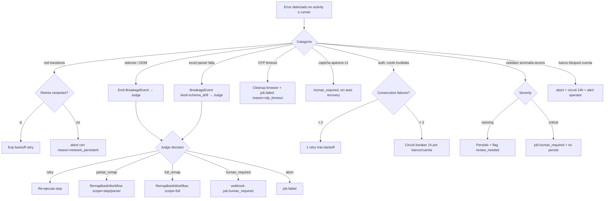

# Flow: Error Recovery

Catálogo de errores conocidos, cómo se detectan, qué recovery automático aplica, cuándo se escala, qué métrica/alarma dispara cada uno.

## Decision tree de recovery

## Tabla por categoría

| Categoría | Detección | Recovery automático | Escalation | Métrica / alerta |
|-----------|-----------|---------------------|-----------|------------------|
| **Red transitoria** (DNS, TCP reset, 5xx en path conocido) | activity raises connection error o HTTP 5xx | Exp backoff: 3 intentos con base 2 s, max 30 s | Tras 3 intentos → `job.failed` reason `network_persistent` | `network_retry_total`, `network_failed_total` (alert si >5%/h) |
| **Selector roto** | `selector_missing` en runner | Vía Judge → `retry` o remap | `partial_remap` o `full_remap` o `human_required` | `breakage_total{cause=selector_missing}` |
| **Step timeout** | step excede timeout | Vía Judge: 1 retry; si recurre → `partial_remap` | igual que arriba | `breakage_total{cause=step_timeout}` |
| **Auth: creds inválidas** | banco devuelve "credenciales inválidas" en login | Sin retry automático (riesgo de bloqueo) | Tras 2 fallas consecutivas → circuit breaker 1 h por (bank, account) | `auth_failure_total`; alert si circuit abre |
| **OTP timeout** | `OTPSignalAwaitActivity` excede 4 min | Ninguno | `job.failed` reason `otp_timeout`; cliente debe iniciar nuevo job | `otp_timeout_total` (alert si >10%/día) |
| **Browser/sandbox lost durante OTP** | heartbeat lost + sandbox no responde | Ninguno (sesión bancaria habría muerto igual) | `job.failed` reason `session_lost` | `browser_lost_during_otp_total` (alert si >0) |
| **Captcha aparece** (no soportado v1) | Selector canary detecta widget conocido | Ninguno | `human_required` con webhook + screenshot | `captcha_detected_total` (alert siempre) |
| **Excel parser falla** | DSL no encuentra columna o tipo inesperado | Vía Judge → `partial_remap` scope=parser | si Judge < 0.85 conf → HITL | `breakage_total{cause=schema_drift}` |
| **Validator: warning** (delta de balance dentro de tolerancia laxa) | Validator devuelve `severity=warning` | Persistir + flag `review_needed=true` en transactions | sin escalación; queda en backlog manual | `validator_warning_total` |
| **Validator: critical** (saldo no cuadra > umbral, fechas futuras, montos absurdos) | Validator devuelve `severity=critical` | Ninguno | `job.human_required` + **no** persist hasta review | `validator_critical_total` (alert siempre) |
| **Banco bloqueó cuenta** | login redirige a página de cuenta bloqueada / aviso de seguridad | Ninguno | `abort` + circuit breaker 24 h + alert operador (webhook + log error) | `account_blocked_total` (alert siempre) |
| **Budget LLM excedido** | suma costo > $0.50/job | Ninguno | `human_required` o `abort` según fase | `budget_exceeded_total` |
| **Remap cap diario** | `remaps_used_24h ≥ 3` para el banco | Ninguno | `human_required` para próximo breakage del día | `remap_capped_total` |
| **Sandbox crash** (OOM, container muere) | Activity heartbeat lost + container exit detectable | Temporal reschedule activity en otro worker; si nuevo sandbox no se levanta → fail | tras 2 intentos → `job.failed` reason `sandbox_unavailable` | `sandbox_crash_total` (alert si >0 sostenido) |
| **Worker crash** | Temporal pierde heartbeat | Reschedule automático en otro worker; el workflow no se entera | sin escalación si reschedule funciona | `worker_activity_reschedule_total` |
| **Webhook delivery falla** | endpoint del cliente no responde 2xx | Exp backoff 5 intentos hasta 1 h | tras agotar retries → log + persist en outbox para reintento manual | `webhook_delivery_failed_total` (alert si sube) |

## Reglas transversales

**Backoff estándar para retries**:

- `initial_interval = 2 s`
- `backoff_coefficient = 2.0`
- `max_interval = 30 s`
- `max_attempts` por activity según tabla en [`02-components/orchestrator.md`](../02-components/orchestrator.md).

**Errores `non_retryable=true`** (no reintentar nunca):

- Credenciales inválidas confirmadas por el banco.
- OTP timeout.
- Budget excedido.
- Cuenta bloqueada por el banco.
- Captcha (v1).
- Validator critical.
- Linter rechaza patch del Remapper.

**Errores retriables**:

- HTTP 5xx, errores de red transitorios.
- Step timeout (1ª vez).
- Heartbeat lost (Temporal lo gestiona transparente).

## Webhooks de error

- `job.failed` — terminal, incluye `reason` taxonomizada (`network_persistent`, `otp_timeout`, `session_lost`, `auth_invalid`, `circuit_open`, `account_blocked`, `cancelled_by_user`, `budget_exceeded`, `validator_critical`, `remap_rejected`, `remap_proposal_expired`, `remap_lint_failed`, `sandbox_unavailable`, `mapping_failed`).
- `job.human_required` — pausa, incluye `evidence_url` y razón corta.
- `job.remap_proposed` — caso particular de HITL, no es error pero requiere acción.

## Outbox de webhooks

`EmitWebhookActivity` escribe en outbox antes de intentar entrega. Si el endpoint del cliente falla 5 veces, el evento queda en outbox con `status=failed_delivery`. Operador puede reintentarlos via tarea administrativa (no expuesta en API v1). Esto evita perder eventos críticos como `job.completed` por una caída momentánea del receptor.

## Idempotency en recovery

Cada activity incluye `(job_id, step_id, attempt_id)` en su input. Side-effects críticos (download, persist, webhook) chequean ledger antes de re-ejecutar. Webhooks usan `event_id` (UUID v7) para que el cliente deduplique en su lado.

## Referencias

- Detección de remap: [`03-flows/remap-detection.md`](./remap-detection.md)
- OTP detalle: [`03-flows/otp-pause-resume.md`](./otp-pause-resume.md)
- Aprobación remap: [`03-flows/remap-approval.md`](./remap-approval.md)
- Orchestrator config: [`02-components/orchestrator.md`](../02-components/orchestrator.md)
