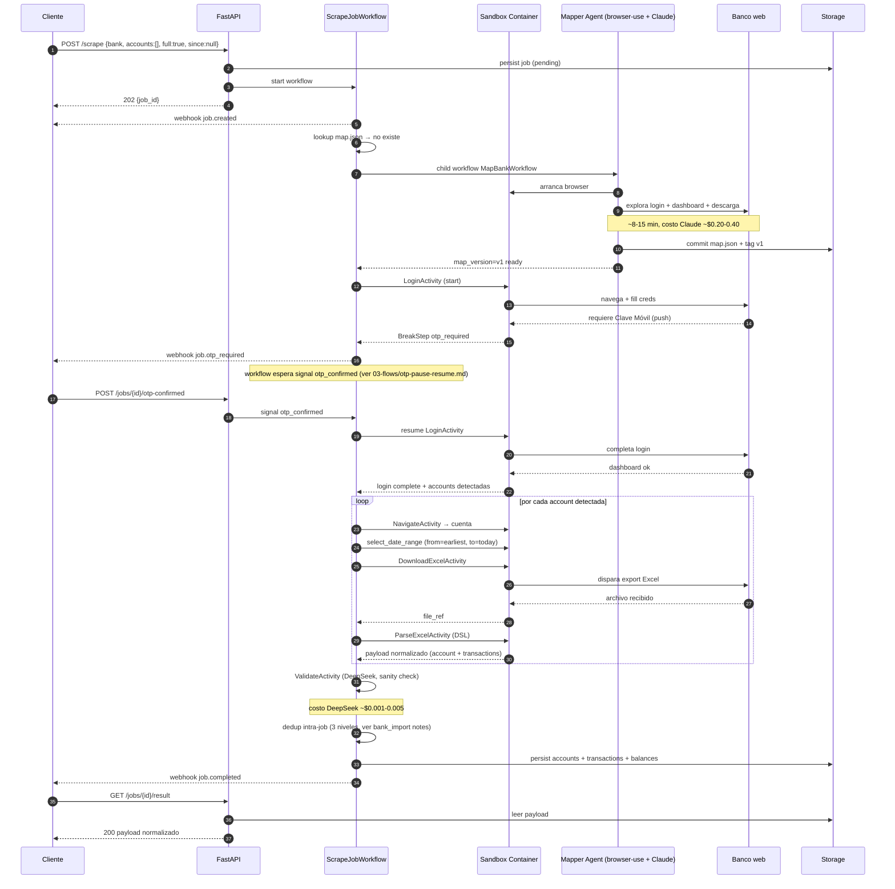

# Flow: Full Historical Scrape

Primer scrape de un banco recién agregado al deployment. Cubre el camino feliz incluyendo mapping inicial, login con Clave Móvil, descarga de todos los Excels históricos por cuenta, parsing, validación, dedup intra-job y persistencia.

## Pre-condiciones

- Banco configurado en `/banks` pero **sin `map.json`** (o con `map_version` marcado como inválido).
- Credenciales del cliente cifradas en sqlcipher.
- Webhook URL del cliente configurada.
- Budget LLM disponible (≤ 3 remaps usados en 24 h, gasto < $0.50 acumulado).

## Sequence diagram

## Tiempos esperados (Banco General, primer scrape)

| Fase | Duración esperada | Notas |
|------|-------------------|-------|
| `MapBankWorkflow` (Mapper Agent) | 8 – 15 min | Una sola vez por banco/versión. Costo Claude vision ~$0.20 – $0.40. |
| Login + OTP wait (humano incluido) | 30 s – 4 min | Hard cap del workflow = 4 min. |
| Navegación + download por cuenta | 20 – 60 s | Banco General: ~3 cuentas típicas → ~3 min. |
| Parse Excel por cuenta | 1 – 5 s | Determinístico, DSL declarativo. |
| Validate + dedup + persist | 5 – 15 s | DeepSeek + escritura sqlcipher. |
| **Total camino feliz primer scrape** | **~12 – 25 min** | Dominado por mapping inicial + espera humana de OTP. |

## Costos LLM aproximados

| Agente | Modelo | Invocaciones | Costo estimado |
|--------|--------|--------------|----------------|
| Mapper | Claude Sonnet 4.6 vision | 1 (sólo primera vez) | $0.20 – $0.40 |
| Validator | DeepSeek V3 texto | 1 | $0.001 – $0.005 |
| Judge | DeepSeek V3 texto | 0 (camino feliz) | $0 |
| Remapper | Claude Sonnet 4.6 vision | 0 | $0 |
| **Total job feliz** | | | **~$0.20 – $0.40** |

Si el job no requiere mapping (corridas siguientes), el costo cae a fracciones de centavo (sólo Validator).

## Outputs persistidos

- `accounts` — una fila por cuenta detectada con `account_type`, identificadores y balance último.
- `transactions` — todos los movimientos descargados, normalizados al schema canónico.
- `balances` — snapshot por fecha si el Excel los provee.
- `map.json` v1 firmado y commiteado al filesystem versionado.
- `last_run_cursor` por cuenta — base para el próximo incremental.

## Errores que cortan el flujo

- Mapper agota budget LLM o timeout 30 min → `job.failed` con `reason: mapping_failed`.
- OTP no confirmado en 4 min → `job.failed` con `reason: otp_timeout`.
- 2 logins fallidos consecutivos → circuit breaker 1 h.
- Validator detecta anomalía severa (e.g. delta de balance vs suma de transacciones > tolerancia) → `job.human_required`.

Detalle por categoría: [`03-flows/error-recovery.md`](./error-recovery.md).

## Referencias

- OTP detail: [`03-flows/otp-pause-resume.md`](./otp-pause-resume.md)
- Incremental siguiente: [`03-flows/incremental-scrape.md`](./incremental-scrape.md)
- Componentes: [`02-components/orchestrator.md`](../02-components/orchestrator.md), [`02-components/scraper-runner.md`](../02-components/scraper-runner.md)
