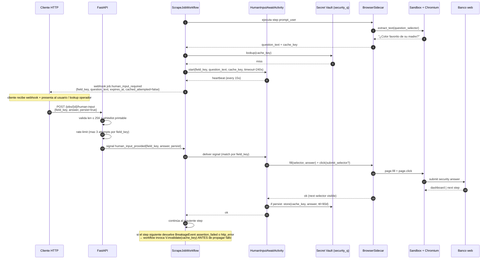
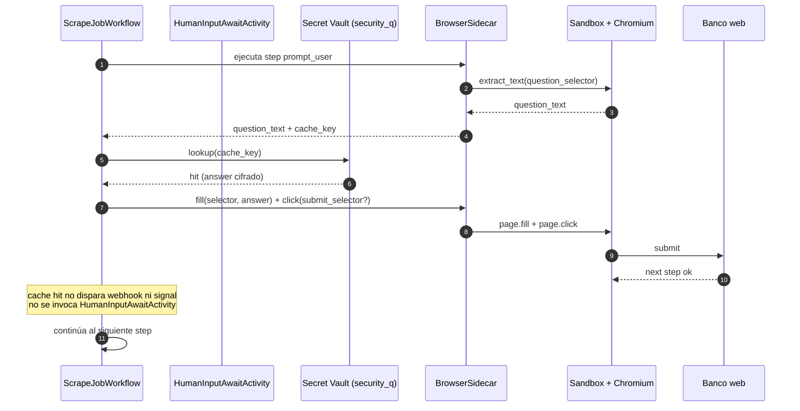
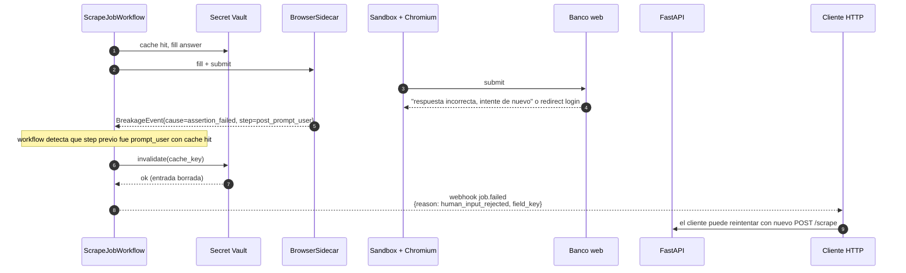
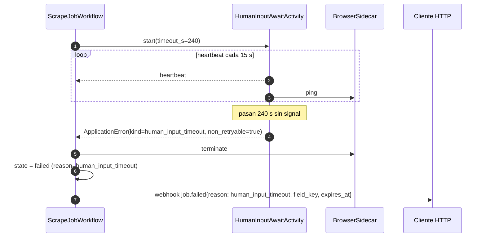
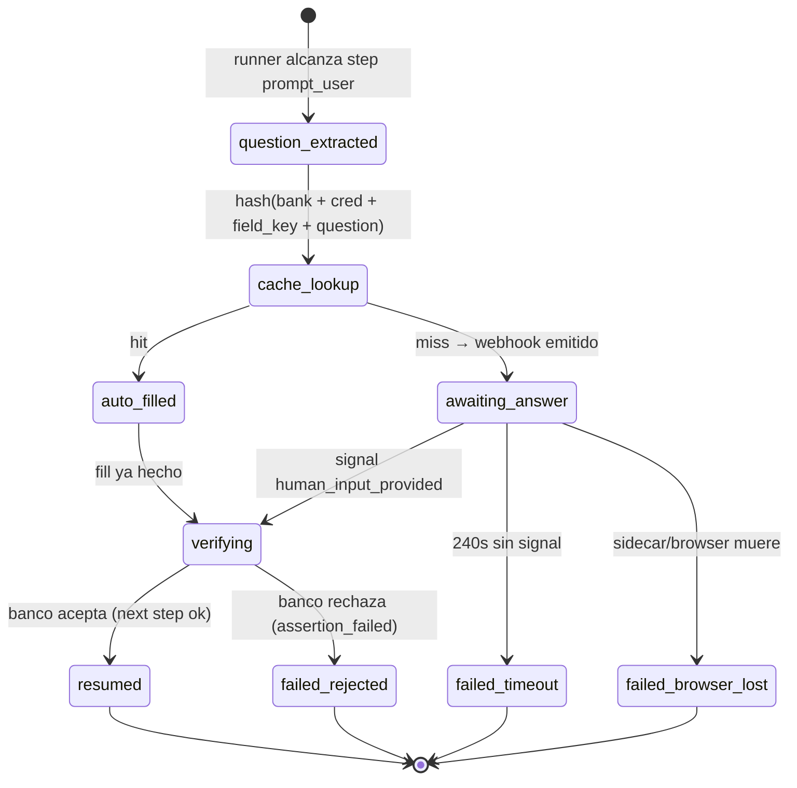

# Flow: Human Input Pause / Resume (preguntas de seguridad, captcha texto)

Flujo análogo al OTP pause/resume pero para **entrada textual** del operador mid-scrape. Disparado por step `prompt_user` (ADR-0021). Reutiliza el `BrowserSidecar` (ADR-0019) para mantener el browser context vivo durante el wait.

**Diferencia clave vs OTP**: el cliente HTTP **envía un valor** (`answer`) que el runner inyecta en el input del banco. OTP solo confirma "lista, sigue".

## Sequence diagram — happy path con cache miss

## Sequence diagram — cache hit (auto-fill)

## Sequence diagram — cache hit pero respuesta rechazada (invalidación)

## Rama de timeout

## Reconexión tras crash del worker

Idéntico al patrón de OTP (ver `otp-pause-resume.md`):

1. Worker que corre `HumanInputAwaitActivity` muere → Temporal detecta heartbeat lost.
2. Nuevo worker recibe `browser_session_token` + `field_key_pending` desde activity input.
3. Conecta al Unix socket del sidecar (`socket_path`).
4. Sidecar sobrevivió — browser context y CDP siguen vivos.
5. Nuevo worker reanuda heartbeat loop. La signal `human_input_provided` que ya estaba pendiente en Temporal queue se entrega normalmente.

Taxonomía de fallos durante human input wait — heredada de ADR-0019:

| Error interno | Causa | Resultado externo |
|---|---|---|
| `sidecar_unreachable` | Unix socket no responde | job `failed` reason `browser_lost` |
| `browser_lost` | Sidecar vivo, Chromium muerto | job `failed` reason `browser_lost` |
| `human_input_timeout` | Sin signal en `timeout_s` | job `failed` reason `human_input_timeout` |
| `human_input_rejected` | Respuesta entregada pero banco la rechaza | job `failed` reason `human_input_rejected`; cache invalidada |
| `human_input_invalid` | API rechazó el POST (length/charset) | el POST devuelve 400; el job sigue esperando hasta timeout |

## Sub-estado `human_input_required`

## Idempotency del signal

`POST /jobs/{id}/human-input` es **idempotente por `(job_id, field_key)`**:

- Si job está en `human_input_required` para ese `field_key` → entrega signal, devuelve `204`.
- Si ya pasó (signal previa exitosa) → `204` no-op.
- Si `field_key` no coincide con el prompt actual → `409` con `expected_field_key` en el error body.
- Si job en `failed` por timeout → `410 Gone` con `reason: human_input_expired`.
- Si job no existe → `404`.

Múltiples llamadas concurrentes con el mismo `(job_id, field_key)` son seguras: el cap de 3 intentos del rate-limiter cubre el caso de retry honesto del cliente; Temporal ignora signals de más una vez que la activity completó.

## Distinción explícita: `prompt_user` no es OTP

| Aspecto | OTP (`pause_for_otp: true`) | `prompt_user` step |
|---|---|---|
| Mecanismo | flag sobre step | step type explícito |
| Valor del usuario | ninguno (signal vacío) | `answer: str` (texto) |
| Endpoint | `POST /jobs/{id}/otp-confirmed` | `POST /jobs/{id}/human-input` |
| Signal | `otp_confirmed` (sin payload) | `human_input_provided{field_key, answer, persist}` |
| Webhook | `job.otp_required` | `job.human_input_required` |
| Activity | `OTPSignalAwaitActivity` | `HumanInputAwaitActivity` |
| Cache | n/a (OTP es always-fresh) | sí, vault `security_q`, TTL 90d |
| Hard cap | 4 min | configurable per-step (`timeout_s`, default 240s) |

Comparten: `BrowserSidecar` (ADR-0019), determinismo del workflow, taxonomía de fallos de browser.

## Métricas críticas

- `human_input_wait_duration_seconds` (histograma).
- `human_input_timeout_total` (counter).
- `human_input_cache_hit_ratio` (gauge).
- `human_input_cache_invalidated_total` (counter, alarm si sube — indica respuestas stale o banco con preguntas rotadas).
- `human_input_attempts_per_field_key` (histograma) — alarm si p99 > 1.
- `browser_lost_during_human_input_total` (counter).

## Referencias

- ADR-0021 — Decisión del step type: [`../adr/0021-human-input-step-type.md`](../adr/0021-human-input-step-type.md)
- ADR-0019 — BrowserSidecar: [`../adr/0019-browser-sidecar-otp.md`](../adr/0019-browser-sidecar-otp.md)
- Flow OTP análogo: [`./otp-pause-resume.md`](./otp-pause-resume.md)
- Endpoint: [`../02-components/api.md`](../02-components/api.md) sección `POST /jobs/{id}/human-input`
- Threat T27: [`../04-security/threat-model.md`](../04-security/threat-model.md)
- Linter L15: [`../04-security/community-maps.md`](../04-security/community-maps.md)
