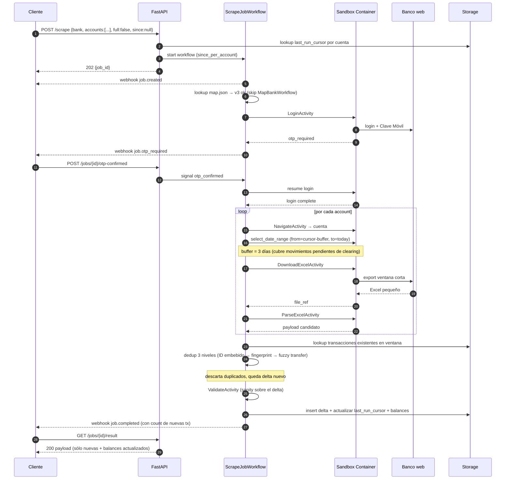
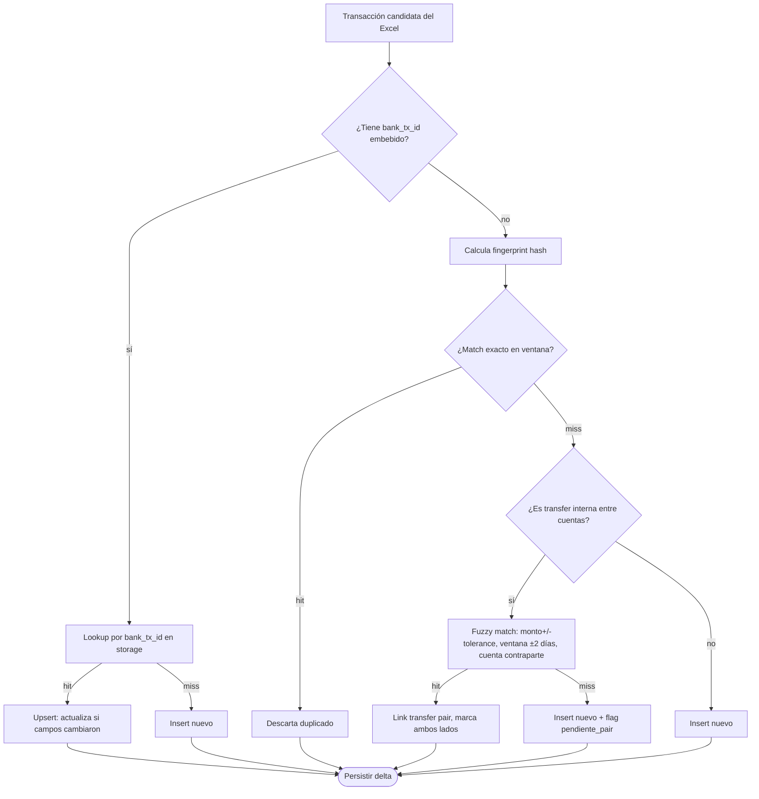

# Flow: Incremental Scrape

Corridas siguientes a la primera. Existe `map.json` válido, existe `last_run_cursor` por cuenta, existen transacciones previas en storage. El objetivo es **descargar la ventana mínima necesaria** y mergear contra lo existente sin duplicar.

## Pre-condiciones

- `map.json` versión actual marcado como sano (`circuit_status=ok`).
- Storage tiene `last_run_cursor` por cuenta (timestamp del movimiento más reciente persistido).
- Cliente envía `since=null` (la API resuelve con cursor) o `since=ts` explícito.

## Sequence diagram

## Diferencias clave vs full historical

| Aspecto | Full historical | Incremental |
|---------|-----------------|-------------|
| `map.json` | Lo crea el Mapper si no existe | Reutiliza versión vigente |
| Ventana de descarga | desde fundación de la cuenta | `last_run_cursor - 3 días` hasta `today` |
| Tamaño Excel | grande (años de historia) | pequeño (días/semanas) |
| Costo LLM | Mapper $0.20–$0.40 + Validator | Sólo Validator (~$0.001) |
| Dedup | intra-job (Excel puede duplicar entre meses) | intra-job + **merge contra storage** |
| Tiempo total | 12 – 25 min | 1 – 5 min (dominado por OTP humano) |
| Re-mapping | aplicable si Mapper falla | sólo si runner detecta breakage |

## Buffer de re-descarga (3 días)

Movimientos pendientes de clearing en el banco pueden cambiar fecha o monto entre corridas. Por eso el `since` efectivo retrocede 3 días sobre el `last_run_cursor`. La capa de dedup elimina lo que ya está; lo que cambió (mismo `bank_tx_id` con campos distintos) se trata como **upsert** y registra una entrada en el audit log.

## Dedup: 3 niveles aplicados al merge

Notas:
- `bank_tx_id` cuando existe (Banco General lo embebe en columna Detail) es la fuente de verdad.
- `fingerprint = sha256(account_id|date|amount|description_normalized)` cuando no hay ID.
- Fuzzy transfers requieren ver todas las cuentas del usuario (por eso dedup vive en API, no en cliente).

## Cuándo un incremental se vuelve "más caro"

- El runner detecta breakage en algún step → escala a Judge → posible remap (sube costo).
- Validator detecta anomalía sobre el delta (e.g. monto absurdo, gap de fechas) → `job.human_required`.
- Cliente forzó `full=true` para reconciliación → degenera al flujo full historical.

## Outputs

- Insert/upsert de transacciones nuevas o modificadas.
- Update de `balance` por cuenta y `last_run_cursor`.
- Webhook `job.completed` con resumen `{new_count, upserted_count, skipped_duplicates}`.

## Referencias

- Full historical: [`03-flows/full-historical-scrape.md`](./full-historical-scrape.md)
- Detección de remap: [`03-flows/remap-detection.md`](./remap-detection.md)
- Schema canónico: [`adr/0012-unified-account-schema.md`](../adr/0012-unified-account-schema.md)
