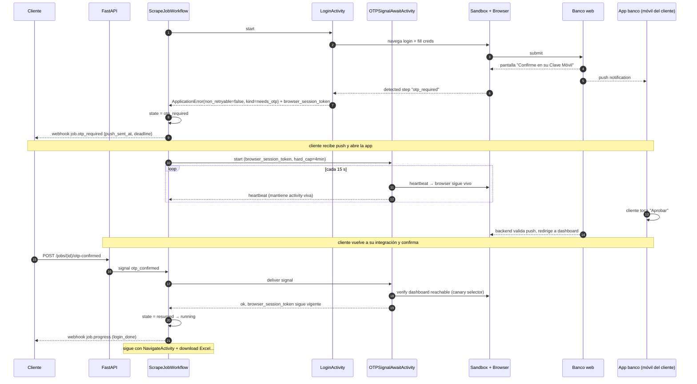
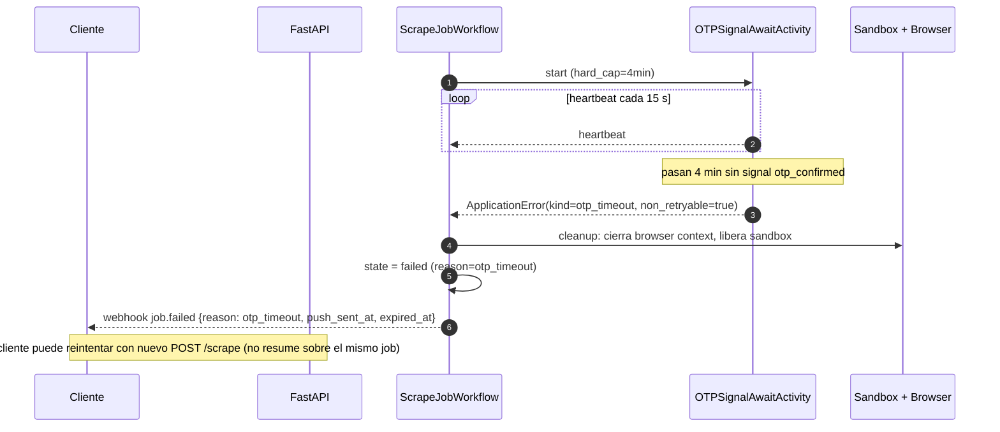
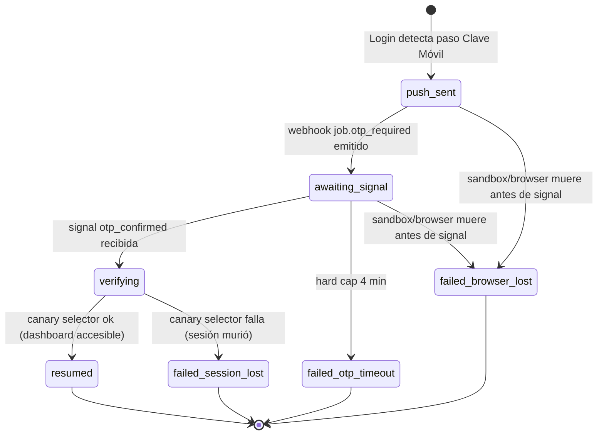

# Flow: OTP Pause / Resume (Clave Móvil)

Flujo crítico del producto. Banco General **no usa SMS**: envía un push a la app del banco del cliente y espera tap manual. La sesión bancaria expira a ~5 min. El workflow debe pausar de forma durable, mantener el browser context vivo, y reanudar dentro del hard cap de 4 min, o abortar limpio.

## Sequence diagram

## Rama de timeout

## Por qué hard cap = 4 min y no 5

La sesión bancaria expira ~5 min de inactividad. Si el workflow espera los 5 minutos completos y el signal llega justo al borde, el browser puede haber perdido la sesión silenciosamente y el dashboard que sigue es una redirección al login. Hard cap a 4 min deja 60 s de buffer para verificar canary selector + ejecutar el siguiente NavigateActivity antes de que el banco corte.

## Mantenimiento del browser context

Temporal **no serializa el browser context** (Chrome no es serializable). Lo que sí persiste:

- En workflow event history: `browser_session_token` (handle al sandbox container).
- En el sandbox container: el proceso de Chrome con el contexto vivo en memoria.

`OTPSignalAwaitActivity` envía heartbeats cada 15 s contra Temporal. Cada heartbeat también pinguea el sandbox para confirmar que el container está vivo y el browser responde. Si el worker que corre la activity muere:

1. Temporal detecta heartbeat lost (`heartbeat_timeout` superado).
2. Reschedule la activity en otro worker.
3. El nuevo worker recibe `browser_session_token` desde el activity input.
4. Se re-asocia al sandbox container existente (que sobrevivió al worker porque vive en otro proceso/host).
5. Continúa el loop de heartbeat sin reiniciar el browser.

Si el sandbox container también murió: la activity falla con `ApplicationError(kind=browser_lost, non_retryable=true)` y el job va a `failed` con razón `session_lost`.

## Sub-estado `otp_required` (detalle)

## Idempotency del signal

`POST /jobs/{id}/otp-confirmed` es idempotente por estado:

- Si job está en `otp_required` → entrega signal, devuelve `204`.
- Si job ya pasó a `running` (signal previa exitosa) → `204` no-op.
- Si job está en `failed` por timeout → `410 Gone` con `reason: otp_expired`.
- Si job no existe → `404`.

Múltiples llamadas concurrentes con el mismo `job_id` son seguras: Temporal entrega la primera signal, las siguientes son ignoradas porque `OTPSignalAwaitActivity` ya completó.

## Cancelación durante OTP

Si el cliente envía `POST /jobs/{id}/cancel` mientras el job está en `otp_required`:

1. API entrega signal `cancel_job` al workflow.
2. Workflow cancela `OTPSignalAwaitActivity`.
3. Cleanup: cerrar browser context + liberar sandbox.
4. Webhook `job.failed` con `reason: cancelled_by_user`.

## Métricas críticas

- `otp_wait_duration_seconds` (histograma) — cuánto tarda el humano en confirmar.
- `otp_timeout_total` (counter) — cuántos jobs fallan por hard cap.
- `browser_lost_during_otp_total` (counter) — alarma si sube.
- `otp_signal_idempotent_noop_total` — tracking de doble-tap del cliente.

## Referencias

- Componente: [`02-components/orchestrator.md`](../02-components/orchestrator.md)
- Endpoint: [`02-components/api.md`](../02-components/api.md) sección `POST /jobs/{id}/otp-confirmed`
- ADR de no-persistencia de sesión: `adr/0015-no-session-persistence-v1.md` (existente)
