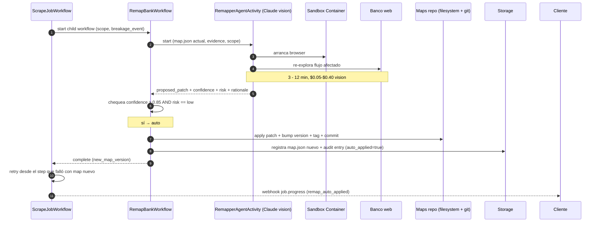
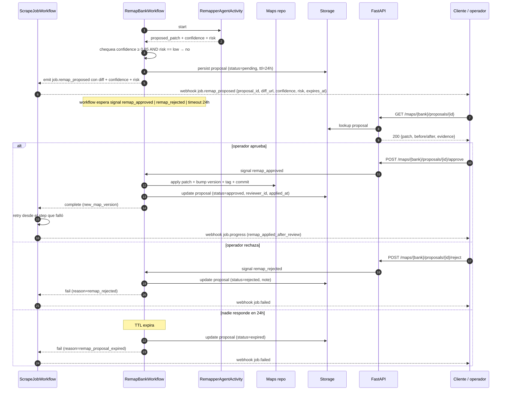
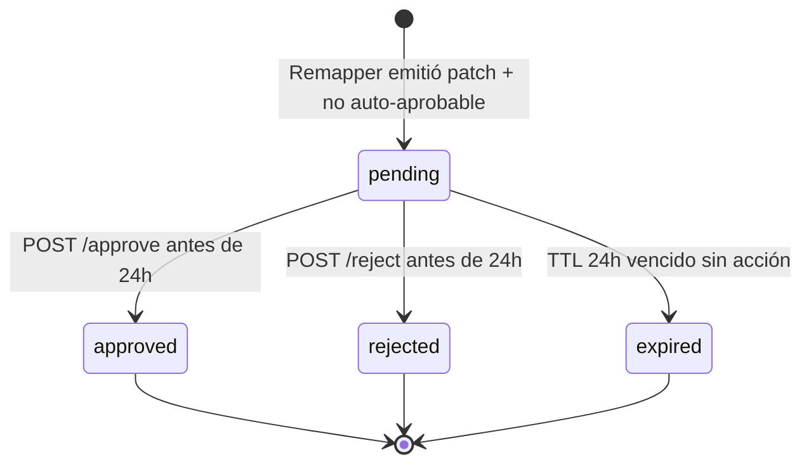

# Flow: Remap Approval

Qué pasa después de que Judge ordena un remap. El Remapper Agent (Claude vision) propone un patch al `map.json`. Si `confidence ≥ 0.85 AND risk == low` se auto-aplica; sino entra a flujo HITL con TTL de 24 h.

## Sequence diagram: rama auto-apply

## Sequence diagram: rama HITL

## Estados del proposal

## Reglas de auto-apply

| Confidence | Risk | Decisión |
|-----------:|------|----------|
| ≥ 0.85 | low | **auto-apply** |
| ≥ 0.85 | medium | HITL |
| ≥ 0.85 | high | HITL |
| < 0.85 | cualquiera | HITL |

Si el banco tiene `community/` map (no oficial firmado), se fuerza HITL siempre, sin importar confidence/risk.

## Contenido del proposal

Persistido en storage y servido por `GET /maps/{bank}/proposals/{id}`:

- `proposal_id`, `bank_id`, `from_map_version`, `to_map_version_target`.
- `scope`: `step | parser | full`.
- `patch`: diff en formato JSON Patch (RFC 6902) sobre `map.json`.
- `before` / `after`: versión completa para visualización.
- `evidence`:
  - `breakage_event` original.
  - `screenshots` antes/después de la exploración del Remapper.
  - `agent_trace` resumido (qué exploró el Remapper, qué selectores probó).
- `confidence`, `risk`, `rationale` del Remapper.
- `judge_decision` que originó el remap.
- `cost_usd` del Remapper run.
- `created_at`, `expires_at` (created + 24h).

## Aplicación del patch

`apply` corre dentro de `RemapBankWorkflow` (no en API):

1. Verificar idempotency: si `to_map_version_target` ya existe (otro proposal ganó la carrera), no re-aplicar.
2. Aplicar JSON Patch sobre el `map.json` actual.
3. Validar el resultado contra el linter estático (selectores, URLs, schema).
4. Bump `map_version` (semver minor para `partial`, major para `full`).
5. Commit + tag al repositorio de maps.
6. Si el map es oficial: re-firma con sigstore (responsabilidad del CI, no del workflow).
7. Audit entry: `who` (auto vs reviewer_id), `when`, `why` (proposal_id), `before/after_hash`.

Si linter rechaza: proposal pasa a `failed` (no `applied`), webhook `job.failed` con `reason: remap_lint_failed`. Esto evita que un patch del LLM rompa más cosas que el original.

## Idempotency de approval/reject

- Mismo proposal aprobado dos veces: segunda llamada devuelve `204` no-op (estado ya es `approved`).
- Approve sobre proposal ya `expired` o `rejected`: `409 Conflict`.
- Reject sobre proposal `approved`: `409 Conflict`.
- El workflow recibe el primer signal y descarta los siguientes.

## Cancelación durante HITL

`POST /jobs/{id}/cancel` mientras el workflow espera approval:

1. Signal `cancel_job` al `ScrapeJobWorkflow`.
2. Workflow cancela el `RemapBankWorkflow` hijo.
3. Proposal queda en `pending` con flag `parent_cancelled=true` (no se aplica).
4. Webhook `job.failed` con `reason: cancelled_by_user`.

## Métricas

- `remap_proposals_total` por banco y por scope.
- `remap_auto_applied_total` vs `remap_hitl_total`.
- `remap_approval_latency_seconds` (histograma) — cuánto tarda el operador en revisar.
- `remap_rejected_total` — señal de calidad del Remapper.
- `remap_expired_total` — señal de operador ausente.
- `remaps_used_24h` (gauge por banco) — alimenta el guardrail de 3/24h.

## Referencias

- Detección: [`03-flows/remap-detection.md`](./remap-detection.md)
- API endpoints: [`02-components/api.md`](../02-components/api.md) sección `/maps/{bank}/proposals`
- ADR threshold: `adr/0013-confidence-threshold-remap.md` (existente)
