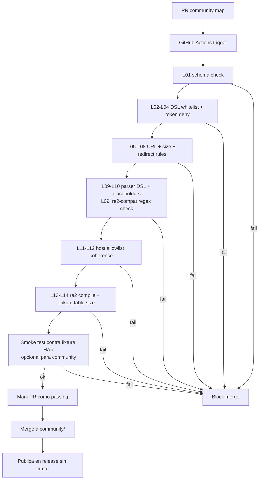
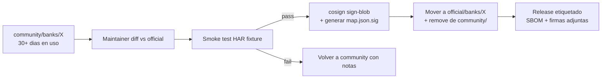

# Community Maps — modelo de confianza

## Contexto

`map.json` declara cómo navegar un banco. Hay dos tiers: `official/` (mantenidos por el proyecto, firmados) y `community/` (PR-based, no firmados, marcados como tales). Este documento define el modelo de confianza, la pipeline de validación y las mitigaciones contra mapas maliciosos.

Cross-refs: [`threat-model.md`](./threat-model.md) (T05, T06, T13) · [`sandbox.md`](./sandbox.md) (network allowlist).

## Tabla comparativa de tiers

| Aspecto | `official/` | `community/` |
|---------|-------------|--------------|
| Origen | Maintainers del proyecto | Pull request externo |
| Review | Humano + smoke test contra fixture HAR | Linter CI automático |
| Firma | sigstore/cosign con clave del proyecto | No firmado |
| Default behaviour | Cargado sin warning | Warning explícito al cargar; flag `--allow-community-maps` requerido |
| Verificación al boot | Verificar firma; abort si mismatch | Re-correr linter al cargar |
| Network policy | Hosts en allowlist global | Mismo allowlist; sin override |
| Promoción | n/a | Path documentado abajo |
| Audit log | `map_loaded` con digest + signer | `map_loaded` con flag `community=true` y digest |

## Validaciones estáticas del linter

El linter corre en CI sobre todo PR que toque `banks/*/map.json`, `banks/*/parser.json` o `community/banks/*/`. Falla si:

| ID | Regla | Razón |
|----|-------|-------|
| L01 | Schema JSON válido contra `map.schema.json` | Tipos y campos esperados |
| L02 | Sólo helpers whitelisted del DSL: `parse_date`, `extract_regex`, `normalize_amount`, `select`, `click`, `wait_for`, `download` | Sin Python arbitrario |
| L03 | Sin tokens `eval`, `exec`, `__import__`, `subprocess`, `os.`, `compile` | Defense in depth si parser cambia |
| L04 | Selectores no usan JS injection (`javascript:`, `data:`, atributos con `on*=`) | Vector de XSS sobre el browser |
| L05 | URLs sólo `https://` y bajo el dominio declarado en `bank.yaml` | T05: prevenir exfiltración a host externo |
| L06 | Sin `http://` salvo localhost en fixtures de tests | TLS obligatorio |
| L07 | Tamaño máximo del map ≤ 64 KB | Evitar map gigante con payload escondido |
| L08 | Sin atributos `redirect` o `follow_external` | Prevenir desvío del flujo a host malicioso |
| L09 | `parser.json` sólo helpers DSL whitelisted; todo `extract_regex` pattern debe ser **re2-compatible** (linter compila con google/re2; patterns con backtracking ilimitado son rechazados — CWE-1333) | Estabilidad del runner; inmunidad a ReDoS |
| L10 | Campos de input declarados deben mapear a placeholders conocidos (`<<username>>`, `<<password>>`, `<<otp>>`) | Sin nombres custom para tipear cred en lugares raros |
| L11 | Hosts secundarios (CDN, fonts) deben estar en `bank.yaml` allowlist | Allowlist explícito por banco |
| L12 | No `eval` en parser DSL ni en map | Redundante con L02/L03, defensa por capas |
| L13 | Cada `extract_regex` pattern debe compilar con re2 sin error. Rechaza lookahead/lookbehind sin límite de longitud. | Garantía constructiva O(n); elimina ReDoS (CWE-1333) |
| L14 | Tamaño total de todos los `lookup_table` maps en un `parser.json` ≤ 1 MB serializado | Complementa el cap runtime de 100 K filas; CWE-400 |

## Pipeline CI de validación

## Promoción community → official

Flujo manual gateado por maintainers:

1. Map vive en `community/banks/<id>/` durante un período de observación (≥ 30 días sugerido).
2. Maintainer corre el smoke test contra fixture HAR real anonimizada y verifica que el resultado matchea el snapshot esperado.
3. Maintainer ejecuta diff contra el `official/` previo (si existe) y revisa cambios línea por línea.
4. Maintainer firma con cosign usando clave del proyecto:
   - `cosign sign-blob official/banks/<id>/map.json` produce `map.json.sig`.
   - Verificación al cargar: `cosign verify-blob` contra `cosign.pub` distribuida en el repo.
5. Audit log entry con: signer identity, map digest SHA256, fecha, PR origen.

## Threat: map malicioso que pasa el linter

Escenario: un atacante envía un PR community con un map que cumple todas las reglas L01-L12 pero abusa de un campo legítimo del banco (e.g. campo de búsqueda) para inyectar la cred dentro de una URL del propio dominio del banco, y luego el banco la registra en sus access logs accesibles al atacante.

Mitigaciones por capas:

| Capa | Control |
|------|---------|
| 1. DSL declarativo | Sin `eval`/exec; el atacante sólo puede usar acciones primitivas |
| 2. Linter L05 | Sólo dominio del banco; no hay forma directa de exfiltrar a host externo |
| 3. Sandbox network allowlist | Sólo egress al banco + LLM gateways; cualquier subdominio fuera del declarado se bloquea |
| 4. Monitoreo egress | El egress-proxy logea todas las requests salientes; CI smoke test verifica que el map no genera requests fuera del path esperado |
| 5. `sensitive_data` placeholders | Las acciones que reciben `<<password>>` se restringen a campos `type=password` y campos declarados explícitamente como password fields en `bank.yaml`; tipear cred en un campo de búsqueda requiere modificar `bank.yaml` (el cual también es PR-reviewable) |
| 6. Default-deny en helpers | `extract_regex` no puede tener como input al field `<<password>>` (regla L10 + linter dedicado) |
| 7. Warning UX | Flag `--allow-community-maps` requerido para cargar; documentación explícita |
| 8. HITL | Si el Judge detecta cambios estructurales sospechosos, escala a humano antes de auto-apply |

Residual: si un atacante compromete el dominio del propio banco, está fuera del threat model (banco es una raíz de confianza implícita).

## Riesgos abiertos

- Linter actual no detecta ofuscación de URLs vía templating del DSL si se permiten variables compuestas. Decisión: prohibir composición string en URLs (sólo URLs literales en el map).
- Smoke test contra fixture HAR no es obligatorio en community por costo de mantenimiento; se recomienda en oficiales.
- La clave de firma de cosign es un activo crítico — debe vivir en HSM o en GitHub OIDC keyless signing.
