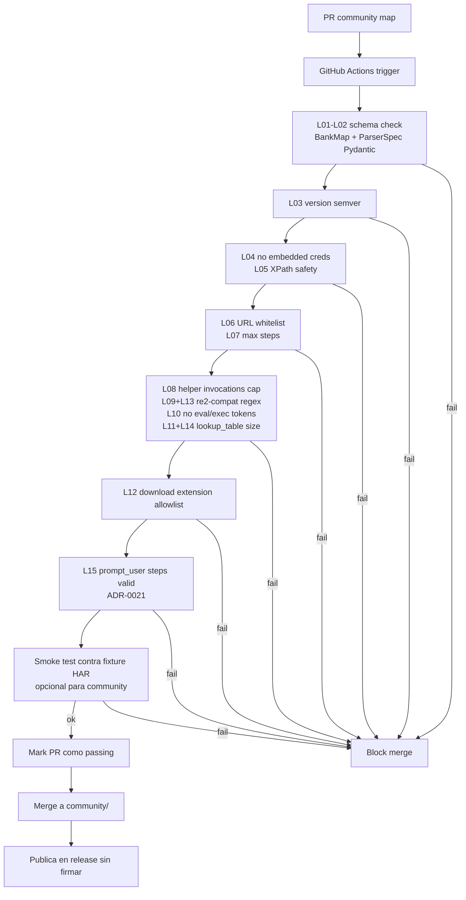
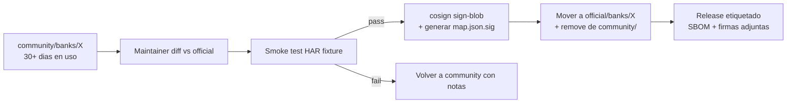

# Community Maps — modelo de confianza

## Contexto

`map.json` declara cómo navegar un banco. Hay dos tiers: `official/` (mantenidos por el proyecto, firmados) y `community/` (PR-based, no firmados, marcados como tales). Este documento define el modelo de confianza, la pipeline de validación y las mitigaciones contra mapas maliciosos.

Cross-refs: [`threat-model.md`](./threat-model.md) (T05, T06, T13) · [`sandbox.md`](./sandbox.md) (network allowlist).

## Tabla comparativa de tiers

| Aspecto | `official/` | `community/` |
|---------|-------------|--------------|
| Origen | Maintainers del proyecto | Pull request externo |
| Review | Humano + smoke test contra fixture HAR | Linter CI automático |
| Firma | sigstore/cosign con clave del proyecto | No firmado |
| Default behaviour | Cargado sin warning | Warning explícito al cargar; flag `--allow-community-maps` requerido |
| Verificación al boot | Verificar firma; abort si mismatch | Re-correr linter al cargar |
| Network policy | Hosts en allowlist global | Mismo allowlist; sin override |
| Promoción | n/a | Path documentado abajo |
| Audit log | `map_loaded` con digest + signer | `map_loaded` con flag `community=true` y digest |

## Validaciones estáticas del linter

El linter corre en CI sobre todo PR que toque `banks/*/map.json`, `banks/*/parser.json` o `community/banks/*/`. Falla si:

> **Nota de implementación:** Las reglas L01-L15 son implementadas por `MapLinter`
> en `packages/adapters/parsing/src/open_banca_parsing/community/linter.py`.
> Las reglas L13 y L14 fueron agregadas en T15 (ADR-0007-amendment).
> La regla L15 se incorpora junto con la implementación del step `prompt_user`
> (Task 36, ADR-0021).
> CLI: `python -m open_banca_parsing.community.linter <bank_dir>`.

| ID | Regla | Razón |
|----|-------|-------|
| L01 | `map.json` valida como `BankMap` Pydantic (bank_id, version, steps, schema_version requeridos) | Tipos y campos esperados |
| L02 | `parser.json` valida como `ParserSpec` Pydantic (version, bank, sheets requeridos) | Schema del DSL completo |
| L03 | Campo `version` no vacío y con formato semver (major.minor.patch[-prerelease]) en ambos archivos | Trazabilidad de versiones |
| L04 | Ningún step con `sensitive:true` tiene un campo `value` literal (debe usar `value_ref`) | Credenciales nunca embebidas en el map |
| L05 | Ningún selector XPath usa `//*` ni `descendant::*` (O(n²) traversal, DoS risk) | Prevenir DoS por selectores degenerados |
| L06 | URLs en steps `navigate` usan solo `https://` y pertenecen al mismo dominio (eTLD+1) del primer step `navigate` del banco | T05: prevenir exfiltración a host externo |
| L07 | Total de steps en `map.json` < 200 | Evitar maps gigantes con payload escondido |
| L08 | Total de invocaciones de helpers DSL por `SheetSpec` < 10 | Cap de complejidad por sheet |
| L09 | Todo `extract_regex` pattern en `parser.json` compila con `re2` (google-re2) sin error | Inmunidad a ReDoS (CWE-1333); patterns con lookahead/lookbehind rechazados |
| L10 | El JSON serializado de `parser.json` no contiene los tokens `eval`, `exec`, `__import__` | Defense-in-depth; sin Python arbitrario en DSL |
| L11 | Tamaño JSON total de todos los `lookup_table` maps en `parser.json` ≤ 1 MB | CWE-400; complementa el cap runtime de 100K filas |
| L12 | Steps `download_file` deben tener `expected_content_type` en la allowlist (.xlsx, .xls, .csv) o selector con extensión permitida | Prevenir descarga de formatos inesperados |
| L13 | Cada `extract_regex` pattern compila con re2 explícitamente (T15 addition, ADR-0007-amendment) | Garantía constructiva O(n); redundante con L09 por defensa en capas |
| L14 | Cada `lookup_table` individual en `parser.json` ≤ 1 MB serializado (T15 addition, ADR-0007-amendment) | Complementa L11 con cap por-mapa individual; CWE-400 |
| L15 | Cada step con `step_type: prompt_user` (ADR-0021) cumple **las tres**: (a) `question_selector` non-null y string non-empty, (b) `selector` non-null y string non-empty, (c) `field_key` matchea regex `^[a-z][a-z0-9_]{2,32}$` y es único dentro del `map.json` | Garantiza correlación signal↔activity vía `field_key`, evita colisiones de cache; previene maps que extraen pregunta sin slot de input válido; T27 input validation aligned |

## Pipeline CI de validación

## Promoción community → official

Flujo manual gateado por maintainers:

1. Map vive en `community/banks/<id>/` durante un período de observación (≥ 30 días sugerido).
2. Maintainer corre el smoke test contra fixture HAR real anonimizada y verifica que el resultado matchea el snapshot esperado.
3. Maintainer ejecuta diff contra el `official/` previo (si existe) y revisa cambios línea por línea.
4. Maintainer firma con cosign usando clave del proyecto:
   - `cosign sign-blob official/banks/<id>/map.json` produce `map.json.sig`.
   - Verificación al cargar: `cosign verify-blob` contra `cosign.pub` distribuida en el repo.
5. Audit log entry con: signer identity, map digest SHA256, fecha, PR origen.

## Threat: map malicioso que pasa el linter

Escenario: un atacante envía un PR community con un map que cumple todas las reglas L01-L12 pero abusa de un campo legítimo del banco (e.g. campo de búsqueda) para inyectar la cred dentro de una URL del propio dominio del banco, y luego el banco la registra en sus access logs accesibles al atacante.

Mitigaciones por capas:

| Capa | Control |
|------|---------|
| 1. DSL declarativo | Sin `eval`/exec; el atacante sólo puede usar acciones primitivas |
| 2. Linter L05 | Sólo dominio del banco; no hay forma directa de exfiltrar a host externo |
| 3. Sandbox network allowlist | Sólo egress al banco + LLM gateways; cualquier subdominio fuera del declarado se bloquea |
| 4. Monitoreo egress | El egress-proxy logea todas las requests salientes; CI smoke test verifica que el map no genera requests fuera del path esperado |
| 5. `sensitive_data` placeholders | Las acciones que reciben `<<password>>` se restringen a campos `type=password` y campos declarados explícitamente como password fields en `bank.yaml`; tipear cred en un campo de búsqueda requiere modificar `bank.yaml` (el cual también es PR-reviewable) |
| 6. Default-deny en helpers | `extract_regex` no puede tener como input al field `<<password>>` (regla L10 + linter dedicado) |
| 7. Warning UX | Flag `--allow-community-maps` requerido para cargar; documentación explícita |
| 8. HITL | Si el Judge detecta cambios estructurales sospechosos, escala a humano antes de auto-apply |

Residual: si un atacante compromete el dominio del propio banco, está fuera del threat model (banco es una raíz de confianza implícita).

## Riesgos abiertos

- Linter actual no detecta ofuscación de URLs vía templating del DSL si se permiten variables compuestas. Decisión: prohibir composición string en URLs (sólo URLs literales en el map).
- Smoke test contra fixture HAR no es obligatorio en community por costo de mantenimiento; se recomienda en oficiales.
- La clave de firma de cosign es un activo crítico — debe vivir en HSM o en GitHub OIDC keyless signing.
