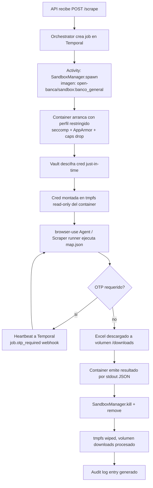
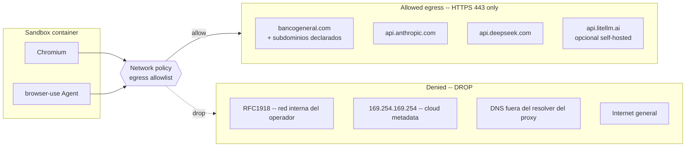
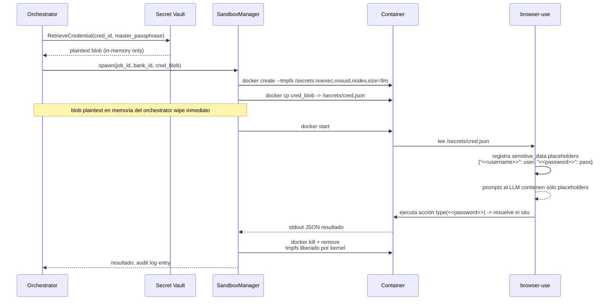

# Sandbox por job

## Contexto

Cada scrape job arranca un container Docker efímero, ejecuta el flujo (login → navegación → descarga Excel) y se destruye. Esto aísla Chromium, las credenciales descifradas y la sesión del banco en una superficie con blast radius acotado. Decisión: [ADR-0009](../adr/0009-docker-sandbox-per-job.md).

Cross-refs: [`threat-model.md`](./threat-model.md) (T07, T14) · [`secrets-at-rest.md`](./secrets-at-rest.md) · [`02-components/secrets.md`](../02-components/secrets.md).

## Lifecycle del sandbox

## Controles del container

| Control | Valor | Razón |
|---------|-------|-------|
| User | non-root (uid `10001`) | Reduce impacto si Chromium escapa al namespace |
| Read-only rootfs | sí | Prevenir persistencia de payloads |
| tmpfs writable | `/tmp` (256MB) y `/secrets` (8MB, noexec, nosuid, nodev) | Mínimo necesario para Chromium y para inyectar creds |
| Volumen downloads | `/downloads` bind mount, owner uid 10001 | Salida del Excel; auditable desde host |
| Capabilities drop | `ALL` | Chromium con sandbox interno no necesita caps |
| `cap_add` | ninguna | Confirmado vía smoke test del scraper |
| Seccomp profile | `default` de Docker + filtrado adicional (`unshare`, `keyctl`, `bpf` denied) | Default cubre la mayoría; deny extra de syscalls comunes en escapes |
| AppArmor / SELinux | profile `open-banca-sandbox` (deny mount, ptrace, raw sockets, kernel modules) | Defensa en profundidad sobre seccomp |
| `no-new-privileges` | sí | Bloquea setuid escalation |
| `pids-limit` | 256 | Forkbomb defense |
| `memory` | 2 GiB hard | Chromium pesado; cap evita exhausting host |
| `cpus` | 1.5 | Throttle |
| `--init` | sí | Reaper de zombies |
| `--ipc=none` y `--pid=` propio | sí | Sin shared IPC con host |
| `--cgroup-parent` | `open-banca/sandbox.slice` | Contabilidad y kill agrupado |
| Env vars | sólo `JOB_ID`, `BANK_ID`, `MAP_PATH`, `LLM_GATEWAY_URL` | Sin API keys del operador en el container; LLM gateway hace de proxy |
| Logs | stdout JSON capturado por orchestrator; redact regex aplicado | Filter se ejecuta antes de Langfuse/OTel |
| TTL hard | 6 min wall-clock | Banco corta sesión a ~5 min; sandbox debe morir antes |
| Restart policy | `no` | Efímero por definición |

## Network policy

Implementación:

- Network mode: red Docker user-defined `open-banca-sandbox-net` con `--internal=false` y reglas iptables/nftables aplicadas por un sidecar `egress-proxy` (tinyproxy o squid en deny-by-default).
- DNS: el container apunta a un resolver local que sólo resuelve hosts en allowlist; cualquier otro nombre devuelve NXDOMAIN.
- Hosts en allowlist: declarados en el `bank.yaml` del banco + bloque global de LLM gateways en config del operador.
- RFC1918 + metadata IP (169.254.169.254) están en deny-list explícita por encima del proxy, defensa contra SSRF accidental.

## Inyección de credenciales

Garantías:

- El plaintext de la credencial sólo existe en: (a) memoria del orchestrator durante el spawn, (b) tmpfs `/secrets` del container durante su vida (~minutos), (c) memoria de Chromium al hacer `type()` el password.
- `tmpfs` con `noexec,nosuid,nodev` y montado sólo en este container; al destruir el container, el kernel libera la memoria.
- El LLM nunca recibe el plaintext: browser-use sustituye placeholders sólo en el momento de la action call (la herramienta `type` resuelve `<<password>>` antes de enviar el evento al CDP, no en el prompt).
- Logs y screenshots: el filter middleware del orchestrator aplica regex de redact sobre los valores conocidos antes de exportar a Langfuse/OTel/HAR.

## Hardening de la imagen

| Item | Política |
|------|----------|
| Base image | `python:3.12-slim` + Chromium pinned por SHA digest |
| Multi-stage build | sí, sólo runtime layer en final |
| `apt` packages | minimal: ca-certificates, fonts, chromium runtime deps |
| Image scan | Trivy en CI, fail si CVE high+ con fix disponible |
| SBOM | generado con syft, publicado junto a la imagen |
| Firma | cosign sign de la imagen final |
| Tag policy | inmutable por digest, no `:latest` en producción |

## Riesgos residuales

- **0-day kernel** que escape seccomp + AppArmor: gVisor/Firecracker postergado a v2.
- **docker-socket-proxy mal configurado**: smoke test en CI debe intentar endpoints prohibidos (e.g. `volumes/create` con bind del host) y verificar 403.
- **Banco que sirve subdominio user-controlled**: el allowlist por dominio es coarse; ver T05/T06 en threat model.
