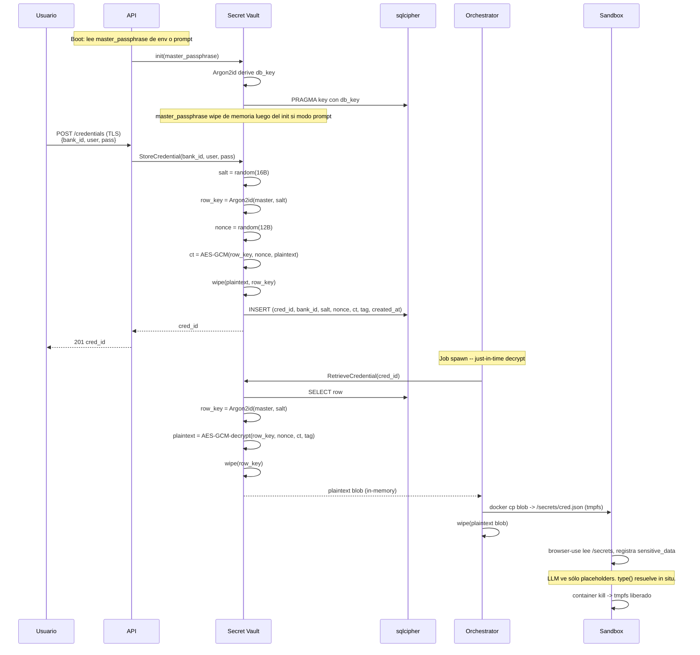

# Secrets at Rest

## Contexto

Las credenciales bancarias del usuario (user/pass) son el activo más sensible del sistema. Este documento describe la cadena de cifrado, el flujo de uso just-in-time, los puntos de fuga potenciales y los controles. Decisión: [ADR-0008](../adr/0008-sqlcipher-secrets.md).

Cross-refs: [`threat-model.md`](./threat-model.md) (T01-T03) · [`sandbox.md`](./sandbox.md) · [`02-components/secrets.md`](../02-components/secrets.md).

## Cadena de cifrado

| Capa | Algoritmo | Parámetros |
|------|-----------|-----------|
| KDF (master → row key) | Argon2id | mem=256 MiB, iters=3, parallelism=4, salt=16B random per row |
| Cifrado per-row | AES-256-GCM | nonce=12B random per encryption, tag=16B |
| Cifrado del DB | sqlcipher (AES-256-CBC + HMAC-SHA512) | passphrase derivada del master vía Argon2id separado (mem=128 MiB, iters=3) |
| Master passphrase source | env `OPEN_BANCA_MASTER_PASSPHRASE` o prompt TTY al boot | Nunca persistida en disco |

Doble capa: sqlcipher protege el DB completo (defense in depth contra robo de archivo); AES-GCM per-row protege cada credencial con su propia salt+nonce, lo que limita el blast radius si una row leak ocurre por bug en una query.

## Flujo de Store + Retrieve

## Parámetros Argon2id

| Parámetro | Per-row | DB key |
|-----------|---------|--------|
| Memory | 256 MiB | 128 MiB |
| Iterations | 3 | 3 |
| Parallelism | 4 | 4 |
| Salt size | 16 B random | 16 B en config (no random; derivado de install) |
| Output size | 32 B (AES-256 key) | 32 B |

Justificación: 256 MiB / 3 iter es competitivo con OWASP cheat sheet 2024 para uso server-side. Cada Retrieve tarda ~300-500 ms en hardware moderno; aceptable porque sólo ocurre al spawn de un sandbox (no por request).

## Rotación de master passphrase

Operación offline batch (requiere stop del API):

1. Operador setea env `OPEN_BANCA_MASTER_PASSPHRASE_NEW`.
2. Comando admin `open-banca rotate-master`:
   - Lee todas las rows.
   - Por cada row: descifra con master viejo, re-cifra con master nuevo (nuevo salt+nonce).
   - Re-cifra DB con sqlcipher `PRAGMA rekey` derivado del master nuevo.
3. Audit log entry `master_rotated` con timestamp y operator id.
4. Stop → swap env var → restart con master nuevo.

Sin downtime real porque el API no acepta tráfico mientras rota; jobs en vuelo abortan con razón explícita.

## Backup y restore

- Backup del archivo SQLite cifrado (`open_banca.db`) es seguro: sin master passphrase es opaco (sqlcipher + Argon2id).
- Estrategia recomendada: snapshot del volumen + copia off-host. No incluir `.env`.
- Restore: copiar archivo + setear env con master passphrase original. Si master se perdió, las creds son irrecuperables y el operador debe re-onboarding.
- Audit log también vive en el DB cifrado.

## Logs, traces y HAR — garantías de no-fuga

Los puntos de fuga potenciales y sus controles:

| Vía | Riesgo | Control |
|-----|--------|---------|
| Langfuse trace de prompts LLM | Cred filtrada al prompt | `sensitive_data` placeholders de browser-use; el LLM ve `<<password>>` no el valor. Test CI con prompt sintético verifica ausencia. |
| OTel span attributes | Cred en `request.body` o atributo custom | Filter middleware con allowlist de span attributes; deny por default todo lo no listado |
| Playwright HAR | Cred en `formData` del POST de login | HAR post-processor: regex redact sobre valores conocidos del job (con cred plaintext en memoria del orchestrator, redact-then-export) |
| Playwright video / screenshots | Password visible si banco lo renderiza | Default: video off en producción, screenshot blur sobre inputs `type=password`; flag debug obligatorio para grabar y firma audit |
| Stdout del container | Cred si el código loguea por error | Stream JSON-only contract; cualquier línea no-JSON es warning + redact attempt antes de OTel |
| Logs del orchestrator | Stack trace con cred en local var | Loguer con redact regex de los valores plaintext mientras viven en memoria |
| Audit log del Vault | Operación + user id, no plaintext | Vault nunca escribe plaintext al audit |
| `.env` con API keys del operador | No es la cred bancaria, pero crítico | File mode 0600, fuera de git, runbook explícito; documentado en T12 |
| Memory dumps / core dumps | Plaintext en heap | `ulimit -c 0` en config recomendada; documentado en runbook |
| Swap | Plaintext en disco | `madvise(MADV_DONTDUMP)` y, en hosts dedicados, swap deshabilitado. Recomendación operativa, no enforced. |

Test CI obligatorios:

- Test que ejecuta un scrape con cred sintética conocida (`SECRET_CANARY_VALUE`) y graba traces Langfuse + OTel + HAR en filesystem; al final, grep por el valor canario debe devolver 0 ocurrencias.
- Test que verifica que el filter middleware tiene allowlist por defecto-deny (no opt-in nuevos campos).

## Riesgos residuales

- **Operador hostil con master passphrase**: puede descifrar todas las cred. Modelo de amenaza single-org acepta esto explícitamente.
- **Memory de Chromium / orchestrator**: el plaintext existe en RAM minutos. Defensa: tmpfs noexec + container efímero + wipe explícito.
- **Filter middleware regresión**: una span attribute nueva podría no estar redactada. Defensa: test canario obligatorio en CI.
- **Argon2id parámetros desactualizados**: revisión anual en runbook; bump cuando hardware lo permita.
