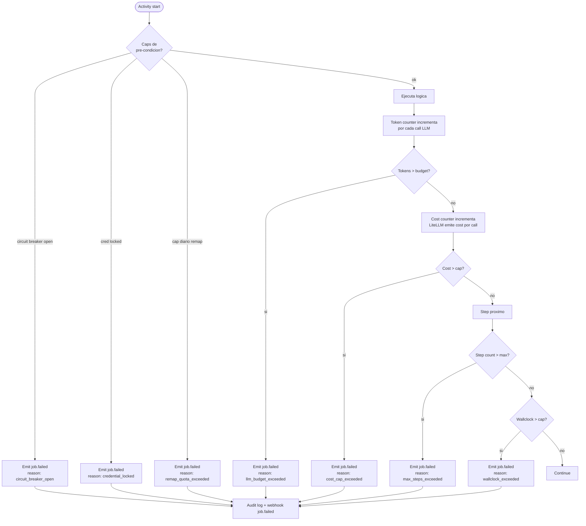

# Cost Guardrails y Rate Limiting

Conjunto de caps por job, por banco, por unidad de tiempo. Diseñados para evitar tres riesgos: (a) factura LLM descontrolada, (b) lockout/baneo del banco por reintentos agresivos, (c) loop infinito de remap por bug. Aplicados en distintas capas; ningún cap es opcional para el flujo default.

## Tabla de caps

| Cap | Default | Scope | Razón |
|-----|---------|-------|-------|
| `cost_cap_usd_per_job` | $0.50 | por scrape job | Mapper Claude Sonnet 4.6 con vision es caro; Validator/Judge DeepSeek es marginal. Cap defiende contra prompt loops. |
| `cost_cap_usd_per_mapping` | $0.40 | por mapping run (Mapper o Remapper) | Subset del cap por job; el resto va a Validator/Judge. |
| `cost_cap_usd_per_validate` | $0.02 | por validate run | DeepSeek es barato; cap para loops anómalos. |
| `cost_cap_usd_per_judge` | $0.02 | por judge call | Idem. |
| `max_remap_attempts_per_bank_24h` | 3 | por banco | Si un banco rompió 3 veces en 24h, hay rediseño real → escalation manual. |
| `max_failed_logins_consecutive` | 2 | por credencial | A la 3ra → circuit breaker abierto 1h. Defiende lockout. |
| `circuit_breaker_open_duration` | 1h | por credencial / banco | Half-open con 1 prueba después; si pasa, vuelve a closed. |
| `max_steps_per_workflow` | 100 | por job | Banco General típicamente ~30-50 steps; 100 es margen ante remap parcial. |
| `max_tokens_input_per_agent_per_job` | 1.5M (Mapper), 100k (Validator), 50k (Judge) | por agente | Vision pesa; texto-only es chico. |
| `max_tokens_output_per_agent_per_job` | 64k (Mapper), 4k (Validator), 2k (Judge) | por agente | El output estructurado es chico siempre. |
| `activity_timeout_default` | 60s | por activity | Excepto OTP wait (240s) y descarga grande (180s). |
| `wallclock_timeout_per_job` | 15 min | por job | Cubre login + OTP (4 min cap) + descarga + parse + validate + buffer. |
| `max_concurrent_jobs_per_credential` | 1 | por credencial | Evitar sesiones simultáneas (banco las pelea). |
| `max_concurrent_jobs_global` | 3 | nodo | Defensivo de RAM/CPU; configurable según host. |
| `webhook_max_retry_attempts` | 5 | por webhook delivery | Backoff exponencial; después → dead letter. |
| `mapping_run_per_bank_per_24h` | 1 (con override) | por banco | Mapping fresh es disruptivo; uno por día salvo override explícito. |

## Enforcement



Implementación:

- **Pre-condition checks** corren al iniciar la activity contra `circuit_breakers` y `audit_log` (queries de count en ventanas).
- **Token counter** vía hook de LiteLLM por call: incrementa contador en memoria del workflow + persiste en cada heartbeat.
- **Cost counter** vía pricing tables de LiteLLM por modelo/tokens; cap chequeado tras cada call LLM.
- **Step counter** lleva el `step_index` del runner; al exceder, abort.
- **Wallclock** usa el `start_time` del workflow + `now()` del worker.

Cualquier abort emite:

- `job.failed` webhook con `failure_reason` enum.
- Entry en `audit_log` con detalles.
- Span OTel con atributo `failure.reason`.
- Métrica counter `open_banca_job_aborted_total{reason=...}`.

## Alertas

| Threshold | Alerta | Acción sugerida |
|-----------|--------|------------------|
| Tasa de fallo de un banco >30% en 24h | `bank_failure_rate_high` | Pausar scrapes auto del banco, revisar map. |
| Cost diario LLM >2x rolling 7d | `llm_cost_spike` | Revisar logs Langfuse, posible loop. |
| Circuit breaker abierto >3 veces para misma cred en 24h | `cred_repeated_lockout` | Rotar password, contactar usuario. |
| Mapping_run_per_bank cap excedido y override usado >2 veces en 7d | `mapping_override_overused` | Revisar estabilidad del banco. |
| Wallclock_exceeded >5 jobs en 1h | `slow_jobs_burst` | Revisar latencia de banco / worker carga. |

Alertas se emiten como métricas + logs estructurados; el operador conecta su pipeline.

## Override del operador

Operador puede override caps via config file `caps.override.yaml`:

```
# pseudo-config
banco_general:
  cost_cap_usd_per_job: 1.00          # justificacion: regression test
  max_remap_attempts_per_bank_24h: 5  # justificacion: migracion banco
  expires_at: 2026-05-15
  approved_by: ops@example.com
```

Reglas:

- Cada override **requiere campo `justificacion`** (texto libre) y `expires_at` (max 30 días).
- Override loggeado en `audit_log` al boot.
- Override expira automáticamente.
- Sin override en runtime via API: cambio de config requiere reboot del worker (intencional, evita escalada de privilegio en runtime).
- No se puede override `max_failed_logins_consecutive` por debajo de 2 (no puede ser más permisivo que el default — defiende lockout siempre).

## Costos esperados (orden de magnitud)

| Operación | Modelo | Tokens típicos | Costo estimado |
|-----------|--------|----------------|------------------|
| Scrape exitoso (sin LLM) | — | 0 | ~$0 |
| Validación (heurísticos OK, sin LLM) | — | 0 | ~$0 |
| Validación con LLM (caso ambiguo) | DeepSeek V3 | 2k in + 0.5k out | <$0.001 |
| Judge call | DeepSeek V3 | 5k in + 1k out | <$0.005 |
| Mapping fresh (Mapper) | Claude Sonnet 4.6 | 500k-1M in + 30k out | $0.20-$0.40 |
| Remap parcial | Claude Sonnet 4.6 | 200k in + 10k out | $0.10-$0.20 |

Promedio target por scrape estable: **<$0.01**. Costo material sólo en mapping/remap, que son eventos raros.

## Lo que cost-guardrails **no** hace

- No optimiza prompts — es responsabilidad de los componentes.
- No corta calls LLM en mid-stream (corta entre calls).
- No factura — sólo previene.

## Referencias

- Observabilidad / métricas: [`observability.md`](./observability.md).
- Judge decisions / circuit breakers: [`../02-components/judge-agent.md`](../02-components/judge-agent.md).
- Mapper budget: [`../02-components/mapper-agent.md`](../02-components/mapper-agent.md).
- ADR-0013 confidence threshold: [`../adr/0013-confidence-threshold-remap.md`](../adr/0013-confidence-threshold-remap.md).
