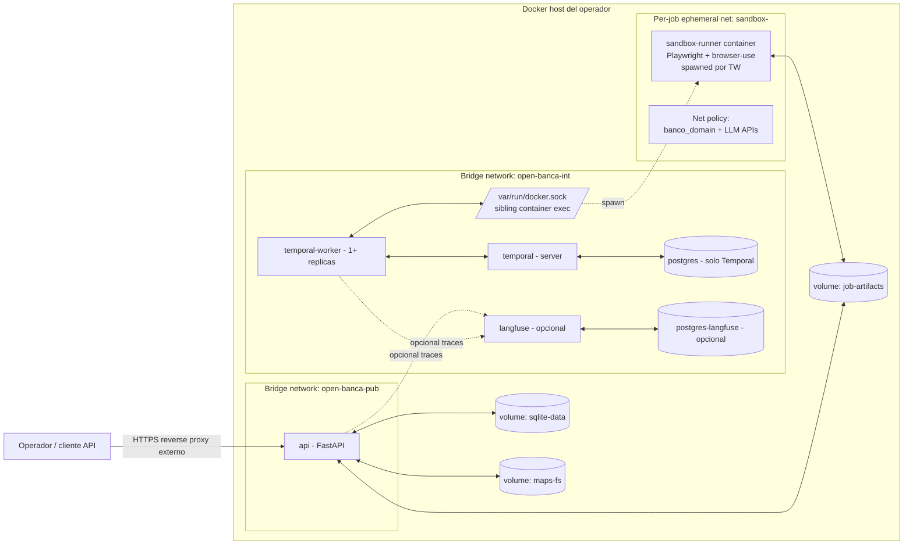
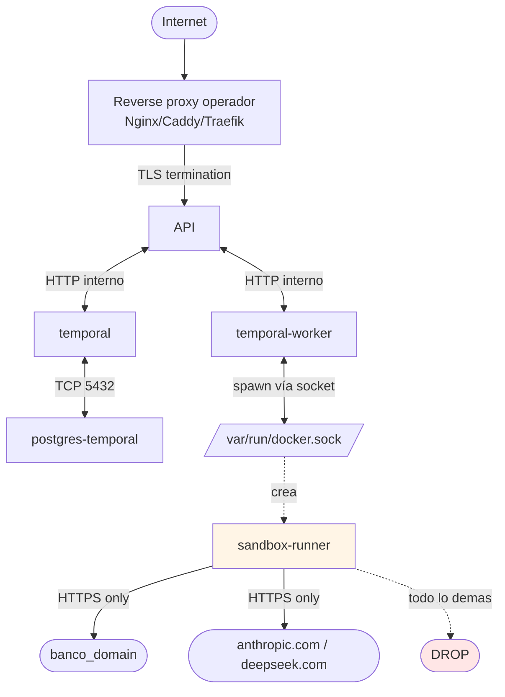

# Deployment self-hosted

Layout de containers + red para correr open-banca on-premises o en VPS del operador. Distribución oficial: **un solo `docker-compose.yml`** que levanta todo.

## Topología de containers



Solo `api` se expone al host (puerto único, ej. `8080`). Reverse proxy / TLS termination es responsabilidad del operador.

## Servicios

| Servicio | Imagen base sugerida | Puertos expuestos | Volúmenes | Depende de | Env vars críticas (sin valores) |
|----------|----------------------|-------------------|-----------|------------|----------------------------------|
| `api` | `python:3.12-slim` (build local con uv) | `8080` (al host) | `sqlite-data:/data`, `maps-fs:/maps:ro`, `job-artifacts:/artifacts:ro` | `temporal`, `temporal-worker` | `OPEN_BANCA_MASTER_PASSPHRASE`, `WEBHOOK_HMAC_SECRET`, `API_KEY`, `TEMPORAL_ADDRESS`, `LANGFUSE_ENABLED`, `OTEL_EXPORTER_OTLP_ENDPOINT` |
| `temporal` | `temporalio/auto-setup` | interno | — | `postgres-temporal` | `DB_HOST`, `DB_USER`, `DB_PORT`, `POSTGRES_PWD` |
| `docker-socket-proxy` | `tecnativa/docker-socket-proxy:latest` | interno (solo `open-banca-internal`) | `/var/run/docker.sock:ro` | — | `CONTAINERS=1`, `IMAGES=1`, `NETWORKS=1`, `POST=1`, `EXEC=0`, `BUILD=0`, `VOLUMES=0` (ver golden config) |
| `temporal-worker` | mismo build que `api` | interno | `maps-fs:/maps:ro`, `job-artifacts:/artifacts` (sin docker.sock directo) | `temporal`, `docker-socket-proxy` | `TEMPORAL_ADDRESS`, `TASK_QUEUE`, `WORKER_CONCURRENCY`, `ANTHROPIC_API_KEY`, `DEEPSEEK_API_KEY`, `DOCKER_HOST=tcp://docker-socket-proxy:2375` |
| `postgres-temporal` | `postgres:16-alpine` | interno | `pg-temporal:/var/lib/postgresql/data` | — | `POSTGRES_USER`, `POSTGRES_PASSWORD`, `POSTGRES_DB` |
| `sandbox-runner` (ephemeral) | `mcr.microsoft.com/playwright/python` (custom layer) | ninguno | `job-artifacts:/artifacts` (sólo subdir del job) | spawned por worker | `JOB_ID`, `BANK_ID`, `MAP_PATH`, `LLM_API_KEYS_FORWARDED` |
| `langfuse` (opcional) | `langfuse/langfuse:latest` | interno (opcional al host) | `langfuse-data:/data` | `postgres-langfuse` | `DATABASE_URL`, `NEXTAUTH_SECRET`, `SALT` |
| `postgres-langfuse` (opcional) | `postgres:16-alpine` | interno | `pg-langfuse:/var/lib/postgresql/data` | — | igual a `postgres-temporal` |

Notas:

- `temporal-worker` usa `docker-socket-proxy` (REQ-018) en lugar de montar `/var/run/docker.sock` directamente. El worker declara `DOCKER_HOST=tcp://docker-socket-proxy:2375`. El proxy expone sólo los endpoints necesarios para spawn/manage del sandbox container (CONTAINERS, IMAGES, NETWORKS, POST). Todo lo demás retorna 403. Detalles en [`../04-security/sandbox.md §docker-socket-proxy`](../04-security/sandbox.md).
- `sandbox-runner` se spawnea **por job**, en su propia ephemeral network con drop-all + allow del dominio del banco + APIs LLM whitelisted (ver [`../04-security/threat-model.md`](../04-security/threat-model.md)).
- `langfuse` y su Postgres son opt-in vía profile docker-compose (`--profile langfuse`).

## Network



- `api` único container con puerto al host (8080).
- `temporal`, `worker`, `postgres`, `langfuse`: nunca expuestos al host. Acceso vía `docker exec` o port-forward temporal del operador.
- `sandbox-runner`: aislado en su propia network por job; sin acceso a la red interna de servicios.

## Checklist de seguridad de memoria — obligatorio antes del primer arranque

Las siguientes verificaciones deben completarse en el host **antes** de ejecutar `docker compose up` en producción. El API se niega a arrancar si detecta swap activo. El operador es responsable de cumplir este checklist y documentarlo en su runbook de plataforma.

| # | Verificación | Comando de comprobación | Resultado esperado | Referencia |
|---|-------------|------------------------|-------------------|------------|
| M-1 | Swap desactivado en caliente | `swapon --show` | Sin output (vacío) | ADR-0008-amendment §2 |
| M-2 | Swap desactivado en /proc | `cat /proc/swaps` | Solo línea de cabecera | ADR-0008-amendment §2 |
| M-3 | swappiness = 0 | `cat /proc/sys/vm/swappiness` | `0` | ADR-0008-amendment §4 |
| M-4 | core dump limit = 0 en docker-compose | Ver `ulimits.core` en `docker-compose.yml` para servicios `api` y `temporal-worker` | `soft: 0, hard: 0` | ADR-0008-amendment §3 |
| M-5 | core dump deshabilitado en systemd (si aplica) | `systemctl show open-banca-api \| grep LimitCORE` | `LimitCORE=0` | ADR-0008-amendment §3 |
| M-6 | RLIMIT_MEMLOCK suficiente para mlock | `ulimit -l` o `cat /proc/<pid>/limits \| grep 'Max locked'` | `unlimited` o valor > 64 MiB | ADR-0008-amendment §consecuencias |
| M-7 | OPEN_BANCA_ENV no es "development" en producción | `grep OPEN_BANCA_ENV .env` | Ausente o `production` | ADR-0008-amendment §4 |

### Comandos de configuración

```bash
# M-1 + M-2: Desactivar swap en caliente
swapoff -a

# M-3: Establecer swappiness = 0 persistente
echo 'vm.swappiness=0' >> /etc/sysctl.d/99-open-banca.conf
sysctl --system

# M-6: RLIMIT_MEMLOCK (systemd service)
# Añadir en /etc/systemd/system/open-banca-api.service:
#   LimitMEMLOCK=infinity
# O para sesión de shell de test:
ulimit -l unlimited

# M-4: Verificar docker-compose.yml incluye:
#   services.api.ulimits.core.soft: 0
#   services.api.ulimits.core.hard: 0
#   services.temporal-worker.ulimits.core.soft: 0
#   services.temporal-worker.ulimits.core.hard: 0
```

### Swap permanente deshabilitado

```bash
# Editar /etc/fstab: comentar o eliminar la línea con tipo 'swap'
# Antes:   /dev/sda2  none  swap  sw  0 0
# Después: # /dev/sda2  none  swap  sw  0 0

# En instancias cloud con swap file:
swapoff /swapfile
rm /swapfile
# Eliminar también la entrada en /etc/fstab
```

El API validará automáticamente M-1, M-2 y M-3 al arrancar y terminará con exit code 1 si alguno falla. El checklist completo (M-4 a M-7) es responsabilidad del operador antes de levantar los containers.

Referencias de amenaza: CWE-244 (heap memory not cleared), CWE-528 (core dump exposure). Detalle técnico en [`../04-security/secrets-at-rest.md`](../04-security/secrets-at-rest.md) §Memory protection — hard requirements y [`../adr/0008-amendment-mlock.md`](../adr/0008-amendment-mlock.md).

## docker-compose.yml — configuración final (Task 33)

El compose final incluye los siguientes servicios:

| Servicio | Imagen | Profile | Healthcheck | Resource limits |
|----------|--------|---------|-------------|-----------------|
| `docker-socket-proxy` | `tecnativa/docker-socket-proxy` | (default) | `wget http://localhost:2375/_ping` | 0.5 CPU / 256M |
| `postgres-temporal` | `postgres:16-alpine` | (default) | `pg_isready` | 1.0 CPU / 512M |
| `temporal-server` | `temporalio/auto-setup:1.27.2` | (default) | `tctl cluster health` | 1.0 CPU / 768M |
| `temporal-ui` | `temporalio/ui:2.35.0` | `ui` | (none) | 0.5 CPU / 256M |
| `api` | build local (target: runtime) | (default) | `curl /healthz` | 1.0 CPU / 512M |
| `temporal-worker` | build local (target: runtime) | (default) | python exit(0) | 2.0 CPU / 1G |
| `sandbox-runner` | build local (sandbox/Dockerfile) | `build-only` | n/a (ephemeral) | per-spawn ADR-0009 |
| `langfuse` | `langfuse/langfuse` | `langfuse` | `curl /api/public/health` | 1.0 CPU / 1G |
| `postgres-langfuse` | `postgres:16-alpine` | `langfuse` | `pg_isready` | 0.5 CPU / 256M |

Notas de implementación:

- `api` y `temporal-worker` usan la **misma imagen** (`open-banca:latest`, target `runtime`). El `command:` en compose diferencia el entrypoint.
- `sandbox-runner` está en profile `build-only`: `docker compose build sandbox-runner` lo construye pero `docker compose up` no lo arranca. El worker lo spawnea per-job con flags ADR-0009.
- `OPEN_BANCA_MASTER_PASSPHRASE` se pasa como env var (Security Critical Rule #6). No como Docker secret (v1).
- `open-banca-internal`: `internal=false` intencional — el worker necesita egress para pull de imágenes sandbox y LLM APIs.
- Todos los servicios tienen `ulimits.core: soft=0, hard=0` (M-4).

## Primer arranque

Procedimiento local recomendado (HU02, issue #8): máquina con Docker instalado y daemon activo; variables en `.env` reales (no placeholders). El repositorio incluye `.env.example` como plantilla — **no** commitear `.env`.

### 1) Secretos y `.env`

Desde la raíz del repo:

```bash
./scripts/bootstrap_env.sh
```

Qué hace el script: si no existe `.env`, copia `.env.example` → `.env` (si ya hay `.env`, **no** lo sobrescribe). Rellena con `secrets` de Python los valores que sigan en placeholder para `OPEN_BANCA_MASTER_PASSPHRASE`, `WEBHOOK_HMAC_SECRET`, `API_KEY` y `TEMPORAL_DB_PASSWORD` (no pisa valores que el operador ya hubiera definido). Después **debes** editar `.env` y poner una `ANTHROPIC_API_KEY` válida (formato `sk-ant-...`); el worker la exige en compose.

Otros campos útiles: `DEEPSEEK_API_KEY` (opcional), `OPEN_BANCA_API_PORT` (default `8080`), modelos `OPEN_BANCA_MAPPER_MODEL` / `OPEN_BANCA_REMAPPER_MODEL` / `OPEN_BANCA_VALIDATOR_MODEL` / `OPEN_BANCA_JUDGE_MODEL` si quieres overrides. El secreto HMAC para webhooks es **`WEBHOOK_HMAC_SECRET`** (no existe `OPEN_BANCA_WEBHOOK_SECRET`).

### 2) Checklist de memoria (M-1 a M-7)

Antes del primer `docker compose up` en un host tipo producción, completar la tabla del checklist de seguridad de memoria más arriba en este documento.

### 3) Build e imagenes auxiliares

```bash
docker compose build api
docker compose build sandbox-runner
```

(`api` y `temporal-worker` comparten imagen `open-banca:latest`; sandbox es imagen separada.)

### 4) Arranque escalonado (dependencias)

Evita condiciones de carrera entre Postgres, Temporal y el proxy de Docker:

```bash
docker compose up -d postgres-temporal
# Esperar healthy: docker compose ps postgres-temporal
docker compose up -d temporal-server
docker compose up -d docker-socket-proxy
docker compose up -d api temporal-worker
```

Comprueba estado: `docker compose ps` — servicios con healthcheck deberían pasar a `healthy` cuando terminen de iniciar.

### 5) Verificación rápida

Sustituye el puerto si definiste `OPEN_BANCA_API_PORT` distinto de `8080` (el smoke script `scripts/smoke_compose.sh` usa la misma variable vía `API_PORT`):

```bash
curl -fsS "http://localhost:${OPEN_BANCA_API_PORT:-8080}/healthz"
curl -fsS "http://localhost:${OPEN_BANCA_API_PORT:-8080}/health"
```

**Temporal Web UI** no forma parte del perfil por defecto. Con el profile `ui` el servicio publica **`TEMPORAL_UI_PORT`** hacia el host (por defecto **8088**, ver `.env.example`), no el 8233 clásico:

```bash
docker compose --profile ui up -d temporal-ui
# UI: http://localhost:${TEMPORAL_UI_PORT:-8088}
```

En logs del worker debe aparecer el mensaje `worker started` cuando el proceso quedó registrado contra Temporal:

```bash
docker compose logs temporal-worker --tail 50 | grep "worker started"
```

### 6) Post arranque operativo

1. `api` puede inicializar DB cifrada con la passphrase maestra, migraciones y credenciales según tu flujo.
2. `temporal-server` y `postgres-temporal` inicializan el backend; el worker queda en la task queue configurada (`TASK_QUEUE`, default `open-banca-main`).
3. Primeras llamadas API: `POST /credentials`, `POST /scrape`, etc. (ver §Autenticación y credenciales).

## Autenticación y credenciales

Todas las rutas autenticadas requieren:

```http
Authorization: Bearer $API_KEY
```

(`API_KEY` en `.env`; alias `OPEN_BANCA_API_TOKEN`.)

**Registrar credenciales vía API (puerto 8080 en producción):**

```bash
export API_KEY=$(grep ^API_KEY .env | cut -d= -f2)

curl -X POST http://localhost:8080/credentials \
  -H "Authorization: Bearer $API_KEY" \
  -H "Content-Type: application/json" \
  -d '{"bank_id":"banco_general","username":"TU_USUARIO","password":"TU_PASSWORD"}'
# → credential_ref: "banco_general" — usar en POST /scrape
```

**Alternativa CLI (desarrollo o exec en container):**

```bash
uv run open-banca register-credentials --bank banco_general
```

**Primer scrape:**

```bash
curl -X POST http://localhost:8080/scrape \
  -H "Authorization: Bearer $API_KEY" \
  -H "Content-Type: application/json" \
  -H "Idempotency-Key: first-scrape-001" \
  -d '{"bank_id":"banco_general","credentials":"banco_general","mode":"full"}'
```

## Desarrollo local (sin Docker)

| Componente | Comando | Puerto |
|------------|---------|--------|
| API | `uv run uvicorn open_banca_api.main:app --reload --port 8000` | 8000 |
| Worker | `uv run python -m open_banca_orchestrator.worker` | — |
| Temporal | `docker compose -f docker-compose.dev.yml up -d` | 7233 / 8088 UI |

En producción Docker, el servicio `api` usa puerto **8080** (`docker-compose.yml`).

Endpoints de salud:

- `GET /healthz` — liveness simple.
- `GET /health` — estado con `status: ok` (útil para comprobaciones tipo load balancer).
- `GET /readyz` — readiness (Temporal + DB desbloqueada + worker registrado, según implementación).

### Smoke automatizado (operador / CI con Docker)

```bash
bash scripts/smoke_compose.sh
```

Para depurar sin bajar el stack al terminar el script: `KEEP_UP=1 bash scripts/smoke_compose.sh`.

## Verificación post-deploy: docker-socket-proxy (REQ-018, obligatorio)

Después de `docker compose up -d`, verificar que el `docker-socket-proxy` bloquea
correctamente los endpoints prohibidos y permite los necesarios.

**Paso P1 — Verificar que el proxy responde:**

```bash
curl -sf http://localhost:2375/version && echo "proxy UP" || echo "proxy DOWN — revisar logs"
# Si el proxy no está expuesto al host (correcto en prod), ejecutar desde dentro de la red:
docker compose exec temporal-worker curl -sf http://docker-socket-proxy:2375/version
```

**Paso P2 — Verificar endpoints bloqueados (deben retornar 403):**

```bash
# Desde el worker (que tiene acceso a la red interna)
docker compose exec temporal-worker sh -c '
  for endpoint in \
    "POST /v1.43/containers/fake_id/exec" \
    "POST /v1.43/build" \
    "GET /v1.43/secrets" \
    "POST /v1.43/services/create" \
    "POST /v1.43/volumes/create"; do
    method=$(echo $endpoint | cut -d" " -f1)
    path=$(echo $endpoint | cut -d" " -f2)
    code=$(curl -s -o /dev/null -w "%{http_code}" -X $method http://docker-socket-proxy:2375$path)
    if [ "$code" = "403" ]; then
      echo "OK  $method $path -> 403 (blocked)"
    else
      echo "FAIL $method $path -> $code (esperado 403) -- REVISAR CONFIGURACION PROXY"
    fi
  done
'
```

**Paso P3 — Verificar que el worker usa el proxy (no el socket directo):**

```bash
# El worker NO debe tener /var/run/docker.sock montado
docker inspect open-banca-temporal-worker \
  --format '{{range .Mounts}}{{.Source}} -> {{.Destination}}{{println}}{{end}}' \
  | grep -v "docker.sock" && echo "OK: no direct socket mount" \
  || echo "FAIL: worker tiene socket directo montado"

# El worker debe tener DOCKER_HOST apuntando al proxy
docker inspect open-banca-temporal-worker \
  --format '{{range .Config.Env}}{{println .}}{{end}}' \
  | grep DOCKER_HOST
# Esperado: DOCKER_HOST=tcp://docker-socket-proxy:2375
```

**Paso P4 — Smoke tests de integración completos (opcional, requiere daemon accesible):**

```bash
# Ejecutar desde el host con el stack corriendo
OPEN_BANCA_DOCKER_INTEGRATION=1 \
DOCKER_PROXY_HOST=localhost \
DOCKER_PROXY_PORT=2375 \
  uv run pytest packages/adapters/sandbox/tests/test_socket_proxy.py -v
```

Si algún paso P1-P3 falla, detener el stack (`docker compose down`) y revisar
`docs/04-security/sandbox.md §docker-socket-proxy golden config` antes de continuar.

## Escalado

| Componente | Estrategia |
|------------|-----------|
| `api` | Stateless. Múltiples réplicas detrás de proxy. Por defecto 1 instancia (self-host típicamente low-traffic). |
| `temporal-worker` | Horizontal: incrementar `replicas`. Cada worker puede correr N activities concurrentes (`WORKER_CONCURRENCY`). Trade-off: más workers = más sandboxes simultáneos = más CPU/RAM/red. |
| `sandbox-runner` | Cap concurrente vía Temporal task queue + slot semaphore. Default sugerido: 2-3 jobs simultáneos en host de 8GB RAM (cada Playwright + Chromium ~1GB). |
| `temporal` server | 1 instancia self-host es OK. Para HA real: 3 nodos + Postgres replicado (fuera de scope v1). |
| `postgres-temporal` | Mantenido por Temporal; backups responsabilidad del operador. |
| `langfuse` | Single instance suficiente para self-host. |

Trade-offs:

- Más workers → más throughput pero proporcionalmente más costo LLM.
- Sandboxes paralelos sobre el mismo banco → riesgo de detección. Recomendación: max 1 sandbox concurrente **por credencial bancaria**.
- DB SQLite no escala horizontalmente — single-writer. Si se vuelve cuello de botella, migración a Postgres es opción documentada en v2 (no v1).

## Backups y operaciones

- **Backup**: snapshot del volumen `sqlite-data` (DB cifrada — backup ya cifrado). Operador define cron.
- **Logs**: stdout de containers → `docker logs` o driver del operador (Loki, CloudWatch, etc.).
- **Upgrades**: pull nueva imagen, `docker compose up -d`. Migraciones de DB corren al boot. Maps versionados via git, upgradeables independientemente.
- **Disaster recovery**: con master passphrase + backup de `sqlite-data` + clone de `maps-fs` se reconstruye todo el estado.

## Lo que deployment **no** incluye

- TLS termination — responsabilidad del operador (recomendamos Caddy o Traefik delante).
- Backup automático — manual o cron del operador.
- Multi-host orchestration (Kubernetes, Nomad) — no soportado en v1, posible plantilla comunitaria.
- Secret management externo (Vault, AWS Secrets Manager) — env vars + `.env` es la única vía v1.

## Referencias

- ADR-0009 sandbox por job: [`../adr/0009-docker-sandbox-per-job.md`](../adr/0009-docker-sandbox-per-job.md).
- ADR-0008 sqlcipher: [`../adr/0008-sqlcipher-secrets.md`](../adr/0008-sqlcipher-secrets.md).
- Threat model: [`../04-security/threat-model.md`](../04-security/threat-model.md).
- Observabilidad: [`observability.md`](./observability.md).
- Cost guardrails: [`cost-guardrails.md`](./cost-guardrails.md).
