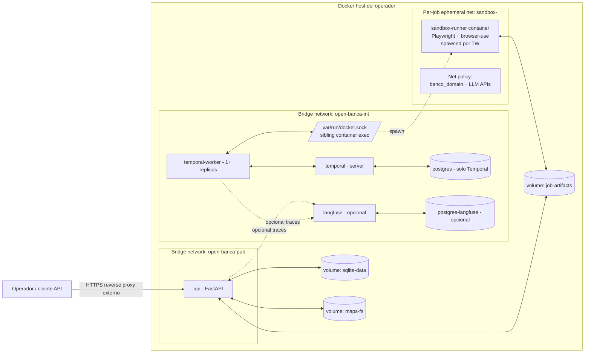

# Deployment self-hosted

Layout de containers + red para correr open-banca on-premises o en VPS del operador. Distribución oficial: **un solo `docker-compose.yml`** que levanta todo.

## Topología de containers



Solo `api` se expone al host (puerto único, ej. `8080`). Reverse proxy / TLS termination es responsabilidad del operador.

## Servicios

| Servicio | Imagen base sugerida | Puertos expuestos | Volúmenes | Depende de | Env vars críticas (sin valores) |
|----------|----------------------|-------------------|-----------|------------|----------------------------------|
| `api` | `python:3.12-slim` (build local con uv) | `8080` (al host) | `sqlite-data:/data`, `maps-fs:/maps:ro`, `job-artifacts:/artifacts:ro` | `temporal`, `temporal-worker` | `OPEN_BANCA_MASTER_PASSPHRASE`, `WEBHOOK_HMAC_SECRET`, `API_KEY`, `TEMPORAL_ADDRESS`, `LANGFUSE_ENABLED`, `OTEL_EXPORTER_OTLP_ENDPOINT` |
| `temporal` | `temporalio/auto-setup` | interno | — | `postgres-temporal` | `DB_HOST`, `DB_USER`, `DB_PORT`, `POSTGRES_PWD` |
| `temporal-worker` | mismo build que `api` | interno | `maps-fs:/maps:ro`, `job-artifacts:/artifacts`, `/var/run/docker.sock` | `temporal` | `TEMPORAL_ADDRESS`, `TASK_QUEUE`, `WORKER_CONCURRENCY`, `ANTHROPIC_API_KEY`, `DEEPSEEK_API_KEY`, `LITELLM_*` |
| `postgres-temporal` | `postgres:16-alpine` | interno | `pg-temporal:/var/lib/postgresql/data` | — | `POSTGRES_USER`, `POSTGRES_PASSWORD`, `POSTGRES_DB` |
| `sandbox-runner` (ephemeral) | `mcr.microsoft.com/playwright/python` (custom layer) | ninguno | `job-artifacts:/artifacts` (sólo subdir del job) | spawned por worker | `JOB_ID`, `BANK_ID`, `MAP_PATH`, `LLM_API_KEYS_FORWARDED` |
| `langfuse` (opcional) | `langfuse/langfuse:latest` | interno (opcional al host) | `langfuse-data:/data` | `postgres-langfuse` | `DATABASE_URL`, `NEXTAUTH_SECRET`, `SALT` |
| `postgres-langfuse` (opcional) | `postgres:16-alpine` | interno | `pg-langfuse:/var/lib/postgresql/data` | — | igual a `postgres-temporal` |

Notas:

- `temporal-worker` monta `/var/run/docker.sock` para spawnar `sandbox-runner` como **sibling container** (no Docker-in-Docker). Trade-off de seguridad: el worker puede pedir cualquier acción al daemon — mitigado porque el worker ya está en red interna y no recibe input externo. Alternativa rootless docker / podman queda como opción para v2.
- `sandbox-runner` se spawnea **por job**, en su propia ephemeral network con drop-all + allow del dominio del banco + APIs LLM whitelisted (ver [`../04-security/threat-model.md`](../04-security/threat-model.md)).
- `langfuse` y su Postgres son opt-in vía profile docker-compose (`--profile langfuse`).

## Network


- `api` único container con puerto al host (8080).
- `temporal`, `worker`, `postgres`, `langfuse`: nunca expuestos al host. Acceso vía `docker exec` o port-forward temporal del operador.
- `sandbox-runner`: aislado en su propia network por job; sin acceso a la red interna de servicios.

## Checklist de seguridad de memoria — obligatorio antes del primer arranque

Las siguientes verificaciones deben completarse en el host **antes** de ejecutar `docker compose up` en producción. El API se niega a arrancar si detecta swap activo. El operador es responsable de cumplir este checklist y documentarlo en su runbook de plataforma.

| # | Verificación | Comando de comprobación | Resultado esperado | Referencia |
|---|-------------|------------------------|-------------------|------------|
| M-1 | Swap desactivado en caliente | `swapon --show` | Sin output (vacío) | ADR-0008-amendment §2 |
| M-2 | Swap desactivado en /proc | `cat /proc/swaps` | Solo línea de cabecera | ADR-0008-amendment §2 |
| M-3 | swappiness = 0 | `cat /proc/sys/vm/swappiness` | `0` | ADR-0008-amendment §4 |
| M-4 | core dump limit = 0 en docker-compose | Ver `ulimits.core` en `docker-compose.yml` para servicios `api` y `temporal-worker` | `soft: 0, hard: 0` | ADR-0008-amendment §3 |
| M-5 | core dump deshabilitado en systemd (si aplica) | `systemctl show open-banca-api \| grep LimitCORE` | `LimitCORE=0` | ADR-0008-amendment §3 |
| M-6 | RLIMIT_MEMLOCK suficiente para mlock | `ulimit -l` o `cat /proc/<pid>/limits \| grep 'Max locked'` | `unlimited` o valor > 64 MiB | ADR-0008-amendment §consecuencias |
| M-7 | OPEN_BANCA_ENV no es "development" en producción | `grep OPEN_BANCA_ENV .env` | Ausente o `production` | ADR-0008-amendment §4 |

### Comandos de configuración

```bash
# M-1 + M-2: Desactivar swap en caliente
swapoff -a

# M-3: Establecer swappiness = 0 persistente
echo 'vm.swappiness=0' >> /etc/sysctl.d/99-open-banca.conf
sysctl --system

# M-6: RLIMIT_MEMLOCK (systemd service)
# Añadir en /etc/systemd/system/open-banca-api.service:
#   LimitMEMLOCK=infinity
# O para sesión de shell de test:
ulimit -l unlimited

# M-4: Verificar docker-compose.yml incluye:
#   services.api.ulimits.core.soft: 0
#   services.api.ulimits.core.hard: 0
#   services.temporal-worker.ulimits.core.soft: 0
#   services.temporal-worker.ulimits.core.hard: 0
```

### Swap permanente deshabilitado

```bash
# Editar /etc/fstab: comentar o eliminar la línea con tipo 'swap'
# Antes:   /dev/sda2  none  swap  sw  0 0
# Después: # /dev/sda2  none  swap  sw  0 0

# En instancias cloud con swap file:
swapoff /swapfile
rm /swapfile
# Eliminar también la entrada en /etc/fstab
```

El API validará automáticamente M-1, M-2 y M-3 al arrancar y terminará con exit code 1 si alguno falla. El checklist completo (M-4 a M-7) es responsabilidad del operador antes de levantar los containers.

Referencias de amenaza: CWE-244 (heap memory not cleared), CWE-528 (core dump exposure). Detalle técnico en [`../04-security/secrets-at-rest.md`](../04-security/secrets-at-rest.md) §Memory protection — hard requirements y [`../adr/0008-amendment-mlock.md`](../adr/0008-amendment-mlock.md).

## Primer arranque

Secuencia esperada:

1. Operador clona repo + edita `.env` (API keys LLM, master passphrase, webhook HMAC secret).
2. `docker compose up -d`.
3. `api` levanta: detecta DB no existente, prompta creación → cifra con master passphrase, corre migraciones, registra usuario admin con `API_KEY`.
4. `temporal` y `postgres-temporal` se inicializan, namespace creado.
5. `temporal-worker` registra activities/workflows, queda listo en task queue.
6. Operador hace primer `POST /banks` con `bank_id=banco_general` (mapping pre-existente del repo) o dispara `POST /banks/{id}/map` para correr Mapper desde cero.
7. Operador hace primer `POST /credentials` con su user/pass de Banco General (cifrado en el vault).
8. Primer `POST /scrape` → flujo descrito en docs.

Health endpoints:

- `GET /healthz` — liveness simple.
- `GET /readyz` — checa conexión a Temporal + DB desbloqueada + worker registrado.

## Escalado

| Componente | Estrategia |
|------------|-----------|
| `api` | Stateless. Múltiples réplicas detrás de proxy. Por defecto 1 instancia (self-host típicamente low-traffic). |
| `temporal-worker` | Horizontal: incrementar `replicas`. Cada worker puede correr N activities concurrentes (`WORKER_CONCURRENCY`). Trade-off: más workers = más sandboxes simultáneos = más CPU/RAM/red. |
| `sandbox-runner` | Cap concurrente vía Temporal task queue + slot semaphore. Default sugerido: 2-3 jobs simultáneos en host de 8GB RAM (cada Playwright + Chromium ~1GB). |
| `temporal` server | 1 instancia self-host es OK. Para HA real: 3 nodos + Postgres replicado (fuera de scope v1). |
| `postgres-temporal` | Mantenido por Temporal; backups responsabilidad del operador. |
| `langfuse` | Single instance suficiente para self-host. |

Trade-offs:

- Más workers → más throughput pero proporcionalmente más costo LLM.
- Sandboxes paralelos sobre el mismo banco → riesgo de detección. Recomendación: max 1 sandbox concurrente **por credencial bancaria**.
- DB SQLite no escala horizontalmente — single-writer. Si se vuelve cuello de botella, migración a Postgres es opción documentada en v2 (no v1).

## Backups y operaciones

- **Backup**: snapshot del volumen `sqlite-data` (DB cifrada — backup ya cifrado). Operador define cron.
- **Logs**: stdout de containers → `docker logs` o driver del operador (Loki, CloudWatch, etc.).
- **Upgrades**: pull nueva imagen, `docker compose up -d`. Migraciones de DB corren al boot. Maps versionados via git, upgradeables independientemente.
- **Disaster recovery**: con master passphrase + backup de `sqlite-data` + clone de `maps-fs` se reconstruye todo el estado.

## Lo que deployment **no** incluye

- TLS termination — responsabilidad del operador (recomendamos Caddy o Traefik delante).
- Backup automático — manual o cron del operador.
- Multi-host orchestration (Kubernetes, Nomad) — no soportado en v1, posible plantilla comunitaria.
- Secret management externo (Vault, AWS Secrets Manager) — env vars + `.env` es la única vía v1.

## Referencias

- ADR-0009 sandbox por job: [`../adr/0009-docker-sandbox-per-job.md`](../adr/0009-docker-sandbox-per-job.md).
- ADR-0008 sqlcipher: [`../adr/0008-sqlcipher-secrets.md`](../adr/0008-sqlcipher-secrets.md).
- Threat model: [`../04-security/threat-model.md`](../04-security/threat-model.md).
- Observabilidad: [`observability.md`](./observability.md).
- Cost guardrails: [`cost-guardrails.md`](./cost-guardrails.md).
