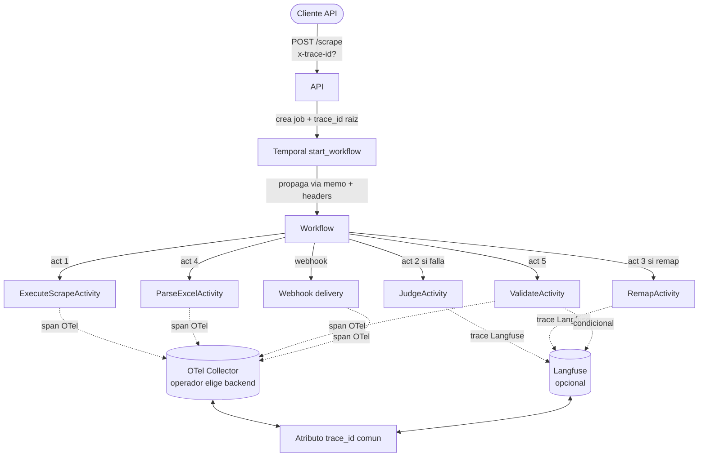

# Observabilidad

Dos planos: **Langfuse** (self-hosted, opcional) para trazas LLM-céntricas y **OpenTelemetry** (OTLP) para todo lo demás. Cada `job_id` lleva un `trace_id` que se propaga end-to-end y permite correlacionar workflows, activities, agent calls y artefactos en disco.

## Quién emite qué

| Componente | Plano | Qué emite |
|------------|-------|-----------|
| `api` (FastAPI) | OTel | Spans HTTP request/response, latencia por endpoint, request_id ↔ job_id, status codes, métricas RED. |
| Temporal server | nativo + OTel | Workflow events (started, completed, signal received, activity scheduled), exportados al collector. |
| Temporal worker | OTel | Spans por activity, attributes: workflow_id, activity_type, attempt, retry. |
| Mapper / Remapper | Langfuse | Trace por mapping run con steps de browser-use, screenshots adjuntos, prompts, tokens, costo, latencia, output `map.json`. |
| Validator | Langfuse + OTel | Span del activity (OTel). Si llama LLM: trace Langfuse con prompt + structured output. |
| Judge | Langfuse | Trace por decisión: input (BreakageEvent + evidencia), output (decision + confidence + risk), prompt versión. |
| Scraper Runner | OTel | Spans por step (`navigate`, `click`, `download`, etc.), atributos: step_index, selector, success/failure. **No emite a Langfuse** (no hay LLM). Genera artefactos locales (HAR, screenshots, trace.zip). |
| Sandbox runtime | OTel | Eventos de container lifecycle (created, started, stopped, exit code), CPU/RAM peak. |
| Webhook outbox | OTel | Span por delivery: target URL, attempt, response status, latency. |
| Parser | OTel | Span con metadata: sheet matched, rows parsed, account_type inferred, dropped count. |

## Trace correlation end-to-end

Cada span/trace lleva al menos: `trace_id`, `job_id`, `bank_id`, `workflow_id`, `attempt`. Esto permite reconstruir un job completo cruzando Langfuse + Jaeger/Tempo/lo-que-sea-que-use-el-operador.

## Langfuse self-hosted (opcional)

Activación: env `LANGFUSE_ENABLED=true` y `--profile langfuse` en docker-compose. Si está off:

- Calls LLM siguen funcionando (LiteLLM es independiente).
- No hay panel de prompts/respuestas/costos LLM.
- Los spans OTel siguen registrando latencia + tokens (vía middleware LiteLLM → OTel) pero sin contenido de prompt.

Razones para tenerlo on:

- Debug de prompts (Mapper especialmente — alta complejidad).
- Análisis de costo histórico por agente.
- Detectar drift de calidad (caída de confidence promedio del Judge a lo largo de semanas).

Razones para tenerlo off:

- Self-host minimal (menos containers).
- Privacidad extra: prompts pueden contener metadata sensible (nombres de campos del banco).

Cloud Langfuse rechazado explícitamente: rompe el principio de self-host (ver DECISIONS.md).

## Playwright traces y artefactos

Cada job genera, en `job-artifacts/<job_id>/`:

| Artefacto | Cuándo | Tamaño típico | Sanitización |
|-----------|--------|----------------|--------------|
| `trace.zip` | siempre (Playwright `tracing.start()`) | 5-50 MB | sin secretos en cleartext (creds inyectadas via `sensitive_data` no aparecen en DOM dumps) |
| `har.json` | siempre | 1-20 MB | bodies de request a `/login` redactados (heurístico de patron password) |
| `screenshots/step-*.png` | pre+post de cada step crítico | <500 KB c/u | sin texto de password (campos type=password renderizan como bullets) |
| `video.webm` | sólo si `DEBUG_VIDEO=true` | 10-100 MB | igual que screenshots |
| `downloads/*.xlsx` | siempre | 100 KB - 2 MB | data financiera del operador, no se sanitiza |
| `breakage_evidence/*.json` | sólo si hubo BreakageEvent | <100 KB | metadata + refs a screenshots |

Retención por defecto: **7 días** para jobs exitosos, **30 días** para jobs fallidos (debug). Configurable via env. Cleanup vía cron in-app.

Sanitización extra disponible: `STRIP_DESCRIPTIONS_FROM_TRACES=true` redacta texto que matchea pattern de número de cuenta antes de escribir el HAR.

## SLI / SLO razonables

| SLI | SLO sugerido v1 | Notas |
|-----|------------------|-------|
| Success rate por banco (jobs completed / total no-cancelled) | ≥95% en 7d | Bajo este threshold → alerta P1. |
| Latencia p50 scrape job (excluyendo OTP wait) | <90s | Banco General típico ~60-90s. |
| Latencia p95 scrape job | <180s | |
| Latencia p99 scrape job | <300s | |
| OTP wait p50 | <60s | Tiempo cliente acepta push. |
| OTP wait timeout rate | <5% | Si sube → revisar UX webhook + notificación. |
| Tasa de remap necesario por banco | <10% / 30d | Encima → banco está en rediseño activo, escalar. |
| Costo LLM medio por scrape exitoso | <$0.15 | Cap absoluto $0.50 (ver cost-guardrails). |
| Costo LLM medio por remap | <$0.30 | Mapper es caro. |
| Webhook delivery success rate | ≥99% en 7d | Si baja → endpoint del cliente roto. |
| Circuit breaker open rate | <2% / 7d | Encima → banco bloqueando o creds malas. |

Métricas se exportan vía OTel; el operador conecta su Prometheus/Grafana/Datadog.

## Alertas mínimas

| Alerta | Trigger | Severidad |
|--------|---------|-----------|
| `scrape_success_rate_low` | <80% en 1h por banco | P1 |
| `circuit_breaker_open_repeated` | >3 aperturas en 24h por banco | P1 |
| `llm_cost_spike` | costo medio diario >2x rolling 7d | P2 |
| `otp_timeout_rate_high` | >20% en 1h | P2 |
| `worker_down` | sin heartbeat de worker en >2 min | P1 |
| `webhook_outbox_backlog` | >100 mensajes sin entregar | P2 |
| `mapper_failed` | mapping run aborta | P3 (manual review) |

## Lo que observabilidad **no** hace

- No persiste datos financieros del cliente fuera del DB principal — Langfuse y OTel ven metadata, no Excel content.
- No reemplaza el `audit_log` (eso es legal/forense, no operacional).
- No expone endpoints públicos — Langfuse y collectors viven en red interna.

## Referencias

- Deployment: [`deployment.md`](./deployment.md).
- Cost guardrails: [`cost-guardrails.md`](./cost-guardrails.md).
- Testing: [`testing.md`](./testing.md).
- Scraper Runner artefactos: [`../02-components/scraper-runner.md`](../02-components/scraper-runner.md).
