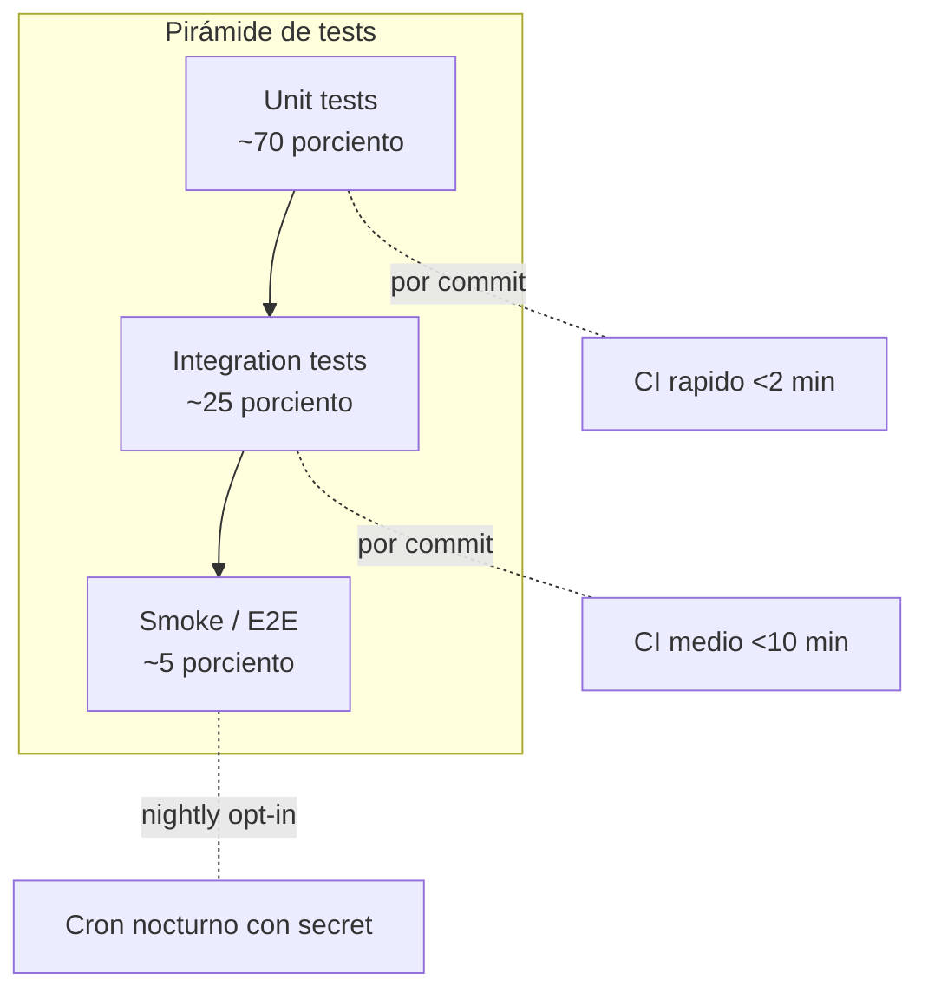
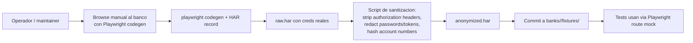

# Estrategia de Testing

Pirámide invertida ligera: muchos unit tests determinísticos, una banda media de integration con replay/time-skipping, y una capa thin de smoke tests opt-in contra banco real. **Cero tests automáticos contra banco real en CI por defecto.**

## Pirámide

## Por capa

| Capa | Scope | Herramienta | Cuándo corre |
|------|-------|-------------|---------------|
| **Unit** | Lógica pura: parser DSL, validators heurísticos, schema canónico, fingerprint dedup, cost counters, judge confidence calibration. | pytest, pytest-asyncio, hypothesis (property tests), PydanticAI test models. | Cada commit. |
| **Unit (LLM mocks)** | Validator/Judge/Mapper sustituyendo modelo por test model con respuestas predefinidas por escenario. | PydanticAI `TestModel` / `FunctionModel`. | Cada commit. |
| **Integration (HAR replay)** | Scraper Runner contra fixtures HAR pre-grabadas: simula servidor banco sin red real. | Playwright HAR-based mocking, pytest. | Cada commit. |
| **Integration (Temporal time-skipping)** | Workflows completos con activities mockeadas (incluye OTP wait skipping). | `temporalio.testing.WorkflowEnvironment`. | Cada commit. |
| **Integration (parser fixtures)** | Parser DSL ejecutado contra Excel reales **anonimizados** commiteados al repo. | pytest + openpyxl. | Cada commit. |
| **Integration (sandbox)** | Spawn real de container `sandbox-runner` con HAR replay, sin acceso a internet. | docker compose + pytest. | Cada commit (lento, en job paralelo). |
| **E2E / Smoke** | Banco General real con creds del operador, full happy path. | pytest, env var `RUN_BANK_SMOKE=true`, `BANCO_GENERAL_USER`/`PASS` desde GH secrets. | Nightly opt-in + manual trigger. |
| **Performance** | Latencia parser sobre Excel grandes, dedup index lookup bajo carga. | pytest-benchmark. | Semanal nightly. |
| **Security** | Lint maps (selectores frágiles), SBOM, secret scanning, dep audit. | bandit, ruff, pip-audit, gitleaks. | Cada commit. |

## Fixtures HAR

Estrategia de generación:

Pasos del sanitizer:

- Borra `Cookie`, `Authorization`, `X-CSRF-Token` de requests.
- Borra setCookie de responses.
- Substituye números de cuenta por hash determinístico (consistente entre fixtures).
- Substituye nombre del titular por placeholder fijo.
- Substituye montos por valores anonimizados (rounded + offset random fijo).
- Corrobora con `gitleaks` antes de commit (fail si encuentra patrón secreto).

Fixtures por escenario:

- `login_happy.har` — login exitoso + dashboard.
- `login_otp_pending.har` — flujo hasta pause.
- `login_otp_rejected.har` — usuario rechazó push.
- `download_savings.har` — flujo descarga ahorro.
- `download_credit_card.har` — flujo descarga tarjeta.
- `selector_drift_v1.har` — capturado cuando el banco rediseñó (dispara `partial_remap` en Judge tests).
- `http_503.har` — banco caído (dispara `retry_with_backoff`).

## LLM mocks vía PydanticAI

PydanticAI permite reemplazar el modelo del agente por un test model durante tests. Estructura del setup:

| Test model | Comportamiento |
|------------|----------------|
| `TestModel` | Devuelve output dummy con shape válida; útil para smoke. |
| `FunctionModel(fn)` | Función Python que recibe el prompt y devuelve respuesta arbitraria. Permite: respuestas determinísticas por escenario, simular structured output específico, retornar errores controlados. |

Fixtures pytest comunes:

- `validator_clean` — FunctionModel que siempre devuelve `verdict=clean`.
- `validator_warning_balance_gap` — devuelve warning con `category=balance_gap`.
- `judge_partial_remap_high_conf` — devuelve `decision=partial_remap, confidence=0.9, risk=low`.
- `judge_human_required` — devuelve decisión que dispara HITL.
- `mapper_returns_valid_map` — devuelve `map.json` parseable.
- `mapper_returns_invalid_map` — para testear validation post-mapping.

Un test típico de Validator no toca LLM real **nunca** — ni en CI, ni local, salvo que el dev quiera. La capa LiteLLM se reemplaza completa.

## Temporal time-skipping

`WorkflowEnvironment.start_time_skipping()` permite correr workflows que esperarían minutos/horas en milisegundos. Útil para:

- Verificar que `pause_for_otp` con timeout 4min hace abort cuando no llega signal.
- Verificar backoff exponencial en `retry_with_backoff` (skip 1s, 2s, 4s, 8s).
- Verificar circuit breaker open por 1h y reapertura half-open.
- Verificar webhook retry con backoff.

Activities reales se reemplazan por mocks que devuelven `StepResult`/`BreakageEvent` predefinidos.

## CI matrix

| Pipeline | Trigger | Duración objetivo | Pasa = mergea |
|----------|---------|---------------------|----------------|
| `lint` | push, PR | <30s | sí |
| `typecheck` (pyrefly) | push, PR | <60s | sí |
| `unit` | push, PR | <2 min | sí |
| `integration-har` | push, PR | <5 min | sí |
| `integration-temporal` | push, PR | <3 min | sí |
| `integration-sandbox` | push, PR (paralelo) | <10 min | sí (puede skip si no toca código del runner) |
| `security-scan` | push, PR | <2 min | sí |
| `parser-fixtures` | PR sólo si toca `banks/` | <1 min | sí |
| `smoke-real` | nightly + manual con `gh workflow run` | ~5 min | NO bloquea merge |
| `perf-bench` | semanal | ~10 min | NO bloquea, alerta si regresión >20% |

Smoke real:

- Requiere secret `BANCO_GENERAL_TEST_USER` + `BANCO_GENERAL_TEST_PASS` en GH (cuenta de test del operador, no producción).
- Requiere `OTP_BOT_WEBHOOK` o operador manual para confirmar OTP — alternativa: cuenta de test bypass OTP si banco lo permite (no probable).
- Si falla 2 noches seguidas → issue auto-creado.

## Property-based testing (hypothesis)

Casos donde aporta más:

- Parser DSL: dado un Excel con shape válida random, el parser nunca explota; nunca produce records con campos faltantes obligatorios.
- Fingerprint dedup: dado un set random de transacciones, hash es determinístico y único bajo permutación.
- Cost counter: nunca cuenta negativo; nunca excede int64.
- Schema discriminator: random payloads válidos roundtrip serialización.

## Lo que NO testea

- **Banco real en CI por defecto** — risk de lockout, costo, dependencia externa.
- **LLMs reales en CI** — costo + flakiness; reemplazados por mocks.
- **Browsers reales en unit tests** — sólo en integration via HAR replay.
- **UI** — no hay UI en v1.

## Referencias

- Observabilidad: [`observability.md`](./observability.md).
- Cost guardrails (token caps testeados): [`cost-guardrails.md`](./cost-guardrails.md).
- ADR-0007 DSL declarativo (testabilidad como argumento): [`../adr/0007-declarative-excel-dsl.md`](../adr/0007-declarative-excel-dsl.md).
- Scraper Runner artefactos para tests: [`../02-components/scraper-runner.md`](../02-components/scraper-runner.md).
