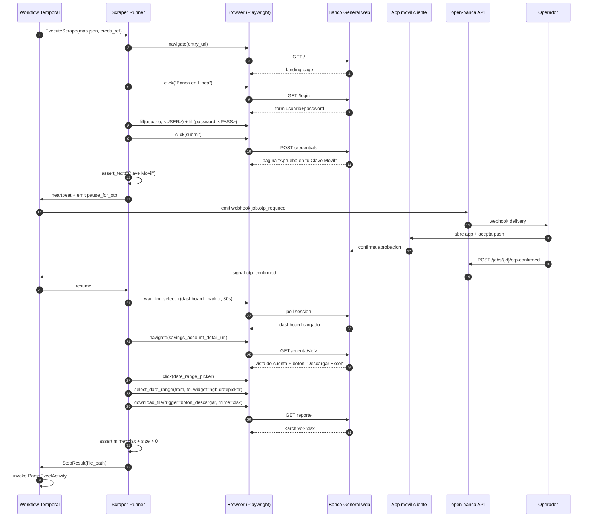
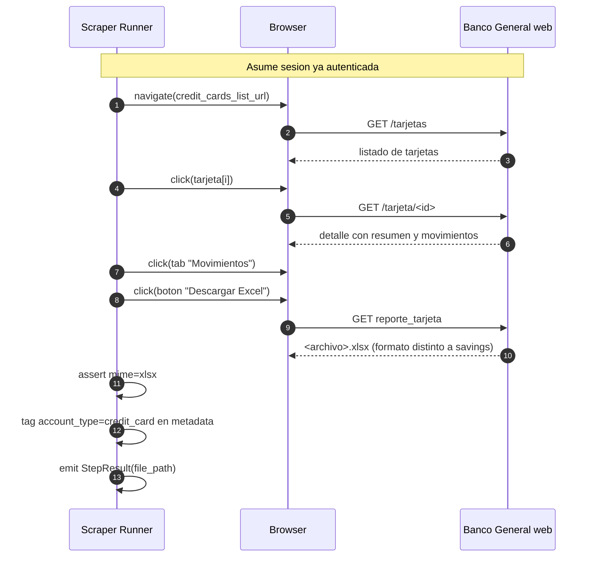

# Banco General (Panamá) — Especificaciones

Banco piloto de open-banca v1. Más grande de Panamá por volumen de clientes retail. Documenta lo que **asumimos** hoy a partir de exploración previa + memoria del proyecto; cada item marcado **(por validar)** debe confirmarse en el primer mapping real.

## Datos generales

| Campo | Valor |
|-------|-------|
| `bank_id` | `banco_general` |
| Nombre | Banco General S.A. |
| País | Panamá (PA) |
| Moneda principal | PAB (1:1 USD); algunas cuentas USD explícitas. |
| URL pública | `https://www.bancogeneral.com` |
| Login URL | redirección post-click "Banca en Línea" hacia portal autenticado **(por validar)** |
| Anti-bot | sin captcha, sin Cloudflare challenge agresivo (hasta donde sabemos). **(por validar)** |
| Idle timeout | ~5 min de inactividad cierra sesión. Hard cap OTP wait = 4 min. |
| Tipos de cuenta v1 | `savings`, `checking`, `credit_card`. Préstamos NO. |
| Historial Excel | típicamente últimos 6 meses online **(por validar)** |
| Auth | usuario + password + Clave Móvil (push 2FA). Sin SMS. |

## Auth: Clave Móvil

Banco General usa su propia app móvil ("Banco General App") con feature **Clave Móvil**. Tras introducir user+pass en la web, la app del cliente recibe push notification; el cliente acepta dentro de la app. La web detecta la aprobación por polling/long-poll **(por validar)** y avanza al dashboard.

Implicaciones:

- **No hay OTP code que escribir** — es approve/deny.
- El job pausa en `pause_for_otp` hasta que llega `POST /jobs/{id}/otp-confirmed` del operador (después de aceptar en su teléfono).
- Hard cap **4 min** de espera; si excede, abort con `failure_reason: otp_timeout`.
- Si el cliente rechaza en su app, la web devuelve a login → BreakageEvent `assertion_failed` o `http_error`, Judge decide `abort_and_alert`.

## Flujo: login + descarga Excel para cuenta de ahorro

## Flujo: descarga Excel para tarjeta de crédito

Diferencias clave del Excel de tarjeta:

- Hoja única **(por validar — puede haber 2: resumen + movimientos)**.
- Header trae: `Saldo Anterior`, `Pagos`, `Cargos del Periodo`, `Saldo Actual`, `Pago Minimo`, `Fecha de Corte`, `Fecha Limite de Pago`.
- Tabla de movimientos: `Fecha`, `Descripcion`, `Referencia`, `Monto`. (Sin columna Saldo running — la tarjeta no la tiene.)

## Formato Excel típico — cuentas savings/checking

Asumido (a confirmar contra descarga real del primer mapping):

| Sección | Contenido |
|---------|-----------|
| Filas 1-N (header) | Nombre del titular, número de cuenta enmascarado, tipo de cuenta, moneda, balance actual, rango de fechas del reporte. |
| Fila header de tabla | `Fecha`, `Descripción`, `Referencia`, `Débito`, `Crédito`, `Saldo`. |
| Filas de datos | Una por movimiento, ordenadas por fecha desc. |
| Footer (opcional) | Totales, leyenda legal. |

Detalles operativos:

- `Débito` y `Crédito` en columnas separadas (sólo una con valor por fila). El parser usa `coalesce` + `negate_if`.
- Formato de fecha probable: `dd/mm/yyyy`.
- Decimal separator: punto (`.`) **(por validar — Panamá usa USD/PAB, típicamente formato US).**
- Sin transaction_id estable embebido **(por validar)** → `id_strategy=fingerprint` por defecto.

## Quirks conocidos / a investigar

| Quirk | Estado | Mitigación / nota |
|-------|--------|-------------------|
| Sesión expira ~5 min | confirmado por arquitectura | hard cap 4 min para OTP, scrape secuencial sin pausas largas |
| Modal de promociones al login | sospechado | step `assert_text` o `dismiss_modal` en `auth_flow` |
| Datepicker `ngb-datepicker` (Angular) | sospechado | step type `select_date_range` con `widget=ngb-datepicker` ya soportado por runner |
| Loading spinner sin selector estable | sospechado | usar `wait_until=networkidle` en `navigate` |
| Multi-step descarga (modal de confirmación) | a investigar | si existe, agregar step click extra |
| Rate limit en descargas | desconocido | observar; si aparece, Judge → `retry_with_backoff` |
| Cookies / fingerprint detection | desconocido | usar Playwright con UA real, no headless visible al banco |
| Diferencia formato Excel cliente individual vs business | a investigar | en v1 sólo retail individual |
| Encoding de descripciones (acentos) | a confirmar | UTF-8 esperado |
| Iframes en dashboard | a investigar | si existen, mapper debe identificar y los step types operan dentro |

## Open questions (validar en primer mapping real)

1. ¿Banco General emite alguna referencia bancaria estable por movimiento? Si sí, usar como `level 1` de dedup.
2. ¿El portal usa Angular o tech stack distinto? Determina selectores estables (data-attributes vs CSS clases).
3. ¿Hay endpoint REST/JSON detrás del Excel que podríamos usar directo? (Probablemente no expuesto, pero capturar HAR para confirmar.)
4. ¿El rango de fechas máximo es 6 meses, 12 meses, o configurable? Afecta estrategia de full historical.
5. ¿La descarga Excel es síncrona (download directo) o requiere job-id + polling? Probablemente síncrona pero a confirmar.
6. ¿Cómo se comporta la app si el cliente está en otra sesión simultánea? ¿Cierra la nueva o la vieja?
7. ¿Hay diferenciación de cuentas en USD vs PAB en el Excel? (Banco General es bi-monetario de facto.)
8. ¿Qué pasa si una cuenta no tiene movimientos en el rango? ¿Excel vacío con header o error?
9. ¿La tarjeta de crédito permite descargar movimientos del ciclo en curso o sólo cerrados?
10. ¿Hay límite de descargas por día / por sesión?

## Roadmap del banco

- **v1.0**: savings + checking + credit_card, full historical inicial, incremental con `since`.
- **v1.1**: soporte multi-titular (cuentas conjuntas), refinamiento de quirks descubiertos en producción real.
- **v2.0**: préstamos personales/hipotecarios, posiblemente fideicomiso e inversiones (Banco General tiene módulos separados).
- **v2.x**: si banco activa captcha/Cloudflare → escalation path documentado en threat model.

## Referencias

- Mapper que produce el `map.json`: [`../02-components/mapper-agent.md`](../02-components/mapper-agent.md).
- Parser que lee el Excel: [`../02-components/parser.md`](../02-components/parser.md).
- Scraper Runner que ejecuta el flow: [`../02-components/scraper-runner.md`](../02-components/scraper-runner.md).
- ADR-0015 no session persistence: [`../adr/0015-no-session-persistence-v1.md`](../adr/0015-no-session-persistence-v1.md).
- DECISIONS.md sección OTP/2FA: [`../DECISIONS.md`](../DECISIONS.md).
